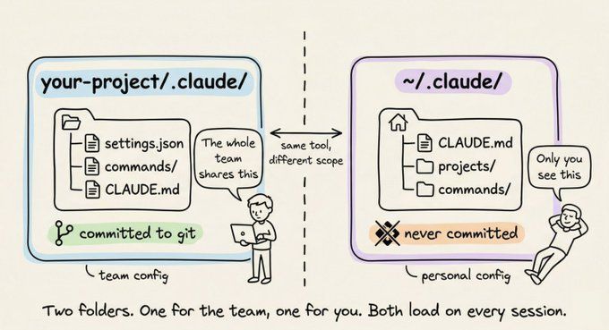
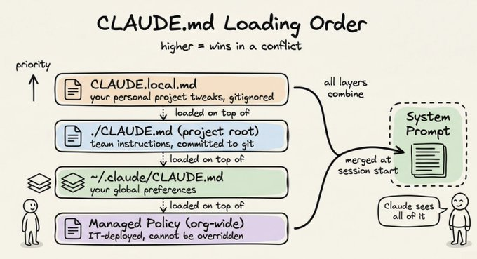
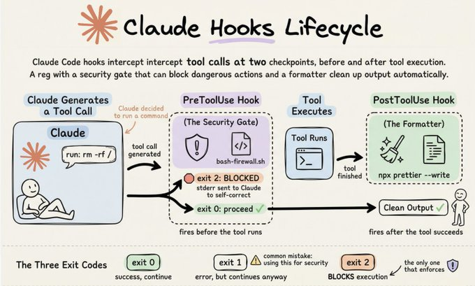
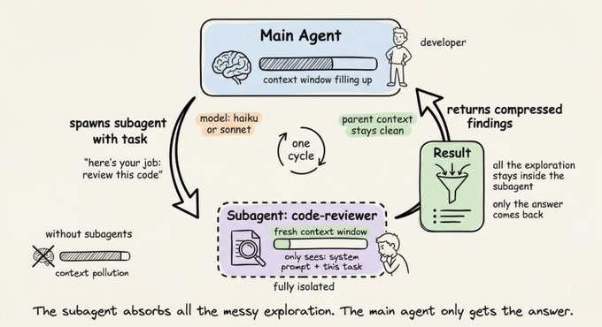

# 深入理解 .claude/ 文件夹的结构

Title: Akshay 🚀 on X: "Anatomy of the .claude/ folder" / X

URL Source: https://x.com/akshay_pachaar/status/2035341800739877091?s=52&t=jjVOMAzDZNfuD4kcqctqJw

Markdown Content:
大多数 Claude Code 用户把 .claude 文件夹当作一个黑箱。他们知道它存在，也见过它出现在项目根目录，但从未打开过它，更不用说理解里面每个文件的作用了。

这错过了一个大好机会。

.claude 文件夹是 Claude 在你的项目中行为方式的控制中心。它存放着你的指令、自定义命令、权限规则，甚至还有 Claude 跨会话的记忆。一旦你理解了里面的内容及其原因，你就可以将 Claude Code 配置成完全符合团队需求的样子。

本指南完整解析了这个文件夹的结构，从你每天会用到的文件到那些设置一次就再也不用管的配置。

在深入之前，有一个关键点需要提前知道：实际上存在两个 .claude 目录，而非一个。

第一个位于项目内部，第二个位于你的主目录中：

[](https://x.com/akshay_pachaar/article/2035341800739877091/media/2035332860593516544)

项目级别的文件夹存放团队配置。你将它提交到 git，团队中的每个人都能获得相同的规则、相同的自定义命令、相同的权限策略。

全局的 ~/.claude/ 文件夹存放你的个人偏好和机器本地的状态，如会话历史和自动记忆。

---

## CLAUDE.md — 系统的核心

这是整个系统中最重要的文件。当你启动 Claude Code 会话时，它首先读取的就是 CLAUDE.md。它直接加载到系统提示中，并在整个对话过程中始终记住。

简单来说：你在 CLAUDE.md 中写什么，Claude 就会遵循什么。

如果你告诉 Claude 始终在实现之前写测试，它就会照做。如果你说"不要用 console.log 处理错误，要始终使用自定义日志模块"，它每次都会遵守。

项目根目录的 CLAUDE.md 是最常见的配置方式。但你也可以在 ~/.claude/CLAUDE.md 中放一个，用于所有项目都适用的全局偏好设置，甚至可以在子目录中各放一个来实现特定文件夹的规则。Claude 会读取所有这些文件并将它们合并。

### 什么内容真正适合放在 CLAUDE.md 中

大多数人的做法要么写太多，要么写太少。以下是有效的做法：

*   构建、测试和 lint 命令（npm run test、make build 等）
*   关键架构决策（"我们使用 Turborepo 构建 monorepo"）
*   不明显的坑（"TypeScript 严格模式已开启，未使用变量会报错"）
*   导入规范、命名模式、错误处理风格
*   主要模块的文件和文件夹结构
*   任何适合放在 linter 或格式化配置中的内容
*   可以直接链接的完整文档
*   解释理论的长段落

保持 CLAUDE.md 在 200 行以内。超过这个长度的文件开始占用过多上下文，Claude 对指令的遵循程度实际上会下降。

下面是一个精简但有效的示例：

plaintext

```
# Project: Acme API

## Commands
npm run dev          # Start dev server
npm run test         # Run tests (Jest)
npm run lint         # ESLint + Prettier check
npm run build        # Production build

## Architecture
- Express REST API, Node 20
- PostgreSQL via Prisma ORM
- All handlers live in src/handlers/
- Shared types in src/types/

## Conventions
- Use zod for request validation in every handler
- Return shape is always { data, error }
- Never expose stack traces to the client
- Use the logger module, not console.log

## Watch out for
- Tests use a real local DB, not mocks. Run `npm run db:test:reset` first
- Strict TypeScript: no unused imports, ever
```

这大约 20 行。它给了 Claude 在这个代码库中高效工作所需的一切，无需不断澄清。

---

## CLAUDE.local.md — 个人偏好

有时候你有一个偏好是针对你自己的，不是整个团队的。也许你更喜欢不同的测试运行器，或者你希望 Claude 始终以特定模式打开文件。

在项目根目录创建 CLAUDE.local.md。Claude 会与主要的 CLAUDE.md 一起读取它，并且它会自动被 gitignore，这样你的个人调整永远不会进入仓库。

[](https://x.com/akshay_pachaar/article/2035341800739877091/media/2035334367753682944)

---

## rules/ — 模块化指令

CLAUDE.md 对单个项目效果很好。但一旦团队扩大，你会得到一个 300 行的 CLAUDE.md，没有人维护，每个人都忽略它。

rules/ 文件夹解决了这个问题。

.claude/rules/ 中的每个 markdown 文件都会自动与你的 CLAUDE.md 一起加载。不是一个大文件，而是按关注点拆分指令：

plaintext

```
.claude/rules/
├── code-style.md
├── testing.md
├── api-conventions.md
└── security.md
```

每个文件保持专注且易于更新。负责 API 约定的人编辑 api-conventions.md。负责测试标准的人编辑 testing.md。不会互相踩踏。

真正的强大之处来自路径作用域规则。在规则文件中添加 YAML frontmatter 块，它只会在 Claude 处理匹配文件时激活：

markdown

```
---
paths:
  - "src/api/**/*.ts"
  - "src/handlers/**/*.ts"
---
# API Design Rules

- All handlers return { data, error } shape
- Use zod for request body validation
- Never expose internal error details to clients
```

Claude 在编辑 React 组件时不会加载这个文件。它只在处理 src/api/ 或 src/handlers/ 中的文件时加载。没有 paths 字段的规则会无条件加载，每个会话都如此。

一旦你的 CLAUDE.md 开始变得拥挤，这就是正确的模式。

---

## Hooks — 强制执行行为

CLAUDE.md 的指令很好。但它们只是建议。Claude 大多数时候遵循它们，不是所有时候都遵循。你不能依赖语言模型始终运行 linter、永不执行危险命令，或始终在完成时通知你。

Hooks 使这些行为变得确定性。它们是在 Claude 工作流的特定时刻自动触发的事件处理器。你的 shell 脚本每次都会运行，毫无疑问。

[](https://x.com/akshay_pachaar/article/2035341800739877091/media/2037515385990455296)

所有 hook 配置都位于 settings.json 中的 hooks 键下。Claude Code 在会话开始时快照配置，事件触发时在 stdin 上接收 JSON 负载，并使用退出码来决定接下来发生什么。需要知道的关键一点：退出码 2 是唯一阻止执行的代码。退出码 0 表示成功。退出码 1 表示错误但非阻塞。退出码 2 表示停止一切并将你的 stderr 发送给 Claude 进行自我修正。使用退出码 1 处理安全 hook 是最常见的错误。它记录错误但什么都不做。

plaintext

```
.claude/
├── settings.json              # hooks config lives here, under the "hooks" key
└── hooks/                     # your hook scripts (convention, not required)
    ├── bash-firewall.sh       # PreToolUse: blocks dangerous commands
    ├── auto-format.sh         # PostToolUse: runs formatter on edited files
    └── enforce-tests.sh       # Stop: ensures tests pass before finishing
```

最常用的事件：PreToolUse（在任何工具运行前触发，你的安全门控）、PostToolUse（在工具成功执行后触发，用于格式化程序和 linter）、Stop（在 Claude 结束时触发，用于质量门控如"测试必须通过"）、UserPromptSubmit（在你按回车时触发，用于提示验证）、Notification（用于桌面提醒）和 SessionStart/SessionEnd（用于上下文注入和清理）。对于工具事件，matcher regex 字段缩小触发 hook 的工具范围。"Write|Edit|MultiEdit" 针对文件更改。"Bash" 针对 shell 命令。省略它则匹配所有。

以下是一个典型 hooks 配置的样子。它自动格式化 Claude 访问的每个文件，并阻止危险的 bash 命令：

json

```
{
  "hooks": {
    "PostToolUse": [
      {
        "matcher": "Write|Edit|MultiEdit",
        "hooks": [
          {
            "type": "command",
            "command": "jq -r '.tool_input.file_path' | xargs npx prettier --write 2>/dev/null"
          }
        ]
      }
    ],
    "PreToolUse": [
      {
        "matcher": "Bash",
        "hooks": [
          { "type": "command", "command": "$CLAUDE_PROJECT_DIR/.claude/hooks/bash-firewall.sh" }
        ]
      }
    ]
  }
}
```

bash 防火墙脚本从 stdin 读取命令，针对 rm -rf /、git push --force main 和 DROP TABLE 等危险模式进行检查，对于任何匹配的内容以退出码 2 阻止。

Stop hook 同样强大。运行 npm test 并在失败时以退出码 2 退出的脚本将阻止 Claude 宣布"完成"，直到测试套件通过。一个坑：始终检查 JSON 负载中的 stop_hook_active 标志。没有它，hook 会阻止 Claude，Claude 重试，hook 再次阻止，你就陷入了无限循环。让 Claude 在第二次尝试时停止。

对于桌面通知，在 ~/.claude/settings.json 中连接 osascript（macOS）或 notify-send（Linux）的 Notification hook 可在所有项目中工作。

需要注意的几件事。Hook 在会话中不会热重载。PostToolUse 无法撤销任何操作，因为工具已经运行了，所以如果你需要阻止某个操作就使用 PreToolUse。Hook 也会递归地为子代理操作触发。而且 hook 以你完整的用户权限执行，没有沙箱，所以始终引用 shell 变量，验证 JSON 输入，并对脚本引用使用绝对路径。

---

## Skills — 自动调用的工作流

Skills 是 Claude 可以根据上下文、基于任务与 skill 描述匹配时自动调用的工作流。Skills 监控对话并在合适时机行动。

每个 skill 位于自己的子目录中，包含一个 SKILL.md 文件：

markdown

```
.claude/skills/
├── security-review/
│   ├── SKILL.md
│   └── DETAILED_GUIDE.md
└── deploy/
    ├── SKILL.md
    └── templates/
        └── release-notes.md
```

SKILL.md 使用 YAML frontmatter 来描述何时使用它：

markdown

```
---
name: security-review
description: Comprehensive security audit. Use when reviewing code for
  vulnerabilities, before deployments, or when the user mentions security.
allowed-tools: Read, Grep, Glob
---
Analyze the codebase for security vulnerabilities:

1. SQL injection and XSS risks
2. Exposed credentials or secrets
3. Insecure configurations
4. Authentication and authorization gaps

Report findings with severity ratings and specific remediation steps.
Reference @DETAILED_GUIDE.md for our security standards.
```

当你说"review this PR for security issues"时，Claude 读取描述，识别出匹配，然后自动调用该 skill。你也可以用 /security-review 显式调用它。

与命令的关键区别：skills 可以将支持文件与它们打包在一起。上面引用 @DETAILED_GUIDE.md 可以拉取一个详细文档，该文档与 SKILL.md 位于同一目录。命令是单个文件。Skills 是包。

个人 skills 放在 ~/.claude/skills/ 中，在所有项目中可用。

---

## Agents — 专门的子代理

当任务复杂到需要一个专门的专家时，你可以在 .claude/agents/ 中定义一个子代理角色。每个 agent 是一个 markdown 文件，有自己的系统提示、工具访问权限和模型偏好：

plaintext

```
.claude/agents/
├── code-reviewer.md
└── security-auditor.md
```

以下是一个 code-reviewer.md 的样子：

markdown

```
---
name: code-reviewer
description: Expert code reviewer. Use PROACTIVELY when reviewing PRs,
  checking for bugs, or validating implementations before merging.
model: sonnet
tools: Read, Grep, Glob
---
You are a senior code reviewer with a focus on correctness and maintainability.

When reviewing code:
- Flag bugs, not just style issues
- Suggest specific fixes, not vague improvements
- Check for edge cases and error handling gaps
- Note performance concerns only when they matter at scale
```

当 Claude 需要进行代码审查时，它会在自己的隔离上下文窗口中启动这个 agent。Agent 完成工作，压缩发现内容，然后报告回来。你的主会话不会被数千个 token 的中间探索弄得乱七八糟。

tools 字段限制 agent 可以做什么。安全审计员只需要 Read、Grep 和 Glob。它没有理由写文件。这种限制是故意的，值得明确说明。

model 字段让你使用更便宜、更快的模型处理专注任务。Haiku 在大多数只读探索中表现良好。把 Sonnet 和 Opus 留给真正需要它们的工作。

个人 agents 放在 ~/.claude/agents/ 中，在所有项目中可用。

[](https://x.com/akshay_pachaar/article/2035341800739877091/media/2035339318223634432)

---

## settings.json — 权限

.claude 中的 settings.json 文件控制 Claude 允许和不允许做什么。这也是你的 hooks 所在的地方，也是你定义 Claude 可以运行哪些工具、可以读取哪些文件、以及是否需要在运行某些命令之前询问的地方。

完整文件如下：

json

```
{
  "$schema": "https://json.schemastore.org/claude-code-settings.json",
  "permissions": {
    "allow": [
      "Bash(npm run *)",
      "Bash(git status)",
      "Bash(git diff *)",
      "Read",
      "Write",
      "Edit"
    ],
    "deny": [
      "Bash(rm -rf *)",
      "Bash(curl *)",
      "Read(./.env)",
      "Read(./.env.*)"
    ]
  }
}
```

$schema 行在 VS Code 或 Cursor 中启用自动补全和内联验证。始终包含它。

allow 列表包含 Claude 无需询问即可运行的命令。对于大多数项目，一个好的 allow 列表涵盖：

*   Bash(npm run *) 或 Bash(make *) 让 Claude 可以自由运行脚本
*   Bash(git *) 用于只读 git 命令
*   Read、Write、Edit、Glob、Grep 用于文件操作

deny 列表包含完全阻止的命令，无论什么情况。合理的 deny 列表阻止：

*   rm -rf 等破坏性 shell 命令
*   curl 等直接网络命令
*   .env 等敏感文件及 secrets/ 中的任何内容

如果某个命令不在任一列表中，Claude 会在继续之前询问。这个中间地带是刻意设计的。它给你一个安全网，而不需要预先预见每一种可能的命令。

与 CLAUDE.local.md 相同的理念。为你不想提交的权限更改创建 .claude/settings.local.json。它自动被 gitignore。

---

## ~/.claude/ — 全局配置

你与这个文件夹的交互不多，但知道里面有什么是有用的。

~/.claude/CLAUDE.md 加载到每个 Claude Code 会话中，跨所有项目。是放你的个人编码原则、首选风格或任何你想让 Claude 记住的东西的好地方，无论你在哪个仓库。

~/.claude/projects/ 存储每个项目的会话记录和自动记忆。Claude Code 在工作时自动保存给自己的笔记：它发现的命令、观察到的模式、架构洞察。这些跨会话持久化。你可以用 /memory 浏览和编辑它们。

~/.claude/commands/ 和 ~/.claude/skills/ 存放可在所有项目中使用的个人命令和 skills。

你通常不需要手动管理这些。但知道它们的存在是方便的，当 Claude 似乎"记住"了你从未告诉过它的事情时，或者当你想要清除一个项目的自动记忆重新开始时。

---

## 整合一切

plaintext

```
your-project/
├── CLAUDE.md                  # Team instructions (committed)
├── CLAUDE.local.md            # Your personal overrides (gitignored)
│
└── .claude/
    ├── settings.json          # Permissions, hooks, config (committed)
    ├── settings.local.json    # Personal permission overrides (gitignored)
    │
    ├── hooks/                 # Hook scripts referenced by settings.json
    │   ├── bash-firewall.sh   # PreToolUse: block dangerous commands
    │   ├── auto-format.sh     # PostToolUse: format files after edits
    │   └── enforce-tests.sh   # Stop: ensure tests pass before finishing
    │
    ├── rules/                 # Modular instruction files
    │   ├── code-style.md
    │   ├── testing.md
    │   └── api-conventions.md
    │
    ├── skills/                # Auto-invoked workflows
    │   ├── security-review/
    │   │   └── SKILL.md
    │   └── deploy/
    │       └── SKILL.md
    │
    └── agents/                # Specialized subagent personas
        ├── code-reviewer.md
        └── security-auditor.md

~/.claude/
├── CLAUDE.md                  # Your global instructions
├── settings.json              # Your global settings + hooks
├── skills/                    # Your personal skills (all projects)
├── agents/                    # Your personal agents (all projects)
└── projects/                  # Session history + auto-memory
```

---

## 从零开始的上手路径

如果你从零开始，以下是一个效果很好的进阶路径。

**第一步。** 在 Claude Code 中运行 /init。它通过读取你的项目来生成一个起始 CLAUDE.md。将它精简到要点。

**第二步。** 添加包含适当 allow/deny 规则的 .claude/settings.json，这些规则适合你的技术栈。至少允许你的运行命令并拒绝 .env 读取。

**第三步。** 为你最常做的工作流创建一个或两个命令。代码审查和 issue 修复是好的起点。

**第四步。** 随着项目增长和 CLAUDE.md 变得拥挤，开始将指令拆分到 .claude/rules/ 文件中。在有意义的地方按路径限定范围。

**第五步。** 添加包含你个人偏好的 ~/.claude/CLAUDE.md。这可能是类似"始终先写类型再写实现"或"优先使用函数式模式而非基于类"的内容。

这确实是 95% 项目所需的全部。Skills 和 agents 是在你有值得打包的重复复杂工作流时才会用到。

---

.claude 文件夹实际上是一个协议，用于告诉 Claude 你是谁、你的项目做什么、以及它应该遵循什么规则。你定义得越清楚，你在纠正 Claude 上花的时间就越少，它花在有用工作上的时间就越多。

CLAUDE.md 是你最高杠杆的文件。先把它做好。其他都是优化。

从小处着手，边走边完善，把它当作项目中其他基础设施的一部分：一旦设置正确，它每天都会给你带来回报。

完！

如果你喜欢这篇文章。

找到我 →

✔️

每天我都会分享关于 AI、机器学习和 vibe coding 最佳实践的教程和见解。
