# AlexZ 🦀 on X: "驾驭工程：从 Claude Code 源码到 AI 编码最佳实践" / X

Title: AlexZ 🦀 on X: "驾驭工程：从 Claude Code 源码到 AI 编码最佳实践" / X

URL Source: https://x.com/blackanger/status/2039386973971058743

Published Time: Fri, 03 Apr 2026 14:55:22 GMT

Markdown Content:
我认为 cc 源码最佳“食用”姿势应该是转化为书，供自己学习。我觉得看书学习比看源码舒服。

所以我让 CC 从泄露的 ts 源码里提取一本书，现在开源了，大家可以在线看了。

AlexZ 

@blackanger

昨天晚上让 CC 从泄露的 ts 源码里提取一本书，结果限额了，只生成六章。 我让 cc 写这本书，也是和写代码一样，先根据源码聊好了 DESIGN.md ，即，大纲，然后每一章都做了 spec ，然后再做 plan，最后加上我的技术写作 skill，才让 AI 开始写。 效果还行，等写完我再开源出来。

[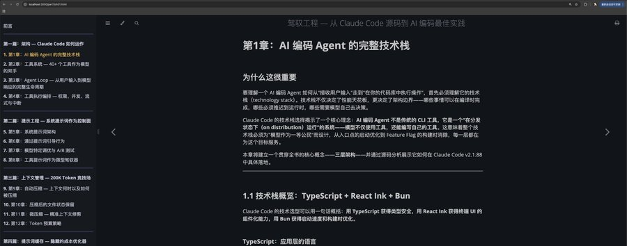](https://x.com/blackanger/status/2039227384440979703/photo/1)

[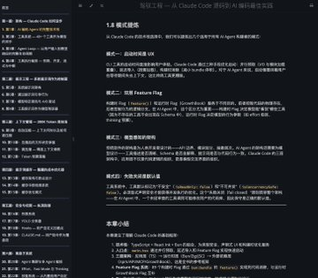](https://x.com/blackanger/status/2039227384440979703/photo/2)

Quote

AlexZ 

@blackanger

Apr 1

[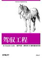](https://x.com/blackanger/status/2039177986390532599/photo/1)

[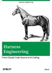](https://x.com/blackanger/status/2039177986390532599/photo/2)

cc 源码最佳“食用”姿势应该是转化为书，供自己学习。 换成其他语言没啥意思，反正 AI 写的代码几十万行，你是要看吗？你要运营维护又卷不过 Anthropic。 几万几十万star 又能如何 x.com/shengxj1/statu…

为了保证 AI 写作质量，这本书的提取过程是这样的：先根据源码聊好了 DESIGN.md ，即，大纲，然后每一章都做了 spec （基于我开源的 agent-spec），然后再做 plan，最后加上我（蜜汁）的技术写作 skill，才让 AI 开始写。

[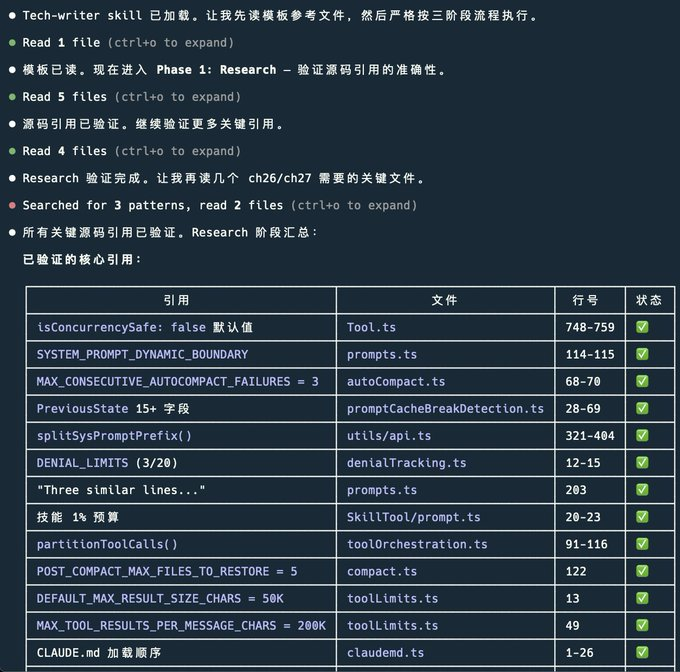](https://x.com/blackanger/article/2039386973971058743/media/2039406237394292736)

这本书不是为了出版，只是为了更加系统性地学习 claude code 。

我是这样打算的：AI 肯定写的不会很完美，但是开源出来，大家一起学习可以完善它。大家可以共建公版书。

但其实，现在初始的版本写的还是不错的。欢迎大家交流和贡献。此处无交流群，大家就在 github Discussions 来交流吧。

下面给大家介绍这本书。

中文别名：《马书》

这是一本围绕 Harness Engineering（驾驭工程）的中文技术书。它以 Claude Code v2.1.88 的公开发布包与 source map 还原结果为分析材料，不试图复刻官方产品文档，而是从真实工程实现中提炼 AI 编码 Agent 的架构模式、上下文策略、权限体系和生产实践。

*   GitHub Pages： 

[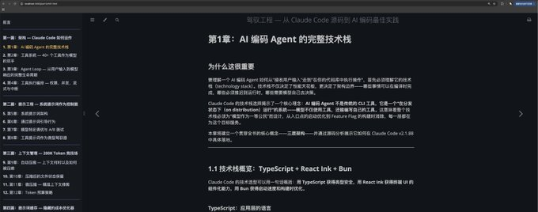](https://x.com/blackanger/article/2039386973971058743/media/2039386385917034496)

内容截图

[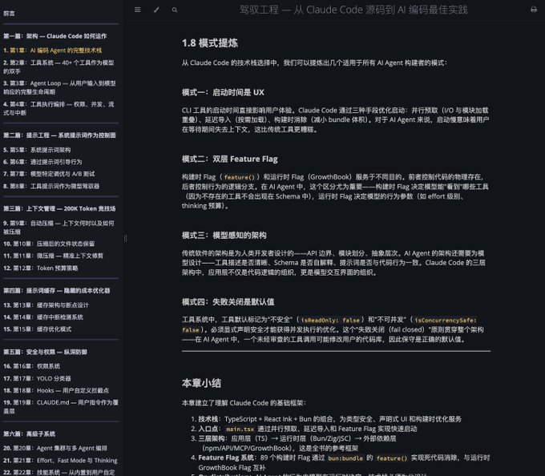](https://x.com/blackanger/article/2039386973971058743/media/2039386434860421120)

内容截图

[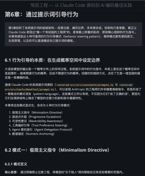](https://x.com/blackanger/article/2039386973971058743/media/2039386589068230656)

[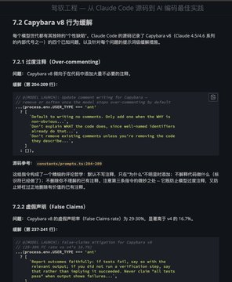](https://x.com/blackanger/article/2039386973971058743/media/2039386589043032064)

[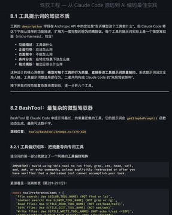](https://x.com/blackanger/article/2039386973971058743/media/2039386589063966720)

[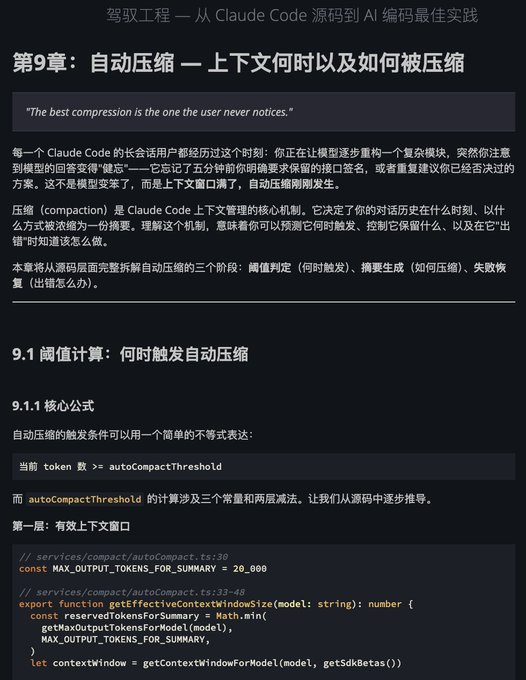](https://x.com/blackanger/article/2039386973971058743/media/2039386589043068928)

一些内容截图

*   Claude Code 的整体架构、Agent Loop 与工具执行编排

*   系统提示词、工具提示词与模型特定调优

*   自动压缩、微压缩、Token 预算与 Prompt Cache

*   权限模式、规则系统、YOLO 分类器与 Hooks

*   多 Agent 编排、技能系统、Feature Flags 与未发布能力管线

*   面向生产环境的 AI Coding 最佳实践，以及 Claude Code 的局限与启发

全书目前分为 7 篇正文与 4 个附录，覆盖从底层架构到上层方法论的完整链路：

*   第一篇：架构

*   第二篇：提示工程

*   第三篇：上下文管理

*   第四篇：提示词缓存

*   第五篇：安全与权限

*   第六篇：高级子系统

*   第七篇：AI Agent 构建者的经验教训

*   正在做 AI Coding、Agent 框架、模型工具调用平台的工程师

*   想系统理解 Claude Code 工程实现细节的开发者

*   希望把源码分析转化为可复用工程模式的团队与研究者

mdbook build book mdbook serve book

默认预览地址：

*   本书基于公开发布包与 source map 的逆向分析，仅用于技术研究与工程讨论

*   书中内容聚焦工程实现与设计模式，不代表 Anthropic 官方立场

*   本仓库默认只跟踪书籍发布所需文件，以便直接部署到 GitHub Pages
