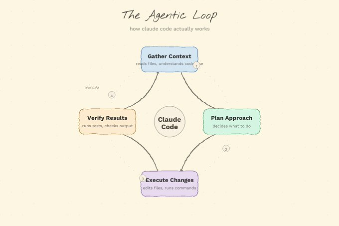
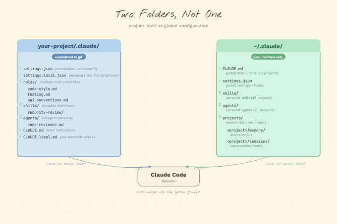
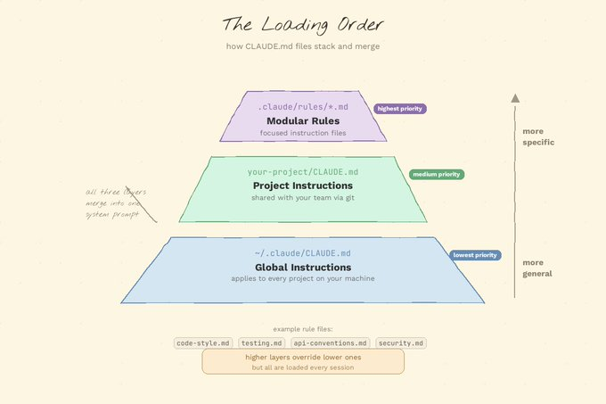
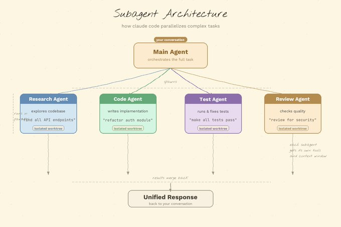
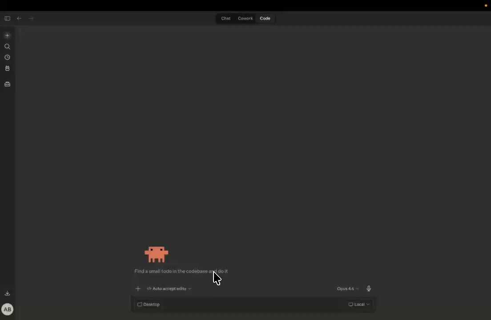
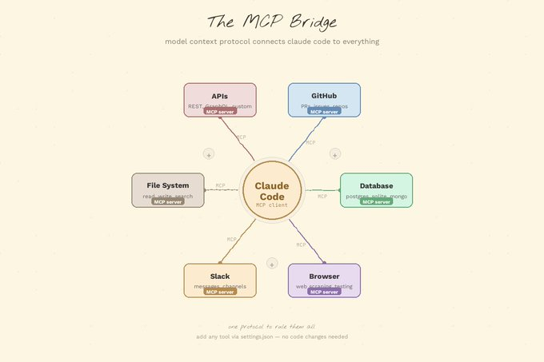
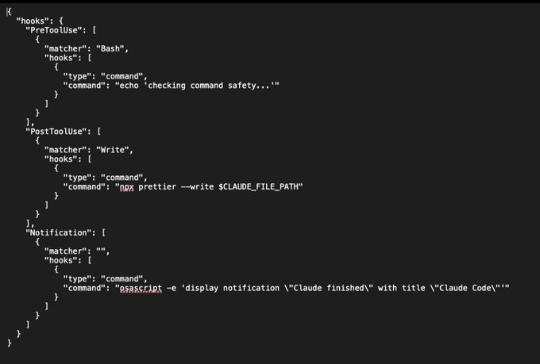
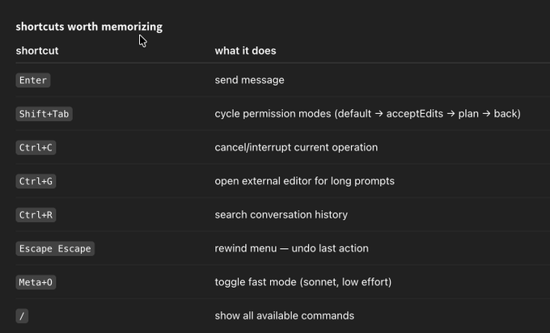
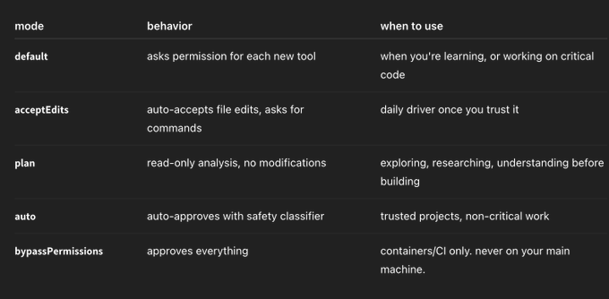

# Axel Bitblaze 🪓 on X: "我使用 Claude Code 两个月学到的所有东西" / X

Title: Axel Bitblaze 🪓 on X: "我使用 Claude Code 两个月学到的所有东西" / X

URL Source: https://x.com/axel_bitblaze69/status/2037978621684621428?s=52&t=jjVOMAzDZNfuD4kcqctqJw

Markdown Content:
现在是 2026 年 3 月，如果你还在把代码复制粘贴到 ChatGPT 里，那我们需要谈谈了。

过去两个月我一直在深度使用 Claude Code。不是随便玩玩——每天都在用，真刀真枪地干。我学了课程、拿了认证、用它做了项目、踩了坑、填了坑、又做了更多东西。我花在跟 Claude 聊天的时间比跟真人聊天的时间还多。

这不是一篇"十大 AI 工具"的水文。这是我学到的一切——没人谈过的功能、真正有效的workflow、浪费我好几个小时的错误、以及帮我省了好几天的技巧。

收藏这篇文章。你会不止一次需要它。

**𝗖𝗹𝗮𝘂𝗱𝗲 𝗖𝗼𝗱𝗲 到底是啥**

先让我纠正最大的误解。Claude Code 不是 Copilot。它不是你粘贴代码进去的聊天机器人。也不是加强版自动补全。

它是一个**智能体**。一个真正自主的智能体，能：

*   阅读你的整个代码库
*   制定方案
*   编辑整个项目中的文件
*   运行测试
*   发现失败并修复
*   迭代直到任务完成

关键词是**自主性**。它以循环方式运作——收集上下文、执行操作、验证结果、重复。你告诉它你想要什么，它来想办法实现。不是你在跟它一起写代码，而是你把事情委托给一个真正理解自己在读什么的东西。

它运行在你的终端里。这不是限制——这才是重点。你的终端是你机器上最强大的界面。Claude Code 在那里跟你会合。

[](https://x.com/Axel_bitblaze69/article/2037978621684621428/media/2037954736113250304)

**𝗖𝗹𝗮𝘂𝗱𝗲 𝗖𝗼𝗱𝗲 的运行场所：**

Claude Code 不再只是 CLI 工具了。它无处不在：

*   **终端**：原汁原味。全力输出。最快。这是魔法发生的地方。
*   **VS Code 扩展**：内联 diff、@提及、侧边栏对话。给那些住在编辑器里的人准备的。
*   **JetBrains 插件**：同样的东西，给 IntelliJ 用户。
*   **桌面应用（Claude Cowork）**：可视化 diff 审查、多会话、定时任务。不需要终端。"我不用命令行"选项。
*   **网页应用（claude.ai/code）**：无需本地配置。随时随地运行长任务。打开浏览器就能用。
*   **通过远程控制实现手机操作**：在笔记本上开始会话，从手机控制。
*   **Slack**：在你的 workspace 里提及，将 issue 转成 PR。
*   **GitHub Actions**：在 PR 评论里触发，它会回复实际的代码变更。
*   **GitLab CI/CD**：对 GitLab 团队同样的概念。

远程控制功能被严重低估了，没人谈它。你在吃午饭，收到 Slack 上关于 bug 的消息，掏出手机，让 Claude 去修。代码运行在家里的机器上。你在手机上审查 diff。批准。搞定。未来已经来了，兄弟们。


**𝗖𝗹𝗮𝘂𝗱𝗲 𝗖𝗼𝗱𝗲 入门**

**安装：**

```
macOS/Linux: curl -fsSL https://claude.ai/install.sh | bash`
Windows: irm https://claude.ai/install.ps1 | iex`
Homebrew: brew install --cask claude-code`
```

**然后：**

```
cd your-project
claude
log in with your anthropic account
start talking to it
```

就这样。没有配置文件。没有安装向导。没有 47 个扩展要装。没有 YAML 地狱。只需要 cd 到你的项目然后输入 claude。

**你首先应该做的事：**

`claude "what does this project do?"`

看它探索你的代码库、阅读文件、理解架构，然后给你一个总结。第一次它正确总结了一个 20000+ 行仓库的那一刻——就是这种感觉。就是这一刻你意识到这不是自动补全。

**𝗧𝗵𝗲 𝗺𝗼𝗱𝗲𝗹𝘀（模型）**

Claude Code 运行在 Anthropic 的 Claude 模型系列上。知道用哪个、什么时候用，这门功课已经学会了一半：

*   **Claude Opus 4.6**：大脑最发达的。推理最强。用于复杂的架构决策、棘手的调试、涉及 10+ 文件的大型重构。当你需要它真正思考的时候用它。
*   **Claude Sonnet 4.6**：主力模型。默认之选。日常编码中速度、成本和质量最佳平衡。这是你的日常座驾。
*   **Claude Haiku**：速度之星。便宜又快。适合简单任务和子智能体。别小看它用于快速提问。

**随时切换模型：**

```
`/model opus` — 遇到难题时在会话中途切换到 opus
`claude --model opus` — 用 opus 开始整个会话
```

我学到这个教训付出了血的代价：让任务难度匹配模型。不要用 opus 重命名一个变量。不要用 haiku 重新设计你的认证系统。第一周我把所有东西都用 opus 因为它"感觉更聪明"，大概浪费了 200 美元。Sonnet 能以同样的质量处理 90% 的任务。

**你还可以独立控制思考深度：**

```
`/effort low` — 快速回答，最少推理。适合"X 的语法是什么？"
`/effort high` — 深度分析，扩展思考。用于调试。
`/effort max` — 全力输出。消耗更多 token，但能捕捉人类漏掉的边缘情况。用于任何要上生产环境的东西。
```

**𝗣𝗿𝗶𝗰𝗶𝗻𝗴（定价，真话）**

**关于钱的问题咱们坦诚相待，因为没人会跟你说这些：**

```
| plan | cost | what you get |
|------|------|-------------|
| 𝗽𝗿𝗼 | $20/mo | claude code access, sonnet + opus, 适合入门 |
| 𝗺𝗮𝘅 𝟱𝘅 | $100/mo | 5x 使用限额，1M 上下文窗口，优先访问 |
| 𝗺𝗮𝘅 𝟮𝟬𝘅 | $200/mo | 20x 限额，速率限制对全天候开发基本消失 |
| 𝘁𝗲𝗮𝗺 | $100/seat/mo (高级) | 集中账单、共享设置、分析 |
| 𝗔𝗣𝗜 | 按 token 付费 | sonnet: $3/$15 per MTok in/out. opus: $15/$75 |
```

Anthropic 自己的真实数据：普通开发者每天大约花 **$6**。90% 的用户每天低于 $12。

这个数据让我下定决心：一位开发者追踪了 8 个月共 100 亿 token。按 API 定价大约是 15000 美元。按 Max 计划？只要 800 美元。如果你每天都在用（你应该每天用），Max 计划到第二周就回本了。

当你在 Max 计划下达到限额时，可以开启"额外用量"按 API 费率计费。没有硬性上限。没有"抱歉，明天再来吧"。

**我希望在第一天就知道的费用管理技巧：**

```
用 sonnet 处理 90% 的任务，opus 只用于难题
用子智能体隔离昂贵操作（后面详述）
`/compact` 当对话变长时手动总结节省上下文 token
`/clear` 在不相关的任务之间清理——不要把 CSS bug 的上下文带到 API 重设计上
保持 CLAUDE.md 精简——臃肿的指令每条消息都会浪费 token
```

**𝗧𝗵𝗲 .𝗰𝗹𝗮𝘂𝗱𝗲 𝗳𝗼𝗹𝗱𝗲𝗿——你的项目控制中心**

这是大多数人对 Claude Code 的使用还停留在 80% 价值以下的原因。.claude 文件夹不是黑箱。它是控制 Claude 在你的项目中行为方式的控制中心。

而且大多数人没意识到的是：**有两个 .claude 目录，不是一个。**

第一个在你的项目内部（提交到 git，与团队共享）。第二个在 ~/.claude/（个人偏好、机器本地状态、会话历史）。

[](https://x.com/Axel_bitblaze69/article/2037978621684621428/media/2037959141877334017)

**𝗖𝗟𝗔𝗨𝗗𝗘.𝗺𝗱：最重要的文件**

当你启动 Claude Code 会话时，它第一个读取的就是 CLAUDE.md。它直接加载到系统提示里。这里面的每一条指令，Claude 都会遵守。每一次会话。始终如一。

如果你告诉 Claude 始终在实现之前写测试，它就会这样做。如果你说"不要用 console.log，用自定义 logger"，它每次都会遵守。

**该怎么写：**

*   构建、测试和 lint 命令（npm run test, make build）
*   关键架构决策（"我们用 turborepo 做 monorepo"）
*   不明显的坑（"TypeScript strict 模式已开启，未使用变量是错误"）
*   import 规范、命名模式、错误处理风格
*   主要模块的文件和文件夹结构

**不要写什么：**

*   属于 linter 或格式化器配置的东西（Prettier 干这个的，不是 CLAUDE.md）
*   你可以链接到的完整文档
*   解释理论的长段落

**保持在 200 行以内。** 超过这个长度的文件开始占用太多上下文，而且 Claude 的指令遵循度实际上会下降。我吃这个亏是因为我 400 行的 CLAUDE.md 被忽略了一半。精简到 150 行，一切变好了。

**一个扎实的 CLAUDE.md 长这样：**

```
Project: Acme API

Commands
npm run dev          # Start dev server
npm run test         # Run tests (Jest)
npm run lint         # ESLint + Prettier check
npm run build        # Production build

Architecture
- Express REST API, Node 20
- PostgreSQL via Prisma ORM
- All handlers live in src/handlers/
- Shared types in src/types/

Conventions
- Use zod for request body validation
- Return shape is always { data, error }
- Never expose stack traces to the client
- Use the logger module, not console.log

Watch out for
- Tests use a real local DB, not mocks. Run `npm run db:test:reset` first
- Strict TypeScript: no unused imports, ever
```

这才 20 行。它给了 Claude 在这个代码库中高效工作所需的一切，不需要反复确认。

**𝗖𝗟𝗔𝗨𝗗𝗘.𝗹𝗼𝗰𝗮𝗹.𝗺𝗱：你的个人覆盖设置**

有时候你有自己的偏好，不是团队的。也许你更喜欢另一个测试运行器。也许你希望 Claude 始终以特定模式打开文件。

在项目根目录创建 CLAUDE.local.md。Claude 会和主 CLAUDE.md 一起读取它，而且它自动被 gitignore，所以你个人的小调整永远不会进入仓库。

**𝗥𝘂𝗹𝗲𝘀/ 文件夹——可扩展的模块化指令**

CLAUDE.md 对单个项目很有效。但一旦团队壮大，你就会得到一个 300 行的 CLAUDE.md，没人维护，每个人都无视它。

rules/ 文件夹解决了这个问题。

.claude/rules/ 里的每个 markdown 文件都会自动和你的 CLAUDE.md 一起加载：

```
.claude/rules/
├── code-style.md
├── testing.md
├── api-conventions.md
└── security.md
```

每个文件保持专注。负责 API 规范的人编辑 api-conventions.md。负责测试标准的人编辑 testing.md。谁也不会踩到谁。

真正的力量来自**路径范围的规则**。添加 YAML frontmatter，规则只会在 Claude 处理匹配文件时激活：

```
---
paths:
  - "src/api/**/*.ts"
  - "src/handlers/**/*.ts"
---
```

𝗔𝗣𝗜 𝗗𝗲𝘀𝗶𝗴𝗻 𝗥𝘂𝗹𝗲𝘀

*   All handlers return { data, error } shape

*   Use zod for request body validation

*   Never expose internal error details to clients

Claude 在编辑 React 组件时根本不会加载这个。只有在 src/api/ 或 src/handlers/ 下工作时才会触发。干净、专注、高效。

[](https://x.com/Axel_bitblaze69/article/2037978621684621428/media/2037959703632986112)

**𝗧𝗵𝗲 𝗳𝗲𝗮𝘁𝘂𝗿𝗲𝘀 𝘁𝗵𝗮𝘁 𝗰𝗵𝗮𝗻𝗴𝗲𝗱 𝗵𝗼𝘄 𝗜 𝘄𝗼𝗿𝗸（改变我工作方式的功能）**

**多文件编辑**

这就是 Claude Code 把其他所有工具远远甩在身后的地方。这是让我停止用其他工具做正经工作的功能。

`claude "refactor the authentication system to use JWT tokens instead of sessions"`

它会：

*   找到所有涉及 auth 的文件
*   更新中间件
*   修改路由
*   改动测试
*   更新配置
*   修复 import

一次会话跨 15+ 个文件。应用之前向你展示 diff 供审查。你批准、拒绝或对每个文件提出修改意见。

我曾经在一个会话里把整个 Express 应用从回调重构为 async/await。23 个文件。每一个都正确。用 tab 补全做做看？

**𝗚𝗶𝘁 集成**

Claude Code 原生支持 git，而且它的 commit 信息写得比我共事过的大多数人都好：

```
claude "commit my changes with a descriptive message"
claude "create a PR for this feature"
claude "help me resolve these merge conflicts"
claude "show me what changed in the last 5 commits and explain the impact"
```

它写的是proper commit 信息——不是"fixed stuff"，而是关于什么变了、为什么变的真实描述。它创建带摘要和测试计划的 PR。它通过真正理解两边代码来处理合并冲突，而不是选一边然后碰运气。

**𝗧𝗵𝗲 𝗮𝗴𝗲𝗻𝘁𝗶𝗰 𝗹𝗼𝗼𝗽（自主循环）：写→测→修→重复**

Claude 不只是写代码——它运行代码：

`写一个函数 → 运行测试 → 发现失败 → 读取错误 → 修复 bug → 再次运行测试 → 全部绿灯`

这个循环才是关键。它不是"给你一些代码，祝你好运"。而是"我写了，测了，修了你想不到的边缘情况，然后通过了。"我曾经看着它在自己写的代码里捉到 bug，那个 bug 我自己要好几个小时才能发现。

**𝗦𝘂𝗯𝗮𝗴𝗲𝗻𝘁𝘀——没人谈的游戏规则改变者**

这个功能我花了 3 周才开始正确使用，我后悔每一天没有早点用。

Claude 可以生成专门的子智能体来处理特定任务，与主会话隔离：

*   **𝗲𝘅𝗽𝗹𝗼𝗿𝗲 𝗮𝗴𝗲𝗻𝘁**：只读研究，快速，用 haiku。完美适合"去理解这个模块是怎么工作的"。
*   **𝗽𝗹𝗮𝗻 𝗮𝗴𝗲𝗻𝘁**：实现之前分析。"动手之前先思考"的强制执行者。
*   **𝗴𝗲𝗻𝗲𝗿𝗮𝗹 𝗮𝗴𝗲𝗻𝘁**：复杂多步任务，干净上下文。

为什么这很重要：当你让 Claude 运行完整测试套件时，输出数百行的是/否结果……会淹没你的上下文窗口。你的主对话被噪音污染了。子智能体在隔离环境中处理。它做那些脏活，压缩发现结果，然后返回干净的摘要。

[](https://x.com/Axel_bitblaze69/article/2037978621684621428/media/2037960517990637568)

你也可以为你的特定工作流创建自定义智能体：

```
.claude/agents/security-reviewer.md
---
name: security-reviewer
description: Expert code reviewer for security vulnerabilities. Use PROACTIVELY when reviewing PRs or before deployments.
model: sonnet
tools: Read, Grep, Glob
---

You are a senior security engineer. When reviewing code:
- Flag bugs, not just style issues
- Check for SQL injection and XSS risks
- Look for exposed credentials or secrets
- Check authentication and authorization gaps
- Note performance concerns only when they matter at scale
```

现在 Claude 会在相关时自动将安全审查委托给你的自定义智能体。或者你可以显式调用：输入 /security-reviewer 它就会启动。

tools 字段是有意的——安全审计者只需要 Read、Grep 和 Glob。它没有任何理由写文件。model 字段让你用 haiku 处理廉价的只读任务，把 opus 省给真正需要深度推理的场景。

个人智能体放在 ~/.claude/agents/，可以在所有项目中用。



**𝗠𝗖𝗣（𝗠𝗼𝗱𝗲𝗹 𝗖𝗼𝗻𝘁𝗲𝘅𝘁 𝗣𝗿𝗼𝘁𝗼𝗰𝗼𝗹）——秘密武器**

这就是 Claude Code 从"不错的编码助手"升级为"我整个工作流的编排层"的地方。

𝗠𝗖𝗣 让𝗖𝗹𝗮𝘂𝗱𝗲 能连接外部工具和服务：

*   **𝗚𝗶𝘁𝗛𝘂𝗯**：搜索仓库、阅读 issue、管理 PR、审查代码
*   **𝗦𝗹𝗮𝗰𝗸**：读取频道、发布消息、回复线程
*   **𝗣𝗼𝘀𝘁𝗴𝗿𝗲𝘀/𝗠𝘆𝗦𝗤𝗟**：直接查询数据库
*   **𝗝𝗶𝗿𝗮**：更新工单、修改状态
*   **𝗙𝗶𝗴𝗺𝗮**：读取设计稿（真的，没开玩笑）
*   **𝗣𝘂𝗽𝗽𝗲𝘁𝗲𝗲𝗿/𝗣𝗹𝗮𝘆𝘄𝗿𝗶𝗴𝗵𝘁**：浏览器自动化
*   **𝗦𝗲𝗻𝘁𝗿𝘆**：错误监控
*   **𝗡𝗼𝘁𝗶𝗼𝗻**：读写文档

在项目根目录的 .mcp.json 里配置：

```
{
  "mcpServers": {
    "github": {
      "type": "stdio",
      "command": "npx",
      "args": ["-y", "@modelcontextprotocol/server-github"],
      "env": {
        "GITHUB_PERSONAL_ACCESS_TOKEN": "your_token"
      }
    }
  }
}
```

**𝗡𝗼𝘄 𝘆𝗼𝘂 𝗰𝗮𝗻 𝗱𝗼 𝘁𝗵𝗶𝗻𝗴𝘀 𝗹𝗶𝗸𝗲（现在你可以做这样的事情）：**

```
claude "find all open bugs in our github repo tagged 'critical' and summarize them"
claude "query the database for users who signed up this week and post the count to #metrics on slack"
claude "check sentry for the top 5 errors this week and create github issues for each one"
```

一个工具，连接到一切。我让 Claude 在一次对话里拉 GitHub issue、读取我的数据库、发摘要到 Slack。不切换标签页。不切换上下文。不在工具之间复制粘贴。

[](https://x.com/Axel_bitblaze69/article/2037978621684621428/media/2037960839433748480)

**𝗛𝗼𝗼𝗸𝘀——确定性自动化**

关于 CLAUDE.md 指令的事情是——它们只是建议。Claude 大多数时候遵循，但不是所有时候。你不能依赖一个语言模型总是运行你的 linter。总是格式化你的代码。总是检查危险命令。

hooks 让这些行为**确定性**的。它们是在 Claude 工作流的特定时刻自动触发的事件处理器。你的 shell 脚本每次都会运行，没有例外。

**你最会用的事件：**

*   **𝗣𝗿𝗲𝗧𝗼𝗼𝗹𝗨𝘀𝗲**：在任何工具运行之前触发。你的安全门。在这儿拦截危险命令。
*   **𝗣𝗼𝘀𝘁𝗧𝗼𝗼𝗹𝗨𝘀𝗲**：工具成功之后触发。自动格式化、自动 lint、自动验证。
*   **𝗦𝘁𝗼𝗽**：Claude 完成一项任务时触发。质量门。"测试必须通过才算完成"。
*   **𝗨𝘀𝗲𝗿𝗣𝗿𝗼𝗺𝗽𝘁𝗦𝘂𝗯𝗺𝗶𝘁**：你按回车时触发。提示验证。
*   **𝗡𝗼𝘁𝗶𝗳𝗶𝗰𝗮𝘁𝗶𝗼𝗻**：Claude 需要你注意时的桌面通知。

这是一个真实的 hooks 配置，auto-format Claude 处理的每个文件并拦截危险的 bash 命令：

```
{
  "hooks": {
    "PostToolUse": [
      {
        "matcher": "Write|Edit|MultiEdit",
        "hooks": [
          {
            "type": "command",
            "command": "jq -r '.tool_input.file_path' | xargs npx prettier --write 2>/dev/null"
          }
        ]
      }
    ],
    "PreToolUse": [
      {
        "matcher": "Bash",
        "hooks": [
          {
            "type": "command",
            "command": "$CLAUDE_PROJECT_DIR/.claude/hooks/bash-firewall.sh"
          }
        ]
      }
    ]
  }
}
```

bash 防火墙脚本从 stdin 读取命令，检查危险模式（rm -rf, git push --force, DROP TABLE），然后以退出码 2 阻止。退出码 0 = 放行。退出码 1 = 警告但继续。退出码 2 = 完全阻止。

一个 Stop hook 运行 npm test 并在失败时以退出码 2 退出，会阻止 Claude 在套件不绿的情况下宣布"完成了"。不再有"我好了！"但 3 个测试还在失败的情况。

hooks 不会在会话中热重载，改了要重启。而且它们以你的完整用户权限运行，所以要引用你的 shell 变量并验证 JSON 输入。

[](https://x.com/Axel_bitblaze69/article/2037978621684621428/media/2037973574066282496)

**𝗦𝗸𝗶𝗹𝗹𝘀——按需调用的可复用工作流**

skills 是让我意识到这个兔子洞有多深的功能。

skill 是一个工作流，Claude 可以根据上下文自主调用，或者你可以用斜杠命令触发。skills 监控对话并在恰当的时刻行动。

**𝗘𝗮𝗰𝗵 𝘀𝗸𝗶𝗹𝗹 𝗹𝗶𝘃𝗲𝘀 𝗶𝗻 𝗶𝘁𝘀 𝗼𝘄𝗻 𝘀𝘂𝗯𝗱𝗶𝗿𝗲𝗰𝘁𝗼𝗿𝘆 𝘄𝗶𝘁𝗵 𝗮 𝗦𝗞𝗜𝗟𝗟.𝗺𝗱 𝗳𝗶𝗹𝗲：**

```
.claude/skills/
├── security-review/
│   ├── SKILL.md
│   └── DETAILED_GUIDE.md
└── deploy/
    ├── SKILL.md
    └── templates/
        └── release-notes.md
```

**𝗧𝗵𝗲 𝗦𝗞𝗜𝗟𝗟.𝗺𝗱 𝘂𝘀𝗲𝘀 𝗬𝗔𝗠𝗟 𝗳𝗿𝗼𝗻𝘁𝗺𝗮𝘁𝘁𝗲𝗿 𝘁𝗼 𝗱𝗲𝘀𝗰𝗿𝗶𝗯𝗲 𝘄𝗵𝗲𝗻 𝘁𝗼 𝗮𝗰𝘁𝗶𝘃𝗮𝘁𝗲：**

Analyze the codebase for security vulnerabilities:

1.   SQL injection and XSS risks

2.   Exposed credentials or secrets

3.   Insecure configurations

4.   Authentication and authorization gaps

Report findings with severity ratings and specific remediation steps. Reference security-standards.md for our security standards.

当你 说"审查这个 PR 的安全问题"时，Claude 读取描述，识别到匹配，然后自动调用 skill。或者你直接调用：/security-review。

skill 和命令的关键区别：**skills 可以 bundl e 辅助文件。**reference security-standards.md 会拉取一个 DETAILED_GUIDE.md，那是和 SKILL.md 在同一目录的详细文档。命令是单文件。skills 是包。

那个在 X 上走红的 /last30days skill 就是一个完美例子——有人构建了一个 skill，扫描过去 30 天任何主题的 Reddit 和 X，综合社区已经摸索出来的东西，然后给你写好可用的提示。输入 /last30days prompting techniques for legal questions，它返回真正的律师和高级用户实际在用的框架。这就是你用 skills 可以构建的东西。

个人 skills 放在 ~/.claude/skills/，可在所有项目中使用。

**𝗣𝗹𝗮𝗻 𝗺𝗼𝗱𝗲——建造之前先思考**

这个功能把我从自己的冲动中拯救了无数次，多到数不清。

**𝗕𝗲𝗳𝗼𝗿𝗲 𝘆𝗼𝘂 𝗹𝗲𝘁 𝗖𝗹𝗮𝘂𝗱𝗲 𝗹𝗼𝗼𝘀𝗲 𝗼𝗻 𝗮 𝗯𝗶𝗴 𝗿𝗲𝗳𝗮𝗰𝘁𝗼𝗿（在你让 Claude 放开手脚做大重构之前）：**

```
按两次 `Shift+Tab` 进入 plan 模式
claude "analyze the database layer and propose a migration to TypeORM"
```

Claude 探索你的代码库，读取相关文件，分析架构，然后给出计划。不做任何修改。不改动任何东西。只有分析和提议方案。

你审查它。调整它。提问。找漏洞。然后当你有信心了，批准，让它实施。

这防止了"Claude 重写了我整个项目，但我没要求它这么做"的时刻。相信我，那个时刻一点都不好玩。先计划，再建造。永远如此。

**𝗠𝗲𝗺𝗼𝗿𝘆 𝘀𝘆𝘀𝘁𝗲𝗺——你用得越多，它就越聪明**

Claude 会跨会话记住事情。自动地。

纠正它一次——"这个项目不要用 class components，我们用 hooks"——它就会保存那个偏好。下次会话，它已经知道了。你不用重复自己。

用 /memory 管理。存储在 ~/.claude/projects/<project>/memory/。

CLAUDE.md（团队知识）+ 自动记忆（个人学习）的组合意味着 **Claude 会复利增长**。你用得越多，它就越好用。同一项目第一周的 Claude 和第八周的 Claude 是完全不同的两种动物。

**𝗖𝗼𝗺𝗽𝘂𝘁𝗲𝗿 𝘂𝘀𝗲**

这个功能在 2026 年 3 月刚推出，它很野。

Claude 现在可以直接控制你的电脑了：

*   打开应用程序
*   操控浏览器
*   填写电子表格
*   与任何 GUI 交互
*   截图并对看到的内容做出反应

无需设置。通过远程控制从手机也能用。

我还没深入研究这个——还在实验。但它蕴含的可能性是疯狂的。想象一下告诉 Claude "打开 Figma，截屏最新设计，然后用 React 实现出来"。我们正在接近那一天。

**𝗣𝗼𝘄𝗲𝗿 𝘂𝘀𝗲𝗿 𝘄𝗼𝗿𝗸𝗳𝗹𝗼𝘄𝘀（高级用户工作流）**

这些模式让我从"使用 Claude Code"进化到"用 Claude Code 搞事情"。这些都不是文档里写的。

**𝗧𝗵𝗲 "𝗶𝗻𝘁𝗲𝗿𝘃𝗶𝗲𝘄 𝗺𝗲" 𝘁𝗲𝗰𝗵𝗻𝗶𝗾𝘂𝗲（"采访我"技巧）**

要启动一个复杂项目？别写一个巨大的 prompt。别试图一开始就想到所有事情。就说：

`claude "interview me in detail about what i want to build"`

让 Claude 向你提问。它会问技术栈、需求、边缘情况、现有代码、部署目标、用户类型——那些你会在 prompt 里忘记提到的东西。10 分钟的来回给 Claude 的上下文比 500 字的 prompt 好得多。

我现在每个新功能都用这个。每一个。

**𝗧𝗵𝗲 𝗿𝗲𝘀𝗲𝗮𝗿𝗰𝗵 → 𝗶𝗺𝗽𝗹𝗲𝗺𝗲𝗻𝘁 𝘀𝗽𝗹𝗶𝘁（研究→实现拆分）**

永远不要让 Claude 实现它还不理解的东西。

```
阶段 1: 按两次 `Shift+Tab` → plan 模式 → `"explore the codebase and understand how payments work"`
审查分析。确保它真的理解了。
阶段 2: `"implement subscription billing based on your analysis"`
```

"直接开干"和"先理解，再开干"的质量差异天差地别。在遗留代码库里尤其如此，因为没有任何东西在你期望的位置。

**𝗣𝗮𝗿𝗮𝗹𝗹𝗲𝗹 𝘄𝗼𝗿𝗸 𝘄𝗶𝘁𝗵 𝘄𝗼𝗿𝗸𝘁𝗿𝗲𝗲𝘀（用 worktree 并行工作）**

```
终端 1: `claude --worktree auth-feature`
终端 2: `claude --worktree billing-feature`
```

每个获得一个隔离的 git 分支。两个独立 Claude 会话同时开发两个功能。准备好了再合并。

我有时候跑 3 个 worktree。终端 1 跑 auth feature，终端 2 跑 API endpoint，终端 3 跑测试套件。全并行。全隔离。生产力是真的离谱。

**𝗧𝗵𝗲 𝗰𝗼𝗻𝘁𝗲𝘅𝘁 𝗺𝗮𝗻𝗮𝗴𝗲𝗺𝗲𝗻𝘁 𝗴𝗮𝗺𝗲（上下文管理策略）**

**这是 #1 技能，把普通 Claude Code 用户和高级用户区分开来。**

上下文窗口大约 200K token。听起来很多。当你深入一个会话时就不是了。随着它被填满：

*   旧的工具输出先被清除
*   对话被自动总结
*   早期的指令可能会丢失

**𝗔𝗰𝘁𝗶𝘃𝗲𝗹𝘆 𝗺𝗮𝗻𝗮𝗴𝗲 𝗶𝘁（主动管理它）：**

```
`/compact` — 手动总结对话以节省空间
`/clear` — 在不相关任务之间全新开始
`/cost` — 看看什么在消耗你的 token 以及消耗在哪里
用子智能体处理冗长操作（测试输出、日志分析、大文件读取）
把重复性指令放在 CLAUDE.md 里，不要放在对话里
```

**黄金法则：尝试两次都失败了，就停下来。别继续。** /clear 然后从头写一个更好的初始 prompt。带着清晰 prompt 的全新上下文几乎总是比被失败方法污染的上下文效果好得多。我为此浪费了大约 6 小时才学会这个教训。

**𝗧𝗵𝗲 ! 𝗽𝗿𝗲𝗳𝗶𝘅 𝘁𝗿𝗶𝗰𝗸（! 前缀技巧）**

**在任何命令前加 ! 就能直接在 shell 里运行，不需要 Claude：**

```
!git status
!npm test
!cat src/config.ts
```

输出自动添加到 Claude 的上下文里。非常适合快速向 Claude 展示正在发生什么，而不用让它运行命令然后等待权限提示。

**𝗘𝘅𝘁𝗲𝗿𝗻𝗮𝗹 𝗲𝗱𝗶𝘁𝗼𝗿 𝗳𝗼𝗿 𝗹𝗼𝗻𝗴 𝗽𝗿𝗼𝗺𝗽𝘁𝘀（长 prompt 用外部编辑器）**

Ctrl+G 打开你的系统编辑器（vim、VS Code，随你怎么配置的）。用语法高亮写复杂的多行 prompt。保存关闭——发送给 Claude。

比在单行终端输入里打一大段字好多了。我现在每个超过 2 句的 prompt 都用这个。

**𝗧𝗵𝗲 𝗱𝗼𝘂𝗯𝗹𝗲-𝗲𝘀𝗰𝗮𝗽𝗲 𝗿𝗲𝘄𝗶𝗻𝗱（双击 Escape 回退）**

这个很关键，没人提过。

Claude 走错方向了？双击 Escape，会出现回退菜单。你可以撤销上一个操作、往回更多步、或者"Summarize from here"——压缩失败的尝试同时保留有用的上下文。比 /clear 好多了，因为不会失去一切，只失去错误的部分。

[](https://x.com/Axel_bitblaze69/article/2037978621684621428/media/2037947336899665920)

把这张表打印出来。贴到显示器上。说真的。

**𝗣𝗲𝗿𝗺𝗶𝘀𝘀𝗶𝗼𝗻 𝗺𝗼𝗱𝗲𝘀（权限模式）**

Claude Code 有不同的自主级别。知道什么时候用哪一种很重要：

[](https://x.com/Axel_bitblaze69/article/2037978621684621428/media/2037947627908833280)

从 default 开始。一旦信任它了（我大约花了一周），移到 acceptedEdits。做大型重构之前用 plan 做探索。

**𝗬𝗼𝘂 𝗰𝗮𝗻 𝗮𝗹𝘀𝗼 𝘄𝗵𝗶𝘁𝗲𝗹𝗶𝘀𝘁 𝗮𝗻𝗱 𝗯𝗹𝗮𝗰𝗸𝗹𝗶𝘀𝘁 𝘀𝗽𝗲𝗰𝗶𝗳𝗶𝗰 𝗰𝗼𝗺𝗺𝗮𝗻𝗱𝘀 𝗶𝗻 .𝗰𝗹𝗮𝘂𝗱𝗲/𝘀𝗲𝘁𝘁𝗶𝗻𝗴𝘀.𝗷𝘀𝗼𝗻：**

```
{
  "permissions": {
    "allow": [
      "Bash(npm run *)",
      "Bash(git status)",
      "Bash(git diff *)",
      "Read",
      "Write",
      "Edit"
    ],
    "deny": [
      "Bash(rm -rf *)",
      "Bash(curl *)",
      "Read(./.env)",
      "Read(./.env.*)"
    ]
  }
}
```

allow 列表不用问直接跑。deny 列表完全阻止。两者都没列的，Claude 先问。这块中间地带是刻意设计的。安全网但不管得太细。

**𝗖𝗹𝗮𝘂𝗱𝗲 𝗖𝗼𝗱𝗲 𝘃𝘀 𝗖𝘂𝗿𝘀𝗼𝗿 𝘃𝘀 𝗖𝗼𝗽𝗶𝗹𝗼𝘁**

**最诚实的对比。没有 fanboy 能量。只是我的真实体验：**

**𝗖𝗹𝗮𝘂𝗱𝗲 𝗖𝗼𝗱𝗲**：终端原生，真正自主。读取你整个代码库。自主多文件修改。最佳使用场景：复杂重构、架构决策、全代码库变更、调试棘手问题、涉及 3+ 个文件的一切。感觉像一个冷静的资深工程师，从不疲倦，从不评判你的代码。

**𝗖𝘂𝗿𝘀𝗼𝗿**：IDE 原生（VS Code 分支）。日常驾驶舱最佳选择，tab 补全和内联建议。在编辑器里反馈循环更紧。自主性较低但小改动更快。最佳使用场景：快速编辑、内联补全、写代码时保持心流。

**𝗚𝗶𝘁𝗛𝘂𝗯 𝗖𝗼𝗽𝗶𝗹𝗼𝘁**：插件方式。免费额度最好（$10/mo）。企业选择最安全。自主能力在提升但仍落后于 Claude Code 和 Cursor。

这里大多数人都没意识到的事情是：**你不必选一个。**

组合策略是真实存在的，而且大多数高级用户实际上就是这么做的。Cursor 做日常 tab 补全和内联编辑。Claude Code 做重活——重构、新功能、调试、架构决策。

数据也支持这个结论：经验丰富的开发者平均使用 **2.3 个 AI 编码工具**。不是用一个替代另一个，而是用对的工具做对的事。

Claude Code 在不到一年的时间里从零成为 **#1 最受欢迎的 AI 编码工具**。2026 年初的调查中，46% 的开发者给它评最喜欢。95% 的开发者现在每周使用 AI 工具。75% 的人用 AI 做超过一半的编码工作。

游戏已经变了。永久地。问题不再是"要不要用 AI 编码工具"，而是"你能多快掌握它们"。

𝗖𝗹𝗮𝘂𝗱𝗲 𝗖𝗼𝗱𝗲 生态系统

社区在 Claude Code 之上已经构建了大量的工具。以下是值得知道的：

**𝗦𝘂𝗽𝗲𝗿𝗽𝗼𝘄𝗲𝗿𝘀（obra/superpowers）**：一套面向 AI 编码智能体的完整开发方法论。GitHub 上 117K+ star。它改变了你的智能体写代码的方式——强制它先头脑风暴、创建详细实施计划、启动子智能体驱动开发、做两阶段代码审查后才宣布完成。如果你觉得 Claude Code 有时候产出的是"意大利面条代码"，这就是解药。

**𝗚𝗦𝗗——𝗚𝗲𝘁 𝗦𝗵𝗶𝘁 𝗗𝗼𝗻𝗲（gsd-build/get-shit-done）**：面向 Claude Code 的元提示和上下文管理系统。轻量但强大。解决了上下文退化问题。

**𝗮𝘄𝗲𝘀𝗼𝗺𝗲-𝗰𝗹𝗮𝘂𝗱𝗲-𝗰𝗼𝗱𝗲**：社区策划的 Claude Code 最优质资源集合——skills、智能体、MCP 服务器等。你探索外面有什么的起点。

**/𝗹𝗮𝘀𝘁𝟯𝟬𝗱𝗮𝘆𝘀 𝘀𝗸𝗶𝗹𝗹**：那个在 X 上走红的 skill。扫描过去 30 天任何主题的 Reddit、X、YouTube、Hacker News 和整个网络。综合社区知识为可直接使用的提示。输入 /last30days cold email frameworks，它给你找到 3Ps framework、ADA、intention-based triggers——这些东西你自己永远找不到。然后基于真正有效的东西给你写好可用的提示。开源，MIT 许可证。

**𝗖𝗹𝗮𝘂𝗱𝗲 𝗵𝗼𝘄-𝘁𝗼**：视觉化、示例驱动的 Claude Code 精通指南。视觉型学习者想要结构化教程的最佳资源。

**𝗖𝗹𝗮𝘂𝗱𝗲 𝗺𝗲𝗺**：持久记忆层。如果内置记忆系统不够你用的话。

**𝗨𝗜 𝗨𝗫 𝗽𝗿𝗼 𝗺𝗮𝘅**：面向 Claude Code 的设计专注工具。当你想让 Claude 关心东西长什么样，而不只是关心它怎么运作的时候用它。

**𝗻𝟴𝗻-𝗠𝗖𝗣**：把 Claude Code 连接到 n8n 工作流自动化。如果你已经在用 n8n，这是毫无疑问的集成。

生态系统增长很快。每周都有新工具。以上是我实际用过或见过产生真实结果的。不是每个东西的精心挑选列表，只是现在真正重要的那些。

常见错误（我都犯过）

**1. 在 CLAUDE.md 里写小说** 保持 200 行以内。具体的。可执行的。如果 Claude 忽视你的指令，你的 CLAUDE.md 可能太长了。我有一个 400 行的 CLAUDE.md 简直是一份宣言。精简到 150 行，一切改善了。

**2. 任务之间不用 /𝗰𝗹𝗲𝗮𝗿** 关于修复 CSS bug 的对话对于实现新 API endpoint 没有任何有用的上下文。剩余的上下文实际上会损害性能。清理它。全新开始。每次都这样。

**3. 与之对抗而不是重启** 尝试两次都失败了，上下文被错误方法污染了。Claude 开始引用它自己的错误。/clear 然后写一个更好的 prompt。带着清晰 prompt 的全新上下文几乎总是效果好得多。我为此浪费了大约 6 小时才学会这个教训。

**4. 不用子智能体** 在你的主对话里运行完整测试套件用数百行的输出淹没上下文。委托给子智能体。保持你的主对话干净，专注在真正的工作上。

**5. 所有东西都用 opus** Sonnet 能以同样的质量处理 90% 的任务。opus 只用于那真正需要深度推理的 10%——复杂架构、棘手调试、微妙逻辑错误。你的钱包会感谢你。我的就感谢了。

**6. 大改动时忽略 plan 模式** 任何涉及 3+ 个文件的都要先计划。始终如此。你花在审查计划的 5 分钟，会在 Claude 走错方向时为你节省 2 小时的清理工作。

**7. 不主动管理上下文** 上下文窗口是一种资源。像资源一样对待它。当它变长时用 /compact。冗长操作交给子智能体。用 CLAUDE.md 放指令而不是每个会话都重复。那些管理上下文好的人得到了显著更好的结果，比那些不管理的。

总结

Claude Code 不是一种工具。它是一个队友。

一个读你整个代码库的家伙。遵守你的编码标准。运行你的测试。创建你的 PR。记住你的偏好。连接到你的所有工具。而且你用得越多，它就越好。

我已经这样做了两个月。我学了课程、拿了认证、每天做项目。而且我可以绝对自信地告诉你：那些学会与 Claude Code 一起工作的开发者，而不只往它里面粘贴代码的，正在以前所未有的速度发布。

现在是 2026 年。你有机会使用一个 AI 智能体，它能自主导航一个 50000 行的代码库、进行精准的多文件修改、运行你的测试、修复它自己的 bug，并创建带文档的 pull request。你的祖先会梦想拥有这个。

停止收藏关于 AI 的文章。开始用它来构建。

如果这帮到了你，分享给还在往 ChatGPT 复制粘贴的人。他们比你更需要这个。

找到我
