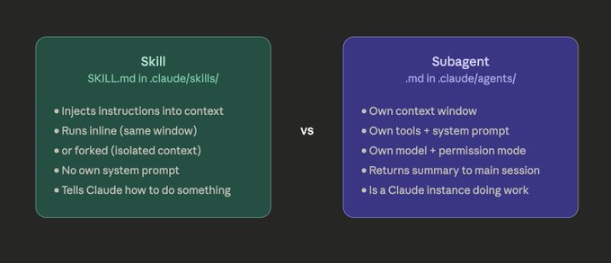
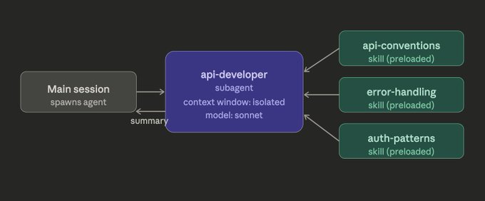
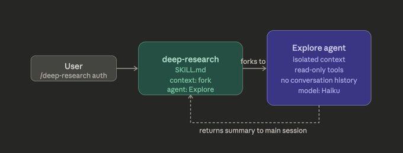
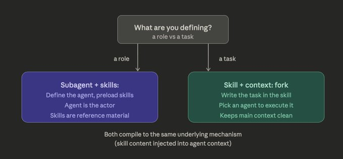

# Daniel San on X: "Skills can use subagents, Subagents can use skills" / X

Title: Daniel San on X: "Skills can use subagents, Subagents can use skills" / X

URL Source: https://x.com/dani_avila7/status/2041185537172607014?s=52&t=jjVOMAzDZNfuD4kcqctqJw

Markdown Content:
I started using subagents in Claude Code to isolate context from the main session.

Complex tasks were polluting the conversation window, consuming tokens, and making Claude progressively worse at reasoning. Spawning a subagent to do the heavy lifting and return only the summary fixed that immediately.

Then skills showed up 😨... I started building libraries of context, conventions, patterns, domain knowledge, and injecting them into Claude's tasks on demand.

[](https://x.com/dani_avila7/article/2041185537172607014/media/2041164957799317504)

Now both exist at the same time, and they can reference each other. A subagent can preload skills. A skill can delegate to a subagent.

They're not interchangeable, each pattern solves a different problem. Here's how to use them together to design better workflows in Claude Code 👇

Use this when you're defining a role, a specialized agent that needs domain knowledge available from the first turn, before any task runs.

The skills: field in the subagent frontmatter injects the full content of each listed skill directly into the subagent's context at startup. It doesn't wait for auto-discovery. The knowledge is already there.

markdown

```
---
name: api-developer
description: Implements API endpoints following team conventions.
model: sonnet
tools: Read, Write, Edit, Bash
skills:
  - api-conventions
  - error-handling-patterns
  - auth-patterns
---

You are a senior backend engineer.
Implement endpoints following the preloaded conventions.
```

The subagent is the actor. The skills are its reference material, baked in, not discovered on demand.

You have a recurring role that always needs the same domain context:

[](https://x.com/dani_avila7/article/2041185537172607014/media/2041166776159838208)

*   A code reviewer that always loads your style guide.

*   A migration agent that always loads your schema conventions.

*   A deployment agent that always loads your infra runbook

Use this when you have a task, something specific and verbose enough that running it inline would pollute your main conversation window.

The context: fork field in the skill frontmatter spawns a subagent, the skill content becomes the task prompt.

The agent: field picks which subagent type executes it. The subagent runs in isolation, does the work, returns a summary. Your main context stays clean.

markdown

```
---
name: deep-research
description: Research a topic thoroughly across the codebase.
context: fork
agent: Explore
---

Research $ARGUMENTS thoroughly:
1. Find all relevant files and patterns
2. Identify how this is used across the project
3. Summarize findings with file references
```

One important constraint from the docs: context: fork only makes sense for skills with explicit instructions.

If your skill contains guidelines without a task, the subagent receives the guidelines but no actionable prompt, and returns without meaningful output.

you already have a skill and want it to run in isolation without creating a full agent file, the skill is the unit of reuse. The fork is just the execution context.

[](https://x.com/dani_avila7/article/2041185537172607014/media/2041168101799268352)

Subagent with skills: you're defining a role that needs domain knowledge baked in. The agent is the long-lived actor; skills are its reference material.

Skill with context: fork you have a task that's too verbose or expensive to run inline. You want isolation without creating a full agent file.

[](https://x.com/dani_avila7/article/2041185537172607014/media/2041169752391929856)

if you're building something new, just make an agent. context: fork is for when you already have a skill and want to run it in isolation without duplicating it into a separate agent file.

Also worth knowing: with skills in a subagent, the subagent controls the system prompt and loads skill content. With context: fork in a skill, the skill content is injected into the agent you specify. Both use the same underlying system Been posting about Claude Code agent design parameters, skills, subagents, hooks, context isolation Follow if you're building agentic systems and want the pattern breakdowns as I work through them