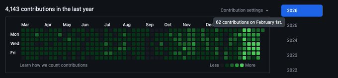
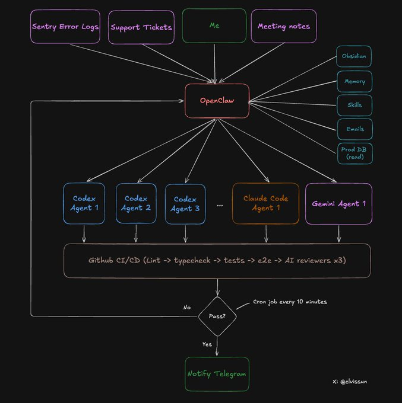

# OpenClaw + Codex/ClaudeCode Agent Swarm：单人开发团队完整方案

我不再直接使用 Codex 或 Claude Code 了。

我使用 OpenClaw 作为我的编排层。我的协调者 Zoe 生成 agents、编写 prompts、为每个任务选择合适的模型、监控进度，并在 PR 准备好合并时通过 Telegram 通知我。

过去 4 周的成果：

- 一天 94 次提交。这是我最高效的一天——我有 3 个客户电话，一次都没打开编辑器。平均每天约 50 次提交。
- 30 分钟 7 个 PR。创意到生产的速度极快，因为编码和验证大部分已自动化。
- 提交 → MRR：我把这套系统用在一个真实的 B2B SaaS 产品上——配合创始人直销，大多数功能需求当天交付。速度把潜在客户变成付费客户。

1月前：CC/codex 单独使用 | 1月后：Openclaw 编排 CC/codex

我的 git 提交记录看起来像刚招了一个开发团队。实际上我只是从直接管理 claude code，变成了管理一个 openclaw agent，而这个 agent 再管理一群其他的 claude code 和 codex agents。

成功率：系统几乎所有中小型任务都能一次性完成，无需干预。

成本：Claude 每月约 $100，Codex 每月 $90，但你从 $20 就可以开始。

这就是它比直接使用 Codex 或 Claude Code 更好的原因：

> Codex 和 Claude Code 对你的业务几乎没有任何上下文了解。

它们只看到代码，看不到你业务的全局。

OpenClaw 改变了这个等式。它在你和所有 agents 之间充当编排层——它在我的 Obsidian 保险库中保存所有业务上下文（客户数据、会议记录、过往决策、什么有效、什么失败），并将历史上下文转化为精确的 prompts 下发给每个编码 agent。Agents 专注编码，编排者专注高层战略。

系统高层架构如下：

上周 Stripe 写了一个叫 "Minions" 的后台 agent 系统——基于集中式编排层的并行编码 agents。我意外地构建了同样的东西，只不过它跑在我本地的 Mac mini 上。

在我告诉你如何搭建之前，你需要先理解为什么你需要 agent 编排器。

上下文窗口是零和博弈。你必须选择放什么进去。

塞满代码 → 没有空间放业务上下文。塞满客户历史 → 没有空间放代码库。这就是两层系统有效的原因：每个 AI 都只加载它真正需要的东西。

OpenClaw 和 Codex 的上下文截然不同：

通过上下文实现专业化，而不是通过不同的模型。

让我用一个上周的真实案例来走一遍流程。

**第一步：客户需求 → 与 Zoe 一起做需求分析**

我和一个代理商客户通话。他们想在团队中复用已经设置好的配置。

通话后，我和 Zoe 一起讨论需求。因为我所有的会议记录都会自动同步到 obsidian 保险库，我这边完全不需要解释。我们一起确认了功能范围——决定做一个模板系统，让客户可以保存和编辑现有配置。

然后 Zoe 做三件事：

1. 充值积分立即解锁客户——她有管理员 API 访问权限
2. 从生产数据库拉取客户配置——她有生产数据库的只读权限（我的 codex agents 永远不会有这个），来获取客户的现有设置，并将其包含在 prompt 中
3. 启动一个 Codex agent——带上包含所有上下文的详细 prompt

**第二步：启动 Agent**

每个 agent 获得自己的工作树（独立分支）和 tmux 会话：

\`\`\`bash
git worktree add ../feat-custom-templates -b feat/custom-templates origin/main
cd ../feat-custom-templates && pnpm install

tmux new-session -d -s "codex-templates" \
  -c "/Users/elvis/Documents/GitHub/medialyst-worktrees/feat-custom-templates" \
  "$HOME/.codex-agent/run-agent.sh templates gpt-5.3-codex high"
\`\`\`

Agent 在 tmux 会话中运行，通过脚本实现完整的终端日志记录。

agent 启动方式：

\`\`\`bash
codex --model gpt-5.3-codex \
  -c "model_reasoning_effort=high" \
  --dangerously-bypass-approvals-and-sandbox \
  "Your prompt here"

claude --model claude-opus-4.5 \
  --dangerously-skip-permissions \
  -p "Your prompt here"
\`\`\`

我以前用 codex exec 或 claude -p，但最近改用 tmux 了：

tmux 好得多，因为任务中重定向非常强大。Agent 走错方向了？别 kill 它：

\`\`\`bash
tmux send-keys -t codex-templates "Stop. Focus on the API layer first, not the UI." Enter

tmux send-keys -t codex-templates "The schema is in src/types/template.ts. Use that." Enter
\`\`\`

任务状态记录在 `.clawdbot/active-tasks.json` 中：

\`\`\`json
{
  "id": "feat-custom-templates",
  "tmuxSession": "codex-templates",
  "agent": "codex",
  "description": "Custom email templates for agency customer",
  "repo": "medialyst",
  "worktree": "feat-custom-templates",
  "branch": "feat/custom-templates",
  "startedAt": 1740268800000,
  "status": "running",
  "notifyOnComplete": true
}
\`\`\`

完成后，会更新 PR 号和检查状态。（更多内容在第五步）

\`\`\`json
{
  "status": "done",
  "pr": 341,
  "completedAt": 1740275400000,
  "checks": {
    "prCreated": true,
    "ciPassed": true,
    "claudeReviewPassed": true,
    "geminiReviewPassed": true
  },
  "note": "All checks passed. Ready to merge."
}
\`\`\`

**第三步：循环监控**

一个 cron 任务每 10 分钟运行一次，照看所有 agents。这基本上是一个增强版的 Ralph Loop，后面会详细说。

但它不会直接轮询 agents——那太贵了。相反，它运行一个脚本，读取 JSON 注册表并检查：

`.clawdbot/check-agents.sh`

这个脚本 100% 确定性，极度节省 token：

- 检查 tmux 会话是否存活
- 检查跟踪分支上是否有 open PR
- 通过 gh cli 检查 CI 状态
- 如果 CI 失败或收到关键审查反馈，自动重启失败的 agent（最多 3 次重试）
- 只有需要人工介入时才警报

我不盯着终端。系统会在需要我关注时告诉我。

**第四步：Agent 创建 PR**

Agent 提交代码、推送，并通过 `gh pr create --fill` 打开 PR。这时候我不会收到通知——单独的 PR 不算完成。

完成的定义（让你的 agent 知道这点非常重要）：

- PR 已创建
- 分支已同步到 main（无合并冲突）
- CI 通过（lint、类型检查、单元测试、E2E）
- Codex review 通过
- Claude Code review 通过
- Gemini review 通过
- UI 变更包含截图

**第五步：自动化代码审查**

每个 PR 都会由三个 AI 模型审查。它们各抓不同的问题：

- **Codex Reviewer** — 边界情况处理出色。审查最全面。能发现逻辑错误、缺失的错误处理、竞态条件。误报率非常低。
- **Gemini Code Assist Reviewer** — 免费且极其有用。能发现其他 agents 遗漏的安全问题和可扩展性问题。而且会给出具体的修复建议。必装。
- **Claude Code Reviewer** — 大多数时候没什么用——过于谨慎。大量的"建议考虑添加..."通常都是过度工程。除非标记为 critical，否则我跳过。除非其他审查者标记了什么东西，否则它自己很少发现 critical 问题。

三个都在 PR 上直接发评论。

**第六步：自动化测试**

我们的 CI 管道运行大量自动化测试：

- Lint 和 TypeScript 检查
- 单元测试
- E2E 测试
- 针对预览环境（与 prod 相同）的 Playwright 测试

上周我加了一条新规则：如果 PR 修改了任何 UI，必须在 PR 描述中包含截图。否则 CI 失败。这大大缩短了审查时间——我不需要点击预览就能看到具体改了什么。

**第七步：人工审查**

现在我收到 Telegram 通知："PR #341 可以审查了。"

此时的状态：

- CI 通过
- 三个 AI 审查者都批准了代码
- 截图展示了 UI 变更
- 所有边界情况都在审查评论中记录了

我的审查只需 5-10 分钟。很多 PR 我根本不读代码就合并了——截图告诉我一切需要知道的。

**第八步：合并**

PR 合并。每天的 cron 任务清理孤立的 worktrees 和任务注册表 JSON。

这基本上就是 Ralph Loop，但更好。

Ralph Loop 从记忆拉取上下文，生成输出，评估结果，保存学习。但大多数实现每个周期都运行相同的 prompt。提炼出的学习改进了未来的检索，但 prompt 本身保持不变。

我们的系统不同。当 agent 失败时，Zoe 不是用同样的 prompt 重新启动它。她会用完整的业务上下文分析失败原因，然后想办法解决：

- Agent 上下文用完了？"只关注这三个文件。"
- Agent 走错方向了？"停。客户想要的是 X，不是 Y。这是他们在会议上说的。"
- Agent 需要澄清？"这是客户的邮件和他们公司的情况。"

Zoe 照看 agents 直到完成。她有 agents 没有的上下文——客户历史、会议记录、我们之前试过什么、为什么失败。她用这些上下文在每次重试时写出更好的 prompts。

但她也不等我来分配任务。她主动找活干：

- 早上：扫描 Sentry → 发现 4 个新错误 → 启动 4 个 agents 调查和修复
- 会议后：扫描会议记录 → 标记客户提到的 3 个功能需求 → 启动 3 个 Codex agents
- 晚上：扫描 git log → 启动 Claude Code 更新 changelog 和客户文档

我和客户通话后去散步。回到 Telegram："7 个 PR 可以审查了。3 个功能，4 个 bug 修复。"

当 agents 成功时，模式会被记录。"这个 prompt 结构对计费功能有效。""Codex 需要先提供类型定义。""总是要包含测试文件路径。"

奖励信号是：CI 通过、三个代码审查都通过、人工合并。任何失败都会触发循环。随着时间推移，Zoe 因为记得什么成功过，能写出更好的 prompts。

不是所有编码 agents 都一样。快速参考：

**Codex** 是我的主力。后端逻辑、复杂 bug、多文件重构、需要跨代码库推理的任务。它慢但全面。我 90% 的任务用它。

**Claude Code** 更快，前端工作更强。权限问题也少，所以很适合 git 操作。

**Gemini** 有不同的超能力——设计感觉。想要漂亮 UI 的话，我会先让 Gemini 生成 HTML/CSS 设计稿，然后交给 Claude Code 在我们的组件系统中实现。Gemini 设计，Claude 构建。

Zoe 为每个任务选择合适的 agent 并在它们之间路由输出。计费系统 bug 交给 Codex。按钮样式修复交给 Claude Code。新仪表盘设计从 Gemini 开始。

把这篇文章复制到 OpenClaw 并告诉它："为我的代码库实现这个 agent swarm 搭建。"

它会读取架构、创建脚本、设置目录结构、配置 cron 监控。10 分钟搞定。

不卖课。

我现在遇到的瓶颈是：RAM。

每个 agent 需要自己的工作树。每个工作树需要自己的 `node_modules`。每个 agent 运行构建、类型检查、测试。5 个 agents 同时运行意味着 5 个并行的 TypeScript 编译器、5 个测试运行器、5 套加载到内存的依赖。

我的 16GB Mac Mini 最多跑 4-5 个 agents 就会开始 swap——还得指望它们不会同时构建。

所以我买了 Mac Studio M4 max，128GB RAM（$3,500）来跑这个系统。3 月底到货，我会分享值不值。

2026 年我们会看到大量单人百万美元公司开始出现。对于懂得如何构建递归自我改进 agents 的人来说，杠杆效应是巨大的。

这就是它的样子：一个 AI 编排器作为你自己的延伸（就像 Zoe 对我的意义），把工作委托给处理不同业务功能的专门 agents。工程、客户支持、运营、市场。每个 agent 专注于它擅长的。你保持激光般的专注和完全的控制。

下一代创业者不会雇 10 个人的团队去做一个人靠正确系统就能完成的事。他们会这样构建——保持小规模、快速移动、每天发布。

现在有太多 AI 生成的垃圾了。太多关于 agents 和"任务控制"的炒作，却没有构建任何真正有用的东西。酷炫的演示，没有现实世界的好处。

我试着做相反的事：少炒作，多记录构建真实业务的过程。真实客户、真实收入、真实提交到生产的代码，也有真实的失败。

我在做什么？Agentic PR——一家对抗企业 PR 现有巨头的单人公司。帮助创业公司无需 $10k/月 的费用就能获得媒体报道的 agents。

如果你想看我能走多远，跟着看。