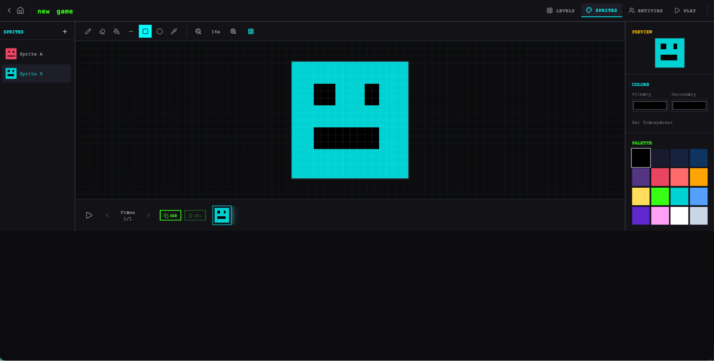
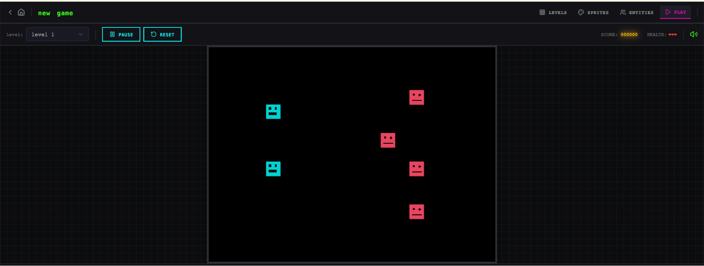

# Harness design for long-running application development / 长运行应用程序开发中的 Harness 设计

# Harness design for long-running application development
# 长运行应用程序开发中的 Harness 设计

_Written by Prithvi Rajasekaran, a member of our[Labs](https://www.anthropic.com/news/introducing-anthropic-labs) team._
_Written by Prithvi Rajasekaran, a member of our [Labs](https://www.anthropic.com/news/introducing-anthropic-labs) team._

Over the past several months I’ve been working on two interconnected problems: getting Claude to produce high-quality frontend designs, and getting it to build complete applications without human intervention. This work originated with earlier efforts on our [frontend design skill](https://github.com/anthropics/claude-code/blob/main/plugins/frontend-design/skills/frontend-design/SKILL.md) and [long-running coding agent harness](https://www.anthropic.com/engineering/effective-harnesses-for-long-running-agents), where my colleagues and I were able to improve Claude’s performance well above baseline through prompt engineering and harness design—but both eventually hit ceilings.
在过去的几个月里，我一直在研究两个相互关联的问题：让 Claude 生成高质量的前端设计，以及让它在无需人工干预的情况下构建完整的应用程序。这项工作源于我们早期的[前端设计技能](https://github.com/anthropics/claude-code/blob/main/plugins/frontend-design/skills/frontend-design/SKILL.md)和[长运行编码 agent harness](https://www.anthropic.com/engineering/effective-harnesses-for-long-running-agents)工作，在这些工作中，我和我的同事能够通过 prompt 工程和 harness 设计将 Claude 的表现提升到远高于基线的水平——但两者最终都遇到了瓶颈。

To break through, I sought out novel AI engineering approaches that held across two quite different domains, one defined by subjective taste, the other by verifiable correctness and usability. Taking inspiration from [Generative Adversarial Networks](https://en.wikipedia.org/wiki/Generative_adversarial_network) (GANs), I designed a multi-agent structure with a **generator** and **evaluator** agent. Building an evaluator that graded outputs reliably—and with taste—meant first developing a set of criteria that could turn subjective judgments like “is this design good?” into concrete, gradable terms.
为了突破，我寻找了在两个截然不同的领域中通用的新型 AI 工程方法，一个由主观品味定义，另一个由可验证的正确性和可用性定义。从[生成对抗网络](https://en.wikipedia.org/wiki/Generative_adversarial_network)（GANs）中获得灵感，我设计了一个包含**生成器**和**评估器** agent 的多 agent 结构。构建一个能可靠地——并且有品味地——对输出进行评分的评估器，意味着首先要开发一套标准，将"这个设计好吗？"这样的主观判断转化为具体的、可评分的术语。

I then applied these techniques to long-running autonomous coding, carrying over two lessons from our earlier harness work: decomposing the build into tractable chunks, and using structured artifacts to hand off context between sessions. The final result was a three-agent architecture—planner, generator, and evaluator—that produced rich full-stack applications over multi-hour autonomous coding sessions.
然后我将这些技术应用于长运行自主编码，从我们早期的 harness 工作中带来了两个经验：将构建分解为可处理的块，以及使用结构化 artifacts 在会话之间传递上下文。最终结果是一个三 agent 架构——规划器、生成器、评估器——在多小时的自主编码会话中产生丰富的全栈应用程序。

## Why naive implementations fall short
## 为什么朴素实现不够用

We've previously shown that harness design has a substantial impact on the effectiveness of long running agentic coding. In an earlier[experiment](https://www.anthropic.com/engineering/effective-harnesses-for-long-running-agents), we used an initializer agent to decompose a product spec into a task list, and a coding agent that implemented the tasks one feature at a time before handing off artifacts to carry context across sessions. The broader developer community has converged on similar insights, with approaches like the "[Ralph Wiggum](https://ghuntley.com/ralph/)" method using hooks or scripts to keep agents in continuous iteration cycles.
我们已经之前展示过，harness 设计对长运行 agentic 编码的有效性有重大影响。在早期的[实验](https://www.anthropic.com/engineering/effective-harnesses-for-long-running-agents)中，我们使用初始化器 agent 将产品规范分解为任务列表，一个编码 agent 一次实现一个功能，然后将 artifacts 传递出去以在会话之间保持上下文。更广泛的开发者社区已经收敛到类似的见解，"[Ralph Wiggum](https://ghuntley.com/ralph/)"等方法使用 hooks 或 scripts 让 agents 保持持续迭代循环。

But some problems remained persistent. For more complex tasks, the agent still tends to go off the rails over time. While decomposing this issue, we observed two common failure modes with agents executing these sorts of tasks.
但一些问题仍然持续存在。对于更复杂的任务，agent 仍然倾向于随时间推移而失控。在分析这个问题时，我们观察到执行这类任务时的两种常见失败模式。

First is that models tend to lose coherence on lengthy tasks as the context window fills (see our post on [context engineering](https://www.anthropic.com/engineering/effective-context-engineering-for-ai-agents)). Some models also exhibit "context anxiety," in which they begin wrapping up work prematurely as they approach what they believe is their context limit. Context resets—clearing the context window entirely and starting a fresh agent, combined with a structured handoff that carries the previous agent's state and the next steps—addresses both these issues.
第一个是模型在冗长任务中由于上下文窗口填满而失去连贯性（参见我们关于[上下文工程](https://www.anthropic.com/engineering/effective-context-engineering-for-ai-agents)的帖子）。一些模型还表现出"上下文焦虑"，即当它们接近认为的上下文限制时开始提前结束工作。上下文重置——完全清除上下文窗口并启动一个新鲜的 agent，结合一个携带前一个 agent 状态和下一步的结构化交接——可以解决这两个问题。

This differs from compaction, where earlier parts of the conversation are summarized in place so the same agent can keep going on a shortened history. While compaction preserves continuity, it doesn't give the agent a clean slate, which means context anxiety can still persist. A reset provides a clean slate, at the cost of the handoff artifact having enough state for the next agent to pick up the work cleanly. In our earlier testing, we found Claude Sonnet 4.5 exhibited context anxiety strongly enough that compaction alone wasn't sufficient to enable strong long task performance, so context resets became essential to the harness design. This solves the core issue, but adds orchestration complexity, token overhead, and latency to each harness run.
这与压缩不同，压缩是在原地总结对话的早期部分，以便同一 agent 可以继续在缩短的历史上工作。虽然压缩保持了连续性，但它没有给 agent 一个干净的状态，这意味着上下文焦虑可能仍然存在。重置提供了一个干净的状态，代价是交接 artifact 需要有足够的状态让下一个 agent 干净地接起工作。在我们早期的测试中，我们发现 Claude Sonnet 4.5 表现出足够强烈的上下文焦虑，仅靠压缩不足以实现强大的长任务性能，因此上下文重置成为 harness 设计的关键解锁。这解决了核心问题，但为每次 harness 运行增加了编排复杂性、token 开销和延迟。

A second issue, which we haven’t previously addressed, is self-evaluation. When asked to evaluate work they've produced, agents tend to respond by confidently praising the work—even when, to a human observer, the quality is obviously mediocre. This problem is particularly pronounced for subjective tasks like design, where there is no binary check equivalent to a verifiable software test. Whether a layout feels polished or generic is a judgment call, and agents reliably skew positive when grading their own work.
第二个问题是我们之前没有解决过的：自我评估。当被要求评估他们产生的工作时，agents 倾向于自信地赞扬工作——即使对于人类观察者来说，质量显然只是中等水平。这个问题在设计等主观任务中尤为突出，因为那里没有可验证软件测试那样的二元检查。一个布局感觉精致还是普通是一个判断，agents 在评价自己的工作时总是偏向正面。

However, even on tasks that do have verifiable outcomes, agents still sometimes exhibit poor judgment that impedes their performance while completing the task. Separating the agent doing the work from the agent judging it proves to be a strong lever to address this issue. The separation doesn't immediately eliminate that leniency on its own; the evaluator is still an LLM that is inclined to be generous towards LLM-generated outputs. But tuning a standalone evaluator to be skeptical turns out to be far more tractable than making a generator critical of its own work, and once that external feedback exists, the generator has something concrete to iterate against.
然而，即使在确实有可验证结果的任务上，agents 有时仍会表现出阻碍其完成任务的不良判断。将做工作的 agent 和评判它的 agent 分离开来被证明是解决这个问题的有力杠杆。这种分离本身并不会立即消除那种宽松；评估器仍然是一个倾向于对 LLM 输出慷慨的 LLM。但调优一个独立的评估器使其持怀疑态度比让生成器批评自己的工作要容易得多，而且一旦外部反馈存在，生成器就有了具体的迭代目标。

## Frontend design: making subjective quality gradable
## 前端设计：让主观质量可评分

I started by experimenting on frontend design, where the self-evaluation issue was most visible. Absent any intervention, Claude normally gravitates toward safe, predictable layouts that are technically functional but visually unremarkable.
我从前端设计开始实验，那里自我评估问题最为明显。在没有任何干预的情况下，Claude 通常会倾向于安全、可预测的布局，这些布局在技术上是可用的，但在视觉上平淡无奇。

Two insights shaped the harness I built for frontend design. First, while aesthetics can’t be fully reduced to a score—and individual tastes will always vary—they can be improved with grading criteria that encode design principles and preferences. "Is this design beautiful?" is hard to answer consistently, but "does this follow our principles for good design?" gives Claude something concrete to grade against. Second, by separating frontend generation from frontend grading, we can create a feedback loop that drives the generator toward stronger outputs.
两个见解塑造了我为前端设计构建的 harness。首先，虽然美学不能完全归结为一个分数——而且个人品味总是不同的——但它们可以通过编码设计原则和偏好的评分标准来改进。"这个设计美吗？"很难一致地回答，但"这是否符合我们对好设计的原则？"给了 Claude 一个具体可评分的标准。其次，通过将前端生成与前端评估分离，我们可以创建一个反馈循环，推动生成器产出更强的输出。

With this in mind, I wrote four grading criteria that I gave to both the generator and evaluator agents in their prompts:
基于此，我在给生成器和评估器 agents 的 prompts 中写了四个评分标准：

*   **Design quality:** Does the design feel like a coherent whole rather than a collection of parts? Strong work here means the colors, typography, layout, imagery, and other details combine to create a distinct mood and identity.
*   **Originality:** Is there evidence of custom decisions, or is this template layouts, library defaults, and AI-generated patterns? A human designer should recognize deliberate creative choices. Unmodified stock components—or telltale signs of AI generation like purple gradients over white cards—fail here.
*   **Craft:** Technical execution: typography hierarchy, spacing consistency, color harmony, contrast ratios. This is a competence check rather than a creativity check. Most reasonable implementations do fine here by default; failing means broken fundamentals.
* **设计质量：** 设计是否感觉是一个连贯的整体而不是部分的集合？在这方面表现出色意味着颜色、排版、布局、图像和其他细节结合在一起，创造出一种独特的情绪和身份。
* **原创性：** 有证据表明是自定义决策，还是模板布局、库默认设置和 AI 生成模式？人类设计师应该能识别出有意识的创意选择。未修改的库存组件——或 AI 生成的明显迹象，如白色卡片上的紫色渐变——在这里会失败。
* **工艺：** 技术执行：排版层次、间距一致性、色彩和谐、对比度。这是一种能力检查而不是创造力检查。大多数合理的实现默认情况下在这里表现良好；失败意味着基础有问题。
* **功能性：** 独立于美学之外的可用性。用户能否理解界面在做什么，找到主要操作，并在不猜测的情况下完成任务？

*   **Functionality:** Usability independent of aesthetics. Can users understand what the interface does, find primary actions, and complete tasks without guessing?
我强调设计质量和原创性超过工艺和功能性。Claude 默认情况下已经在工艺和功能性上得分很高，因为所需的技术能力往往是模型自然具备的。但在设计和原创性上，Claude 经常产生的输出充其量只是平淡的。这些标准明确惩罚了高度通用的"AI 垃圾"模式，通过更强调设计和原创性推动了模型更高的美学风险承担。

I emphasized design quality and originality over craft and functionality. Claude already scored well on craft and functionality by default, as the required technical competence tended to come naturally to the model. But on design and originality, Claude often produced outputs that were bland at best. The criteria explicitly penalized highly generic “AI slop” patterns, and by weighting design and originality more heavily it pushed the model toward more aesthetic risk-taking.
我使用 few-shot 示例和详细分数分解来校准评估器。这确保了评估器的判断与我的偏好一致，并减少了跨迭代的分数漂移。

I calibrated the evaluator using few-shot examples with detailed score breakdowns. This ensured the evaluator’s judgment aligned with my preferences, and reduced score drift across iterations.
我在 [Claude Agent SDK](https://platform.claude.com/docs/en/agent-sdk/overview) 上构建了这个循环，这使得编排很简单。生成器 agent 首先根据用户提示创建一个 HTML/CSS/JS 前端。我给评估器 Playwright MCP，这让它可以直接与实时页面交互，然后在给每个标准评分之前对其进行详细批评。在实践中，评估器会自己导航页面，截屏并仔细研究实现，然后才做出评估。那个反馈作为下一次迭代的输入流回生成器。每次生成运行 5 到 15 次迭代，每次迭代通常在响应评估器批评时推动生成器走向更有特色的方向。因为评估器主动在页面上导航而不是对静态截屏评分，每个周期都需要真正的挂钟时间。完整运行延伸至四个小时。我还指示生成器在每次评估后做出战略决策：如果分数趋势良好则完善当前方向，或者如果方法不 work 则完全转向不同的美学。

I built the loop on the [Claude Agent SDK](https://platform.claude.com/docs/en/agent-sdk/overview), which kept the orchestration straightforward. A generator agent first created an HTML/CSS/JS frontend based on a user prompt. I gave the evaluator the Playwright MCP, which let it interact with the live page directly before scoring each criterion and writing a detailed critique. In practice, the evaluator would navigate the page on its own, screenshotting and carefully studying the implementation before producing its assessment. That feedback flowed back to the generator as input for the next iteration. I ran 5 to 15 iterations per generation, with each iteration typically pushing the generator in a more distinctive direction as it responded to the evaluator's critique. Because the evaluator was actively navigating the page rather than scoring a static screenshot, each cycle took real wall-clock time. Full runs stretched up to four hours. I also instructed the generator to make a strategic decision after each evaluation: refine the current direction if scores were trending well, or pivot to an entirely different aesthetic if the approach wasn't working.
在整个运行过程中，评估器的评估随迭代改进然后趋于平稳，但仍有空间。一些生成是增量改进的。其他的在迭代之间采取了急剧的美学转变。

Across runs, the evaluator's assessments improved over iterations before plateauing, with headroom still remaining. Some generations refined incrementally. Others took sharp aesthetic turns between iterations.
标准的措辞以我没有完全预期的方式引导了生成器。包含"最好的设计是博物馆级的"这样的短语推动了设计走向特定的视觉收敛，这表明与标准相关的提示直接塑造了输出的特征。

The wording of the criteria steered the generator in ways I didn't fully anticipate. Including phrases like "the best designs are museum quality" pushed designs toward a particular visual convergence, suggesting that the prompting associated with the criteria directly shaped the character of the output.
虽然分数通常随迭代改进，但模式并不总是干净线性的。后来的实现总体上往往更好，但我经常看到我更喜欢中间迭代而不是最后一次的情况。实现复杂性也倾向于在轮次中增加，因为生成器在响应评估器的反馈时寻求更雄心勃勃的解决方案。即使在第一次迭代中，输出也明显比完全没有提示的基线好，这表明标准和相关语言本身在评估器反馈进一步改进之前就将模型引向了非通用默认值。

While scores generally improved over iterations, the pattern was not always cleanly linear. Later implementations tended to be better as a whole, but I regularly saw cases where I preferred a middle iteration over the last one. Implementation complexity also tended to increase across rounds, with the generator reaching for more ambitious solutions in response to the evaluator’s feedback. Even on the first iteration, outputs were noticeably better than a baseline with no prompting at all, suggesting the criteria and associated language themselves steered the model away from generic defaults before any evaluator feedback led to further refinement.
在一个值得注意的例子中，我提示模型为一个荷兰艺术博物馆创建一个网站。到第九次迭代时，它为一个虚构博物馆产生了一个简洁的暗色主题登陆页面。这个页面在视觉上很精致，但基本在我预期之内。然后，在第十个周期，它完全抛弃了这种方法，将网站重新设想为一种空间体验：一个带有 CSS 透视绘制的棋盘格地板的 3D 房间，艺术品以自由形式位置挂在墙上，以及基于门口在画廊房间之间的导航代替滚动或点击。这是我以前在单次生成中从未见过的创造性飞跃。

In one notable example, I prompted the model to create a website for a Dutch art museum. By the ninth iteration, it had produced a clean, dark-themed landing page for a fictional museum. The page was visually polished but largely in line with my expectations. Then, on the tenth cycle, it scrapped the approach entirely and reimagined the site as a spatial experience: a 3D room with a checkered floor rendered in CSS perspective, artwork hung on the walls in free-form positions, and doorway-based navigation between gallery rooms instead of scroll or click. It was the kind of creative leap that I hadn't seen before from a single-pass generation.
## 扩展到全栈编码

## Scaling to full-stack coding
有了这些发现，我将这种 GAN 启发的模式应用于全栈开发。生成器-评估器循环自然映射到软件开发生命周期，其中代码审查和 QA 扮演与设计评估器相同的结构性角色。

With these findings in hand, I applied this GAN-inspired pattern to full-stack development. The generator-evaluator loop maps naturally onto the software development lifecycle, where code review and QA serve the same structural role as the design evaluator.
### 架构

### The architecture
在我们早期的[长运行 harness](https://www.anthropic.com/engineering/effective-harnesses-for-long-running-agents)中，我们用初始化器 agent、一次完成一个功能的编码 agent 以及会话之间的上下文重置解决了连贯的多会话编码问题。上下文重置是一个关键解锁：harness 使用了 Sonnet 4.5，它表现出前面提到的"上下文焦虑"倾向。创建一个在上下文重置之间表现良好的 harness 是保持模型任务的关键。Opus 4.5 在很大程度上自行消除了这种行为，所以我能够从这个 harness 中完全删除上下文重置。这些 agents 作为跨越整个构建的连续会话来运行，[Claude Agent SDK](https://platform.claude.com/docs/en/agent-sdk/overview) 的自动压缩在此过程中处理上下文增长。

In our earlier [long-running harness](https://www.anthropic.com/engineering/effective-harnesses-for-long-running-agents), we had solved for coherent multi-session coding with an initializer agent, a coding agent that worked one feature at a time, and context resets between sessions. Context resets were a key unlock: the harness used Sonnet 4.5, which exhibited the “context anxiety” tendency mentioned earlier. Creating a harness that worked well across context resets was key to keeping the model on task. Opus 4.5 largely removed that behavior on its own, so I was able to drop context resets from this harness entirely. The agents were run as one continuous session across the whole build, with the [Claude Agent SDK](https://platform.claude.com/docs/en/agent-sdk/overview)'s automatic compaction handling context growth along the way.
对于这项工作，我在原始 harness 的基础上构建了一个三 agent 系统，每个 agent 解决我在先前运行中观察到的特定差距。该系统包含以下 agent 角色：

For this work I built on the foundation from the original harness with a three-agent system, with each agent addressing a specific gap I'd observed in prior runs. The system contained the following agent personas:
**规划器：** 我们之前的长运行 harness 要求用户预先提供详细规范。我想自动化这个步骤，所以我创建了一个规划器 agent，它接受一个简单的 1-4 句子提示，并将其扩展为完整的产品规范。我提示它对范围要大胆，并专注于产品上下文和高层技术设计，而不是详细的技术实现。之所以强调这一点，是因为担心如果规划器试图预先指定粒度技术细节并出错，规范中的错误会级联到下游实现中。似乎更聪明的方法是约束 agents 要产生的可交付成果，让他们自己在工作时弄清楚路径。我还要求规划器寻找将 AI 功能编织到产品规范中的机会。（参见底部附录中的示例。）

**Planner:** Our previous long-running harness required the user to provide a detailed spec upfront. I wanted to automate that step, so I created a planner agent that took a simple 1-4 sentence prompt and expanded it into a full product spec. I prompted it to be ambitious about scope and to stay focused on product context and high level technical design rather than detailed technical implementation. This emphasis was due to the concern that if the planner tried to specify granular technical details upfront and got something wrong, the errors in the spec would cascade into the downstream implementation. It seemed smarter to constrain the agents on the deliverables to be produced and let them figure out the path as they worked. I also asked the planner to find opportunities to weave AI features into the product specs. (See example in the Appendix at the bottom.)
**生成器：** 早期 harness 中的一次一个功能的方法对范围管理很有效。我在这里应用了类似的模型，指示生成器以冲刺方式工作，从规范中一次挑选一个功能。每次冲刺使用 React、Vite、FastAPI 和 SQLite（后来是 PostgreSQL）技术栈实现应用程序，并指示生成器在移交给 QA 之前在每次冲刺结束时自我评估其工作。它还使用 git 进行版本控制。

**Generator:** The one-feature-at-a-time approach from the earlier harness worked well for scope management. I applied a similar model here, instructing the generator to work in sprints, picking up one feature at a time from the spec. Each sprint implemented the app with a React, Vite, FastAPI, and SQLite (later PostgreSQL) stack, and the generator was instructed to self-evaluate its work at the end of each sprint before handing off to QA. It also had git for version control.
**评估器：** 早期 harnesses 的应用程序看起来令人印象深刻，但当你实际尝试使用它们时仍然有真正的 bug。为了发现这些问题，评估器使用 Playwright MCP 点击通过运行中的应用程序，像用户一样测试 UI 功能、API 端点和数据库状态。然后它根据发现的 bug 以及一套以设计实验为模型、适用于产品深度、功能、视觉设计和代码质量的标准对每次冲刺进行评分。每个标准都有一个硬阈值，如果任何一个低于该阈值，冲刺失败，生成器会收到关于哪里出错的详细反馈。

**Evaluator:** Applications from earlier harnesses often looked impressive but still had real bugs when you actually tried to use them. To catch these, the evaluator used the Playwright MCP to click through the running application the way a user would, testing UI features, API endpoints, and database states. It then graded each sprint against both the bugs it had found and a set of criteria modeled on the frontend experiment, adapted here to cover product depth, functionality, visual design, and code quality. Each criterion had a hard threshold, and if any one fell below it, the sprint failed and the generator got detailed feedback on what went wrong.
在每次冲刺之前，生成器和评估器协商一个冲刺契约：在任何代码编写之前就商定该工作块的"完成"是什么样子的。这之所以存在，是因为产品规范是有意的高层次的，我希望有一个步骤来弥合用户故事和可测试实现之间的差距。生成器提议它将构建什么以及如何验证成功，评估器审查该提议以确保生成器在构建正确的东西。两者迭代直到达成一致。

Before each sprint, the generator and evaluator negotiated a sprint contract: agreeing on what "done" looked like for that chunk of work before any code was written. This existed because the product spec was intentionally high-level, and I wanted a step to bridge the gap between user stories and testable implementation. The generator proposed what it would build and how success would be verified, and the evaluator reviewed that proposal to make sure the generator was building the right thing. The two iterated until they agreed.
沟通通过文件处理：一个 agent 写一个文件，另一个 agent 读取它并在该文件内或用生成器将读取的新文件进行回复。然后生成器根据商定的契约进行构建，然后再将工作交给 QA。这使工作忠实于规范，而不会在太早的阶段过度指定实现。

Communication was handled via files: one agent would write a file, another agent would read it and respond either within that file or with a new file that the previous agent would read in turn. The generator then built against the agreed-upon contract before handing the work off to QA. This kept the work faithful to the spec without over-specifying implementation too early.
### 运行 harness

### Running the harness
对于这个 harness 的第一个版本，我使用了 Claude Opus 4.5，对同一个提示分别运行完整 harness 和单 agent 系统进行比较。我使用 Opus 4.5 是因为这是当我开始这些实验时我们最好的编码模型。

For the first version of this harness, I used Claude Opus 4.5, running user prompts against both the full harness and a single-agent system for comparison. I used Opus 4.5 since this was our best coding model when I began these experiments.
我写了以下提示来生成一个复古视频游戏制作器：

I wrote the following prompt to generate a retro video game maker:
> _创建一个具有关卡编辑器、精灵编辑器、实体行为和可玩测试模式功能的 2D 复古游戏制作器。_

> _Create a 2D retro game maker with features including a level editor, sprite editor, entity behaviors, and a playable test mode._
下表显示了 harness 类型、运行时间和总成本。

The table below shows the harness type, length it ran for, and the total cost.
| **Harness** | **Duration** | **Cost** |
| --- | --- | --- |
| Solo | 20 min | $9 |
| Full harness | 6 hr | $200 |

harness 贵了 20 多倍，但输出质量的差异立即显而易见。

The harness was over 20x more expensive, but the difference in output quality was immediately apparent.
我期望的是一个我可以构建一个关卡及其组件（精灵、实体、瓦片布局）的界面，然后点击播放来实际玩游戏。我首先打开 solo 运行的输出，初始应用程序似乎符合这些期望。

I was expecting an interface where I could construct a level and its component parts (sprites, entities, tile layout) then hit play to actually play the level. I started by opening the solo run’s output, and the initial application seemed in line with those expectations.
然而，当我点击时，问题开始出现。布局浪费空间，带有固定高度面板的视图在大面积区域留下空白。工作流程很僵硬。试图填充一个关卡时，系统提示我首先创建精灵和实体，但 UI 中没有任何东西引导我走向这个顺序。更重要的是，实际的游戏坏了。我的实体出现在屏幕上，但没有任何东西响应输入。深入代码后发现，实体定义和游戏运行时之间的连接断了，而且没有表面指示哪里出了问题。

As I clicked through, however, issues started to emerge. The layout wasted space, with fixed-height panels leaving most of the viewport empty. The workflow was rigid. Trying to populate a level prompted me to create sprites and entities first, but nothing in the UI guided me toward that sequence. More to the point, the actual game was broken. My entities appeared on screen but nothing responded to input. Digging into the code revealed that the wiring between entity definitions and the game runtime was broken, with no surface indication of where.
在评估 solo 运行后，我将注意力转向 harness 运行。这个运行从相同的句子提示开始，但规划器步骤将该提示扩展为一个跨越十次冲刺的 16 功能规范。它远远超出了 solo 运行的尝试。除了核心编辑器和播放模式外，规范还要求精灵动画系统、行为模板、音效和音乐、AI 辅助精灵生成器和关卡设计师，以及带有可分享链接的游戏导出。我给规划器访问了我们的[前端设计技能](https://github.com/anthropics/claude-code/blob/main/plugins/frontend-design/skills/frontend-design/SKILL.md)，它读取并用来在规范中为应用程序创建设计语言。对于每次冲刺，生成器和评估器协商定义该冲刺的特定实现细节的契约，以及将用于验证完成的可测试行为。

After evaluating the solo run, I turned my attention to the harness run. This run started from the same one-sentence prompt, but the planner step expanded that prompt into a 16-feature spec spread across ten sprints. It went well beyond what the solo run attempted. In addition to the core editors and play mode, the spec called for a sprite animation system, behavior templates, sound effects and music, an AI-assisted sprite generator and level designer, and game export with shareable links. I gave the planner access to our [frontend design skill](https://github.com/anthropics/claude-code/blob/main/plugins/frontend-design/skills/frontend-design/SKILL.md), which it read and used to create a visual design language for the app as part of the spec. For each sprint, the generator and evaluator negotiated a contract defining the specific implementation details for the sprint, and the testable behaviors that would be tested to verify completion.
该应用程序立即显示出比 solo 运行更多的打磨和流畅。画布使用了整个视口，面板大小合理，界面具有符合规范设计方向的统一视觉身份。solo 运行中看到的一些笨拙确实仍然存在——工作流程仍然没有明确说明应该在尝试填充关卡之前构建精灵和实体，我不得不通过四处摸索来弄清楚。这被读作基础模型的产品直觉差距，而不是 harness 旨在解决的问题，尽管它确实表明了 harness 内有针对性的迭代可以进一步改进输出质量的地方。

The app immediately showed more polish and smoothness than the solo run. The canvas used the full viewport, the panels were sized sensibly, and the interface had a consistent visual identity that tracked the design direction from the spec. Some of the clunkiness I'd seen in the solo run did remain—the workflow still didn't make it clear that you should build sprites and entities before trying to populate a level, and I had to figure that out by poking around. This read as a gap in the base model’s product intuition rather than something the harness was designed to address, though it did suggest a place where targeted iteration inside the harness could help to further improve output quality.
在处理编辑器时，新运行的优势比 solo 变得更加明显。精灵编辑器更丰富、功能更全面，工具面板更干净，颜色选择器更好用，缩放控制更可用。

Working through the editors, the new run's advantages over solo became more apparent. The sprite editor was richer and more fully featured, with cleaner tool palettes, a better color picker, and more usable zoom controls.
因为我要求规划器将其规范中编织 AI 功能，所以应用程序还带有一个内置的 Claude 集成，让我可以通过提示生成游戏的不同部分。这大大加快了工作流程。

Because I'd asked the planner to weave AI features into its specs, the app also came with a built-in Claude integration that let me generate different parts of the game through prompting. This significantly sped up the workflow.
最大的差异在播放模式。我实际上可以移动我的实体并玩游戏。物理有一些粗糙的地方——我的角色跳到一个平台上，但最终与它重叠，这直观上感觉不对——但核心功能 work，这是 solo 运行没有做到的。在四处移动之后，我确实遇到了一些 AI 游戏关卡构建的限制。有一面我无法跳过去的大墙，所以我被困住了。这表明 harness 可以处理一些常识性的改进和边界情况，以进一步细化应用程序。

The biggest difference was in play mode. I was actually able to move my entity and play the game. The physics had some rough edges—my character jumped onto a platform but ended up overlapping with it, which felt intuitively wrong—but the core thing worked, which the solo run did not manage. After moving around a bit, I did hit some limitations with the AI’s game level construction. There was a large wall that I wasn’t able to jump past, so I was stuck. This suggested there were some common sense improvements and edge cases that the harness could handle to further refine the app.
阅读日志，评估器清楚地使实现与规范保持一致。每次冲刺，它都通过 Playwright 遍历冲刺契约的测试标准，并 exercise 运行中的应用程序以发现与预期行为不符的任何问题。契约是粒度的——仅第三次冲刺就有 27 个涵盖关卡编辑器的标准——评估器的发现足够具体，可以直接根据它行动，无需额外调查。下表显示了我们评估器识别的几个问题示例：

Reading through the logs, it was clear that the evaluator kept the implementation in line with the spec. Each sprint, it walked through the sprint contract's test criteria and exercised the running application through Playwright, filing bugs against anything that diverged from expected behavior. The contracts were granular—Sprint 3 alone had 27 criteria covering the level editor—and the evaluator's findings were specific enough to act on without extra investigation. The table below shows several examples of issues our evaluator identified:
| **Contract criterion** | **Evaluator finding** |
| --- | --- |
| Rectangle fill tool allows click-drag to fill a rectangular area with selected tile | **FAIL** — Tool only places tiles at drag start/end points instead of filling the region. `fillRectangle` function exists but isn't triggered properly on mouseUp. |
| User can select and delete placed entity spawn points | **FAIL** — Delete key handler at `LevelEditor.tsx:892` requires both `selection` and `selectedEntityId`to be set, but clicking an entity only sets `selectedEntityId`. Condition should be `selection || (selectedEntityId && activeLayer === 'entity')`. |
| User can reorder animation frames via API | **FAIL** — `PUT /frames/reorder` route defined after `/{frame_id}` routes. FastAPI matches 'r`eorder`' as a frame_id integer and returns 422: "unable to parse string as an integer." |

让评估器达到这个水平的性能需要工作。开箱即用，Claude 是一个糟糕的 QA agent。在早期运行中，我看到它识别出合法问题，然后说服自己决定这不是什么大问题并批准工作。它也倾向于表面测试，而不是探测边界情况，所以更微妙的 bug 经常溜走。调优循环是读取评估器的日志，找到其判断与我不同的例子，并更新 QA 的 prompt 来解决这些问题。我花了几轮这种开发循环，评估器的评分方式才达到我认为合理的水平。即便如此，harness 输出显示了模型 QA 能力的极限：小布局问题、某些地方感觉不直观的交互，以及评估器没有彻底 exercise 的更深层嵌套功能中未发现的 bug。显然还有更多的验证空间可以通过进一步调优来获取。但与 solo 运行相比，应用程序的核心功能根本无法 work，这 lift 是显而易见的。

Getting the evaluator to perform at this level took work. Out of the box, Claude is a poor QA agent. In early runs, I watched it identify legitimate issues, then talk itself into deciding they weren't a big deal and approve the work anyway. It also tended to test superficially, rather than probing edge cases, so more subtle bugs often slipped through. The tuning loop was to read the evaluator's logs, find examples where its judgment diverged from mine, and update the QAs prompt to solve for those issues. It took several rounds of this development loop before the evaluator was grading in a way that I found reasonable. Even then, the harness output showed the limits of the model’s QAing capabilities: small layout issues, interactions that felt unintuitive in places, and undiscovered bugs in more deeply nested features that the evaluator hadn't exercised thoroughly. There was clearly more verification headroom to capture with further tuning. But compared to the solo run, where the central feature of the application simply didn't work, the lift was obvious.








### 迭代 harness

### Iterating on the harness
第一组 harness 结果令人鼓舞，但它也很笨重、缓慢且昂贵。合乎逻辑的下一步是找到简化 harness 的方法，而不降低其性能。这部分上是常识，部分上是一个更普遍的原则：harness 中的每个组件都编码了一个关于模型无法自行完成的假设，这些假设值得进行压力测试，因为它们可能不正确，而且随着模型改进，它们可能会很快过时。我们的博文[构建有效的 Agents](https://www.anthropic.com/research/building-effective-agents) 将底层想法框架为"找到最简单的解决方案，只有在需要时才增加复杂性"，这是任何维护 agent harness 的人一致出现的模式。

The first set of harness results was encouraging, but it was also bulky, slow, and expensive. The logical next step was to find ways to simplify the harness without degrading its performance. This was partly common sense and partly a function of a more general principle: every component in a harness encodes an assumption about what the model can't do on its own, and those assumptions are worth stress testing, both because they may be incorrect, and because they can quickly go stale as models improve. Our blog post [Building Effective Agents](https://www.anthropic.com/research/building-effective-agents) frames the underlying idea as "find the simplest solution possible, and only increase complexity when needed," and it's a pattern that shows up consistently for anyone maintaining an agent harness.
在我第一次简化尝试中，我大幅削减了 harness 并尝试了一些创意新想法，但我无法复制原始性能。而且很难判断 harness 设计的哪些部分实际上是承重的，以及以什么方式。基于那个经验，我转向了更有条理的方法，一次移除一个组件并审查它对最终结果的影响。

In my first attempt to simplify, I cut the harness back radically and tried a few creative new ideas, but I wasn't able to replicate the performance of the original. It also became difficult to tell which pieces of the harness design were actually load-bearing, and in what ways. Based on that experience, I moved to a more methodical approach, removing one component at a time and reviewing what impact it had on the final result.
在我进行这些迭代周期时，我们还发布了 Opus 4.6，这为减少 harness 复杂性提供了进一步的动力。有充分的理由预期 4.6 将比 4.5 需要更少的脚手架。从我们的[发布博客：](https://www.anthropic.com/news/claude-opus-4-6)"[Opus 4.6] 更仔细地计划，在更长的 agentic 任务中持续更长时间，能够更可靠地在更大的代码库中操作，并且具有更好的代码审查和调试技能来 catch 自己的错误。"它在长上下文检索方面也有实质性改进。这些都是 harness 旨在补充的模型能力。

As I was going through these iteration cycles, we also released Opus 4.6, which provided further motivation to reduce harness complexity. There was good reason to expect 4.6 would need less scaffolding than 4.5 did. From our [launch blog:](https://www.anthropic.com/news/claude-opus-4-6) "[Opus 4.6] plans more carefully, sustains agentic tasks for longer, can operate more reliably in larger codebases, and has better code review and debugging skills to catch its own mistakes." It also improved substantially on long-context retrieval. These were all capabilities the harness had been built to supplement.
### 移除冲刺结构

### Removing the sprint construct
我首先完全移除了冲刺结构。冲刺结构帮助将工作分解为块，让模型能够连贯地工作。鉴于 Opus 4.6 的改进，有充分的理由相信模型可以本机处理这项工作，而不需要这种分解。

I started by removing the sprint construct entirely. The sprint structure had helped to decompose work into chunks for the model to work coherently. Given the improvements in Opus 4.6, there was good reason to believe that the model could natively handle the job without this sort of decomposition.
我保留了规划器和评估器，因为每个都继续增加明显的价值。没有规划器，生成器会 scope 不足：给定原始提示，它会在首先规范其工作之前开始构建，最终创建一个不如规划器所做的功能更丰富的应用程序。

I kept both the planner and evaluator, as each continued to add obvious value. Without the planner, the generator under-scoped: given the raw prompt, it would start building without first speccing its work, and end up creating a less feature-rich application than the planner did.
在移除冲刺结构后，我将评估器移到了运行结束时的一次通过，而不是每次冲刺评分。由于模型能力强得多，它改变了评估器对某些运行的承重程度，其有用性取决于任务相对于模型可靠独立完成的事情的位置。在 4.5 上，那个边界很近：我们的构建在生成器可以单独完成的事情的边缘，评估器在整个构建中 catch 有意义的问题。在 4.6 上，模型的原始能力增加了，所以边界向外移动。曾经需要评估器检查才能连贯实现的任务现在通常在生成器自行处理的能力范围内，对于该边界内的任务，评估器成为不必要的开销。但对于仍然在生成器能力边缘的构建部分，评估器继续提供真正的 lift。

With the sprint construct removed, I moved the evaluator to a single pass at the end of the run rather than grading per sprint. Since the model was much more capable, it changed how load-bearing the evaluator was for certain runs, with its usefulness depending on where the task sat relative to what the model could do reliably on its own. On 4.5, that boundary was close: our builds were at the edge of what the generator could do well solo, and the evaluator caught meaningful issues across the build. On 4.6, the model's raw capability increased, so the boundary moved outward. Tasks that used to need the evaluator's check to be implemented coherently were now often within what the generator handled well on its own, and for tasks within that boundary, the evaluator became unnecessary overhead. But for the parts of the build that were still at the edge of the generator’s capabilities, the evaluator continued to give real lift.
实际的含义是评估器不是一个固定的、是或否的决定。当任务处于当前模型可靠独立完成的事情之外时，它是值得成本的。

The practical implication is that the evaluator is not a fixed yes-or-no decision. It is worth the cost when the task sits beyond what the current model does reliably solo.
除了结构简化，我还添加了提示来改进 harness 如何将 AI 功能构建到每个应用程序中，具体是让生成器构建一个能够通过工具驱动应用程序自身功能的适当 agent。这需要真正的迭代，因为相关知识足够新，Claude 的训练数据覆盖得很薄。但通过足够的调优，生成器正在正确地构建 agents。

Alongside the structural simplification, I also added prompting to improve how the harness built AI features into each app, specifically getting the generator to build a proper agent that could drive the app's own functionality through tools. That took real iteration, since the relevant knowledge is recent enough that Claude's training data covers it thinly. But with enough tuning, the generator was building agents correctly.
### 更新后的 harness 结果

### Results from the updated harness
为了测试更新后的 harness，我使用以下提示生成了一个数字音频工作站（DAW），一个用于作曲、录音和混音的音乐制作程序：

To put the updated harness to the test, I used the following prompt to generate a Digital Audio Workstation (DAW), a music production program for composing, recording, and mixing songs:
> _使用 Web Audio API 在浏览器中构建一个功能完整的 DAW。_

> _Build a fully featured DAW in the browser using the Web Audio API._
运行仍然漫长且昂贵，大约 4 小时和 $124 的 token 成本。

The run was still lengthy and expensive, at about 4 hours and $124 in token costs.
大部分时间花在构建器上，它连贯地运行了两个多小时，而不需要 Opus 4.5 所需的冲刺分解。

Most of the time went to the builder, which ran coherently for over two hours without the sprint decomposition that Opus 4.5 had needed.
| **Agent & Phase** | **Duration** | **Cost** |
| --- | --- | --- |
| Planner | 4.7 min | $0.46 |
| Build (Round 1) | 2 hr 7 min | $71.08 |
| QA (Round 1) | 8.8 min | $3.24 |
| Build (Round 2) | 1 hr 2 min | $36.89 |
| QA (Round 2) | 6.8 min | $3.09 |
| Build (Round 3) | 10.9 min | $5.88 |
| QA (Round 3) | 9.6 min | $4.06 |
| **Total V2 Harness** | **3 hr 50 min** | **$124.70** |


**Agent & Phase****Duration****Cost**
Planner 4.7 min$0.46
Build (Round 1)2 hr 7 min$71.08
QA (Round 1)8.8 min$3.24
Build (Round 2)1 hr 2 min$36.89
QA (Round 2)6.8 min$3.09
Build (Round 3)10.9 min$5.88
QA (Round 3)9.6 min$4.06
**Total V2 Harness****3 hr 50 min****$124.70**
与之前的 harness 一样，规划器将单行提示扩展为完整规范。从日志中，我可以看到生成器模型很好地规划了应用程序和 agent 设计，将 agent 连接起来，并在移交给 QA 之前对其进行了测试。

As with the previous harness, the planner expanded the one-line prompt into a full spec. From the logs, I could see the generator model did a good job planning the app and the agent design, wiring the agent up, and testing it before handing off to QA.
也就是说，QA agent 仍然 catch 了真正的差距。在第一轮反馈中，它注意到：

That being said, the QA agent still caught real gaps. In its first-round feedback, it noted:
> 这是一个具有出色设计保真度、坚实的 AI agent 和良好后端的强大应用程序。主要失败点是功能完整性——虽然应用程序看起来令人印象深刻，AI 集成工作良好，但几个核心 DAW 功能仅是展示性的，没有交互深度：时间线上的 clips 不能拖动/移动，没有乐器 UI 面板（合成器旋钮、鼓垫），也没有可视化效果编辑器（EQ 曲线、压缩器仪表）。这些不是边缘情况——它们是使 DAW 可用的核心交互，规范中明确要求了这些。

> This is a strong app with excellent design fidelity, solid AI agent, and good backend. The main failure point is Feature Completeness — while the app looks impressive and the AI integration works well, several core DAW features are display-only without interactive depth: clips can't be dragged/moved on the timeline, there are no instrument UI panels (synth knobs, drum pads), and no visual effect editors (EQ curves, compressor meters). These aren't edge cases — they're the core interactions that make a DAW usable, and the spec explicitly calls for them.
在其第二轮反馈中，它再次 catch 了几个功能差距：

In its second round feedback, it again caught several functionality gaps:
> 剩余差距：
> * 音频录制仍然是 stub-only（按钮切换但没有麦克风捕获）
> * 尚未实现通过边缘拖动调整 clip 大小和 clip 分割
> * 效果可视化是数字滑块，而不是图形化的（没有 EQ 曲线）

> Remaining gaps:
> 
> - Audio recording is still stub-only (button toggles but no mic capture)
> 
> - Clip resize by edge drag and clip split not implemented
> 
> - Effect visualizations are numeric sliders, not graphical (no EQ curve)
生成器仍然容易遗漏细节或在独自一人时 stub 功能，而 QA 在 catch 最后里程问题方面仍然增加了价值，让生成器修复。

The generator was still liable to miss details or stub features when left to its own devices, and the QA still added value in catching those last mile issues for the generator to fix.
根据提示，我期望一个我可以创作旋律、和声和鼓点、将它们安排成一首歌曲、并在此过程中获得集成 agent 帮助的程序。下面的视频显示了结果。

Based on the prompt, I was expecting a program where I could create melodies, harmonies, and drum patterns, arrange them into a song, and get help from an integrated agent along the way. The video below shows the result.
这个应用程序远非专业的音乐制作程序，而且 agent 的歌曲创作技能显然还需要大量工作。此外，Claude 实际上无法听到，这使得 QA 反馈循环在音乐品味方面效果较差。

The app is far from a professional music production program, and the agent's song composition skills could clearly use a lot of work. Additionally, Claude can’t actually hear, which made the QA feedback loop less effective with respect to musical taste.
但最终应用程序具有功能完整的音乐制作程序的所有核心部分：一个工作的 arrangement view、混音器和传输在浏览器中运行。除此之外，我能够完全通过提示组合一段简短的歌曲片段：agent 设置了 tempo 和 key，放下了旋律，构建了鼓音轨，调整了混音器电平，并添加了混响。歌曲创作的核心原语存在，agent 可以使用工具自主驱动它们，从头到尾创建一个简单的制作。你可能会说它还不完美——但它正在接近那里。

But the final app had all the core pieces of a functional music production program: a working arrangement view, mixer, and transport running in the browser. Beyond that, I was able to put together a short song snippet entirely through prompting: the agent set the tempo and key, laid down a melody, built a drum track, adjusted mixer levels, and added reverb. The core primitives for song composition were present, and the agent could drive them autonomously, using tools to create a simple production from end to end. You might say it’s not pitch-perfect yet—but it’s getting there.
## 下一步

## What comes next
随着模型继续改进，我们可以粗略地期望它们能够工作更长时间，并在更复杂的任务上工作。在某些情况下，这意味着围绕模型的脚手架会随着时间推移变得不那么重要，开发者可以等待下一个模型，看看某些问题自己解决。另一方面，模型越好，就越有空间开发能够实现超出模型基线能力的复杂任务的 harnesses。

As models continue to improve, we can roughly expect them to be capable of working for longer, and on more complex tasks. In some cases, that will mean the scaffold surrounding the model matters less over time, and developers can wait for the next model and see certain problems solve themselves. On the other hand, the better the models get, the more space there is to develop harnesses that can achieve complex tasks beyond what the model can do at baseline.
考虑到这一点，这项工作中有一些值得延续的经验教训。与你正在构建的模型一起实验、读取其在现实问题上的追踪、并调整其性能以达到你期望的结果，始终是良好实践。在处理更复杂的任务时，有时有从头分解任务并将专门 agents 应用于问题的每个方面的空间。当新模型落地时，重新检查 harness 通常是良好实践，剥离不再承重的部分，并添加新部分以实现可能以前不可能的更大能力。

With this in mind, there are a few lessons from this work worth carrying forward. It is always good practice to experiment with the model you're building against, read its traces on realistic problems, and tune its performance to achieve your desired outcomes. When working on more complex tasks, there is sometimes headroom from decomposing the task and applying specialized agents to each aspect of the problem. And when a new model lands, it is generally good practice to re-examine a harness, stripping away pieces that are no longer load-bearing to performance and adding new pieces to achieve greater capability that may not have been possible before.
从这项工作中，我的信念是，随着模型改进，有趣的 harness 组合空间不会缩小。相反，它在移动，对 AI 工程师来说有趣的工作是继续寻找下一个新的组合。

From this work, my conviction is that the space of interesting harness combinations doesn't shrink as models improve. Instead, it moves, and the interesting work for AI engineers is to keep finding the next novel combination.
## 致谢

## Acknowledgements
特别感谢 Mike Krieger、Michael Agaby、Justin Young、Jeremy Hadfield、David Hershey、Julius Tarng、Xiaoyi Zhang、Barry Zhang、Orowa Sidker、Michael Tingley、Ibrahim Madha、Martina Long 和 Canyon Robbins 对这项工作的贡献。

Special thanks to Mike Krieger, Michael Agaby, Justin Young, Jeremy Hadfield, David Hershey, Julius Tarng, Xiaoyi Zhang, Barry Zhang, Orowa Sidker, Michael Tingley, Ibrahim Madha, Martina Long, and Canyon Robbins for their contributions to this work.
还要感谢 Jake Eaton、Alyssa Leonard 和 Stef Sequeira 在塑造这篇文章方面的帮助。

Thanks also to Jake Eaton, Alyssa Leonard, and Stef Sequeira for their help shaping the post.
## 附录

## Appendix
规划器 agent 生成的示例计划。

Example plan generated by planner agent.

```

RetroForge - 2D Retro Game Maker


Overview

RetroForge is a web-based creative studio for designing and building 2D retro-style video games. It combines the nostalgic charm of classic 8-bit and 16-bit game aesthetics with modern, intuitive editing tools—enabling anyone from hobbyist creators to indie developers to bring their game ideas to life without writing traditional code.


The platform provides four integrated creative modules: a tile-based Level Editor for designing game worlds, a pixel-art Sprite Editor for crafting visual assets, a visual Entity Behavior system for defining game logic, and an instant Playable Test Mode for real-time gameplay testing. By weaving AI assistance throughout (powered by Claude), RetroForge accelerates the creative process—helping users generate sprites, design levels, and configure behaviors through natural language interaction.


RetroForge targets creators who love retro gaming aesthetics but want modern conveniences. Whether recreating the platformers, RPGs, or action games of their childhood, or inventing entirely new experiences within retro constraints, users can prototype rapidly, iterate visually, and share their creations with others.


Features

1. Project Dashboard & Management

The Project Dashboard is the home base for all creative work in RetroForge. Users need a clear, organized way to manage their game projects—creating new ones, returning to works-in-progress, and understanding what each project contains at a glance.


User Stories: As a user, I want to:


- Create a new game project with a name and description, so that I can begin designing my game

- See all my existing projects displayed as visual cards showing the project name, last modified date, and a thumbnail preview, so that I can quickly find and continue my work

- Open any project to enter the full game editor workspace, so that I can work on my game

- Delete projects I no longer need, with a confirmation dialog to prevent accidents, so that I can keep my workspace organized

- Duplicate an existing project as a starting point for a new game, so that I can reuse my previous work


Project Data Model: Each project contains:


Project metadata (name, description, created/modified timestamps)

Canvas settings (resolution: e.g., 256x224, 320x240, or 160x144)

Tile size configuration (8x8, 16x16, or 32x32 pixels)

Color palette selection 

All associated sprites, tilesets, levels, and entity definitions


...

```
