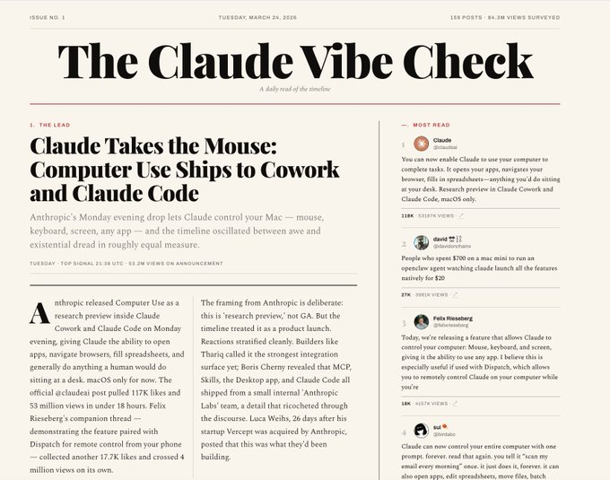
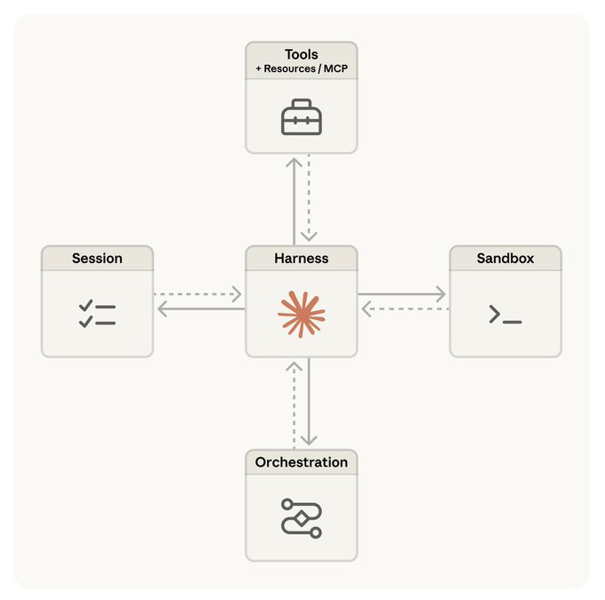

# Launching Claude Managed Agents / 推出 Claude 托管代理

## Article

## Conversation

[]

Launching Claude Managed Agents

推出 Claude 托管代理

TL;DR – Claude Managed Agents is a pre-built, configurable agent harness that runs in managed infrastructure. You define an agent as a template – tools, skills, files / repos, etc. The agent harness and the infrastructure are provided for you. The system is designed to keep pace with Claude’s rapidly growing intelligence and support long horizon tasks. Some useful links:

TL;DR – Claude 托管代理是一个预构建、可配置的代理框架，运行于托管基础设施之上。你将代理定义为模板——包括工具、技能、文件/仓库等。代理框架和基础设施由系统提供。该系统旨在跟上 Claude 快速增长的智能水平，并支持长周期任务。以下是一些有用的链接：

*   : Usage patterns and customer examples 
*   : The design of Claude Managed Agents 
*   : Onboarding, quickstart, overview of the CLI and SKDs

*   ：使用模式和客户案例
*   ：Claude 托管代理的设计
*   ：入门指南、快速启动、CLI 和 SDK 概览

Why Claude Managed Agents

为什么选择 Claude 托管代理

The Claude

Claude

is a direct gateway to the model: it accepts messages and returns content blocks. Agents built on the messages API use a harness to route Claude’s tool calls to handlers and manage context. This poses a few challenges:

是模型的直接网关：它接收消息并返回内容块。基于消息 API 构建的代理使用框架来路由 Claude 的工具调用到处理器并管理上下文。这带来了几个挑战：

*   Harnesses need to keep up with Claude – I recently wrote a blog

*   框架需要跟上 Claude 的步伐——我最近写了一篇博客

focused on building agents using Claude API primitives to handle tool orchestration and context management. But agent harnesses encode assumptions about what Claude can’t do. These assumptions grow stale as Claude gets more capable and can

，专注于使用 Claude API 原语构建代理来处理工具编排和上下文管理。但代理框架编码了关于 Claude 不能做什么的假设。随着 Claude 变得越来越有能力，这些假设会变得过时，可以

Claude’s performance. Harnesses need to be continually updated to keep pace with Claude. 
*   Claude is running for longer – Claude’s

Claude 的性能。框架需要不断更新以跟上 Claude。
*   Claude 的运行时间越来越长——Claude 的

, already exceeding over 10 human-hours of work on the METR benchmark. This puts pressure on the infrastructure around an agent: it needs to be safe, resilient to infrastructure failures that happen over long horizon tasks, and support scaling (e.g., to many agent teams).

，已经在 METR 基准上超过了 10 个人工小时的工作量。这给代理周围的基础设施带来了压力：它需要是安全的、对长时间任务中发生的基础设施故障具有弹性，并支持扩展（例如，扩展到多个代理团队）。

Addressing these challenges is important because we expect future Claude to run over days, weeks, or months on humanity's greatest challenges. The

解决这些挑战很重要，因为我们期望未来的 Claude 在人类最大挑战上运行数天、数周甚至数月。

was a first step, providing an excellent general purpose agent harness. Claude Managed Agents is the next step in this progression: a system with the harness and managed infrastructure designed to support safe, reliable execution over the time-horizon that we expect Claude to work.

是第一步，提供了一个优秀的通用代理框架。Claude 托管代理是这一进程的下一个步骤：一个将框架和托管基础设施结合在一起的系统，旨在支持在我们期望 Claude 工作的时长范围内安全、可靠地执行。

How to get started

如何开始

An easy way to onboard is to use our open source

一个简单的入门方式是使用我们的开源

, which works out of the box in Claude Code. Get the latest version of Claude Code and run the following sub-command for Claude Managed Agents onboarding. I’m excited about skills as a way to onboard to new features, and have used this skill extensively:

，它在 Claude Code 中开箱即用。获取最新版本的 Claude Code 并运行以下子命令进行 Claude 托管代理入门。我对技能作为入门新功能的方式感到兴奋，并且广泛使用过这个技能：

json

```
$ claude update
$ claude
/claude-api managed-agents-onboarding
```

Also see our

另请参阅我们的

for quickstart with the SDKs or CLI, and prototype agents

，了解 SDK 或 CLI 的快速启动，以及原型代理

.

。

Use cases

使用场景

You can see our

您可以在我们的

for a number of interesting examples. Some of the common patterns I’ve noticed across these examples and my own work:

中看到一些有趣的示例。在这些示例和我自己工作中，我注意到的一些常见模式：

*   Event-triggered: A service triggers the Managed Agent to do a task. For example, a system flags a bug and a managed agent writes the patch and opens the PR. No human in the loop between flag and action.

*   事件触发：服务触发托管代理执行任务。例如，系统标记出一个 bug，托管代理编写补丁并打开 PR。在标记和操作之间无需人工介入。

*   Scheduled: Managed Agent is scheduled to do a task. For example, I and many others use this pattern for scheduled daily briefs (e.g., of X or Github activity, what a team of agents is working on). Here's an example daily brief of X activity that I use.

*   定时任务：托管代理被调度执行任务。例如，我和其他许多人使用这种模式进行每日简报（例如，关于 X 或 Github 活动的简报，或代理团队正在做什么的简报）。这是我使用的 X 活动每日简报示例。

[]

*   Fire-and-forget: Humans trigger the Managed Agent to do a task. For example, assign tasks to the Managed Agent via Slack or Teams and get back deliverables (spreadsheets, slides, apps).

*   触发即忘：人类触发托管代理执行任务。例如，通过 Slack 或 Teams 向托管代理分配任务，然后收到交付物（电子表格、幻灯片、应用程序）。

*   Long-horizon tasks: Long-running tasks are an area where I think Managed Agents will be particularly useful. I’ve explored this by forking

*   长周期任务：长时间运行的任务是我认为托管代理特别有用的领域。我通过分叉

's auto-research repo and exploring a few different ideas. For example, I recently took

的自动研究仓库并探索一些不同的想法来研究这个问题。例如，我最近采用了

’s excellent

出色的

and had a Managed Agent explore ways to apply it to our engineering blog content.

，并让托管代理探索如何将其应用到我们的工程博客内容中。

The media could not be played.

无法播放该媒体。

Key concepts

核心概念

When onboarding, there’s three central concepts to understand:

入门时，有三个核心概念需要理解：

*   Agent — A versioned config that houses the agent's identity: model, system prompt, tools, skills, MCP servers, etc. You create it once and reference it by ID.

*   代理（Agent）——一个版本化的配置，包含代理的身份：模型、系统提示词、工具、技能、MCP 服务器等。你创建一次，通过 ID 引用它。

*   Environment — A template describing how to provision the sandbox the agent's tools run in (e.g., runtime type, networking policy, and package config).

*   环境（Environment）——一个模板，描述如何配置代理工具运行所在沙箱的供给（例如，运行时类型、网络策略和包配置）。

*   Session — A stateful run using the pre-created agent config and environment. It provisions a fresh sandbox from the environment template, mounts any per-run resources (files, GitHub repos), stores auth in a secure vault (MCP credentials).

*   会话（Session）——使用预创建的代理配置和环境的有状态运行。它从环境模板中提供一个新的沙箱，挂载每次运行的资源（文件、GitHub 仓库），在安全保管库中存储认证信息（MCP 凭证）。

Think about an agent as a configuration, an environment as a template describing the sandbox you want the agent to access for code execution, and the session as any agent execution. One agent can have many sessions.

可以把代理理解为一种配置，环境作为描述你希望代理访问用于代码执行的沙箱的模板，而会话作为代理的任何执行。一个代理可以拥有多个会话。

Usage

使用方式

See

请参阅

here:

：

*   – These are code-facing: import them in your app to drive sessions at runtime. Six languages have Managed Agents support: Python, TypeScript, Java, Go, Ruby, PHP. 
*   – Terminal-facing: every API resource (agents, environments, sessions, vaults, skills, files) is exposed as a subcommand. 
*   Common patterns – Use the CLI for setup and SDK for runtime. Agents templates are persistent: you create one, store it (e.g., as a YAML with model, system prompt, tools, MCP servers, skills in git) and have the CLI apply it in your deploy pipeline.

*   ——这些是面向代码的：在你的应用中导入它们以在运行时驱动会话。六种语言有托管代理支持：Python、TypeScript、Java、Go、Ruby、PHP。
*   ——面向终端：每个 API 资源（代理、环境、会话、保管库、技能、文件）都作为子命令暴露。
*   常见模式——使用 CLI 进行设置，使用 SDK 进行运行时操作。代理模板是持久化的：你创建一个，存储它（例如，在 git 中作为包含模型、系统提示词、工具、MCP 服务器、技能的 YAML），然后让 CLI 在你的部署流水线中应用它。

How it works

工作原理

I wrote an Anthropic engineering

我与

with

、

,

和

, and

一起写了一篇 Anthropic 工程博客

on the process of building Claude Managed Agents: a lesson we share in the post is that building agents to scale with Claude’s intelligence is an infrastructure challenge, not strictly a matter of harness design.

，讲述了构建 Claude 托管代理的过程：我们在文章中分享的一个教训是，构建能够随 Claude 智能水平扩展的代理是一个基础设施挑战，而不是严格意义上的框架设计问题。

[]

With this in mind, we didn’t design a particular agent harness; we expect agent harnesses to constantly evolve. Instead we decouple what we thought of as the “brain” (Claude and its harness) from both the “hands” (sandboxes and tools that perform actions) and the “session” (the log of session events).

基于这一认识，我们没有设计一个特定的代理框架；我们期望代理框架会不断演进。相反，我们将曾经认为是"大脑"的部分（Claude 及其框架）与"双手"（执行操作的沙箱和工具）以及"会话"（会话事件的日志）解耦。

Each became an interface that made few assumptions about the others, and each could fail or be replaced independently. We share how this gives the system reliability, security, and flexibility to add future harnesses, sandboxes, or infrastructure to house sessions.

每个部分都成为一个接口，对其他部分做很少的假设，并且每个部分都可以独立地失败或被替换。我们分享这如何赋予系统可靠性、安全性和灵活性，以添加未来的框架、沙箱或用于存放会话的基础设施。

Conclusion

结论

I'm excited about projects exploring different patterns of multi-agent orchestration or long-running tasks. One of the frustrations

我对探索多代理编排或长周期任务不同模式的项目感到兴奋。

is keeping agent harnesses up with model capabilities. Claude Managed Agents handles the agent harness and infrastructure for you, allowing for explorations on top of the agent as a new core primitive in the Claude API.

的一个挫折是让代理框架跟上模型能力。Claude 托管代理为你处理代理框架和基础设施，允许在代理作为 Claude API 的新核心原语之上进行探索。