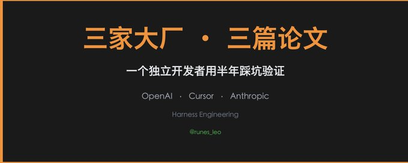
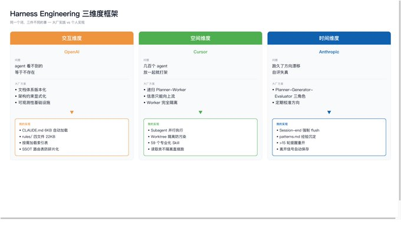
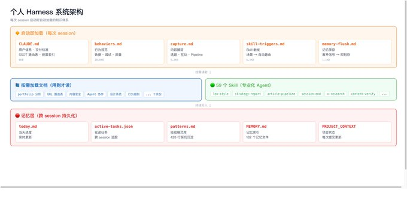

# Leo on X: "OpenAI/Cursor/Anthropic 同时发了 Harness   Engineering，我用半年踩坑验证了他们说的每一条" / X

Title: Leo on X: "OpenAI/Cursor/Anthropic 同时发了 Harness   Engineering，我用半年踩坑验证了他们说的每一条" / X

URL Source: https://x.com/runes_leo/status/2042243228678693244

Published Time: Fri, 10 Apr 2026 03:54:46 GMT

Markdown Content:
## Article

## Conversation

OpenAI/Cursor/Anthropic 同时发了 Harness Engineering，我用半年踩坑验证了他们说的每一条

OpenAI、Cursor、Anthropic 在同一个季度发了三篇实践报告，都叫 harness engineering，但讲的是三件完全不同的事。

有一篇文章把这三篇拆清楚了：OpenAI 在讲怎么设计 agent 的工作环境（交互维度），Cursor 在讲几百个 agent 怎么并行不打架（空间维度），Anthropic 在讲一个 agent 跑几个小时怎么不跑偏（时间维度）。三个独立的 scaling 问题，没有人同时解了三个。

我不是大厂，但这三个问题我全踩过。用 Claude Code 当全天候工作伙伴搞了半年多，踩坑的形状跟他们描述的一模一样。

Claude Code 每次新对话，context 是空的。

第一个月我每天花 15 分钟重复同样的话：这个项目是干嘛的、代码风格用什么、哪些文件别动、上次改到哪了。有一天我烦了，开始往 CLAUDE.md 里写规则。

一开始就几行提示。后来越写越多，用户信息、交付标准、协作偏好，慢慢长到 6KB。再后来 6KB 不够了，行为规范、内容捕捉规则、skill 触发条件这些东西全塞进去会撑爆 context，就拆成了 rules/ 目录，四个文件加起来 22KB，每次 session 自动加载。

还有十几份按需文档——portfolio 分析指南、URL 抓取路由表之类的，用到才读。CLAUDE.md 里维护一张索引表，AI 自己判断当前任务需要读哪些。

OpenAI 原文说得很直白："Codex 看不到的等于不存在"。我的体感完全一致。只不过 OpenAI 面对的是整个团队的隐性知识怎么推进 repo，我面对的是自己一个人的工作习惯怎么写成 markdown。

有一条规则是被逼出来的。有段时间持仓数据同时存在三个 markdown 文件里，三个版本互相矛盾，花了半天才理清楚哪个是真的。从那以后搞了一张 SSOT 路由表，每种信息只有一个存储位置，不查路由就写等于违规。

有一次我同时起了两个 subagent，一个重构某个模块，另一个在修同一个目录下的 bug。跑完发现重构的改动被 bug 修复覆盖了一半，两边的结果都不完整。

这就是 Cursor 论文里说的核心挑战：单个 agent 够聪明，放在一起就开始打架。他们几百个 agent 并行，我只有两三个，但撞上的问题结构一样。

解法是 worktree 隔离。需要改代码的 agent 启动时指定 isolation: "worktree"，在独立的 git worktree 里工作，改完不影响主分支。纯搜索或研究类的不用隔离，直接跑。

另一个收获是专业化比通用化靠谱。搜代码的用 Explore agent，做方案的用 Plan agent，修构建错误的用 build-error-resolver。59 个 skill 覆盖从推文写作到策略部署。让对的 agent 干对的事，比一个全能 agent 什么都干好很多。

最坑的一次，一个 session 跑了快三小时讨论交易策略参数调整。我当时觉得讨论得很充分，直接按 AI 建议改了配置部署上去。

第二天发现参数有问题——AI 在 session 后半段把前面讨论过的一个约束条件忘了，给出的建议跟早期的结论矛盾。幸亏金额不大，但这件事让我意识到 Anthropic 那篇文章说的"自评失真"是真的：agent 跑久了，它觉得自己回答得很好，实际上已经偏了。

具体来说，超过 15 轮对话或 30 次工具调用之后，AI 对之前的细节开始模糊，有时候还会"创造性地"补全一些不存在的事实。2-4 小时的 session 最隐蔽，不够长到明显出错，但够长到决策质量悄悄下降。

所以我搞了几层防护。session-end 时强制刷写记忆，当天进度写 today.md，跨 session 待办写 active-tasks.json。不等用户主动触发，检测到"先这样""出门了"之类的离开信号就立即执行，因为用户可能随时关窗口。

更长期的是 patterns.md——每次被纠正、连续失败三次、发现反直觉的事情，立即记录。下次 session 开始先读这个文件。同一个错误出现三次以上，提炼成规则写入 behaviors.md。目前积累了 428 行。

长 session 超过阈值时还会主动提醒重开。AI 主动要求结束对话，听起来反直觉，但 context 退化是真实存在的，诚实面对比假装没事强。

Anthropic 用 planner-generator-evaluator 三角色解决这个问题。我的方案土很多：定期存档、规则积累、主动截断。但对一个人够用了。

顺带一提，写完这篇的两天后 Anthropic 发了 Claude Managed Agents，思路是把整个 harness 这层直接包起来托管。这正好从另一面印证了这三个维度是真问题——个人方案和官方答卷的形状不同，但要解的病是同一个。

这三个维度的问题跟团队大小无关，来自"AI 长期可靠工作"这件事本身。只要你把 AI 当全天候工作伙伴而不只是偶尔写写代码，你就会遇到：知识怎么传递、任务怎么并行、状态怎么持久化。

如果你也在重度用 Claude Code，可以从最简单的开始：建一个 CLAUDE.md，把你每次重复交代的东西写进去。用两周，你就会发现它自己会长。

原文比我写的深很多，推荐读一遍：

关于作者：Leo (

)，AI x Crypto 独立构建者。在

做量化交易，用 Claude Code 搭建数据分析和自动化交易系统。更多实战分享：
