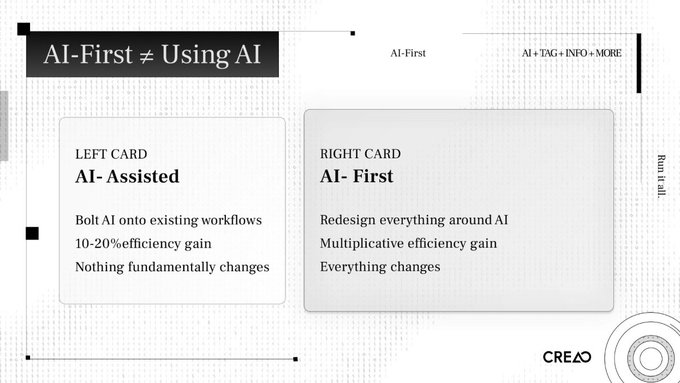
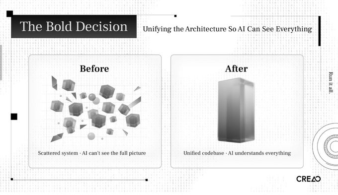
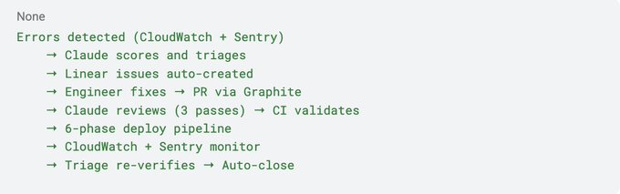
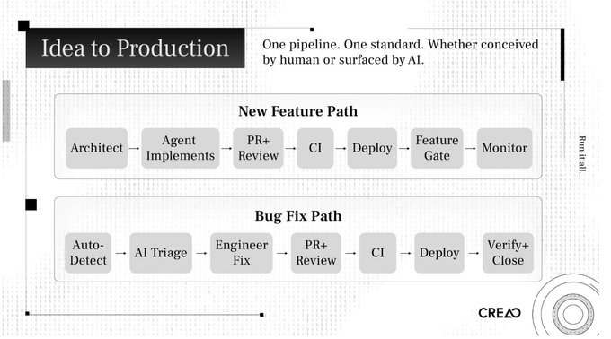
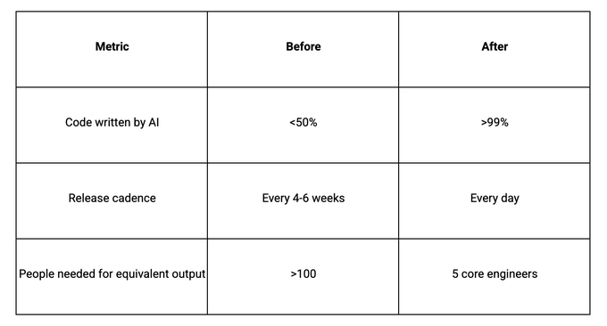

# Peter Pang on X: Why Your "AI-First" Strategy Is Probably Wrong / 为什么你的「AI优先」战略很可能是错的

99% of our production code is written by AI. Last Tuesday, we shipped a new feature at 10 AM, A/B tested it by noon, and killed it by 3 PM because the data said no. We shipped a better version at 5 PM. Three months ago, a cycle like that would have taken six weeks.

我们生产环境 99% 的代码是由 AI 编写的。上周二，我们上午 10 点上线了一个新功能，中午做了 A/B 测试，下午 3 点就因为数据显示不行而把它下线了。下午 5 点我们上线了一个更好的版本。三个月前，这样一个周期需要六周。

We didn't get here by adding Copilot to our IDE. We dismantled our engineering process and rebuilt it around AI. We changed how we plan, build, test, deploy, and organize the team. We changed the role of everyone in the company.

我们能做到这一点，不是靠给 IDE 加个 Copilot，而是拆掉了整个工程流程，用 AI 重建。我们改变了计划方式、构建方式、测试方式、部署方式和团队组织方式。我们改变了公司里每个人的角色。

CREAO is an agent platform. Twenty-five employees, 10 engineers. We started building agents in November 2025, and two months ago I restructured the entire product architecture and engineering workflow from the ground up.

CREAO 是一个 Agent 平台。25 名员工，10 名工程师。我们从 2025 年 11 月开始构建 Agent，两个月前我从零开始重构了整个产品架构和工程工作流。

OpenAI published a concept in February 2026 that captured what we'd been doing. They called it harness engineering: the primary job of an engineering team is no longer writing code. It is enabling agents to do useful work. When something fails, the fix is never "try harder." The fix is: what capability is missing, and how do we make it legible and enforceable for the agent?

OpenAI 在 2026 年 2 月发表了一个概念，完美概括了我们一直在做的事情。他们称之为 Harness Engineering：工程团队的主要工作不再是写代码，而是让 Agent 能够完成有效的工作。当某件事出错时，解决方案从来不是"再努力试试"，而是：缺少什么能力？我们如何让它对 Agent 来说可见且可执行？

We arrived at that conclusion on our own. We didn't have a name for it.

我们独立得出了这个结论，只是没有一个名字。

Most companies bolt AI onto their existing process. An engineer opens Cursor. A PM drafts specs with ChatGPT. QA experiments with AI test generation. The workflow stays the same. Efficiency goes up 10 to 20 percent. Nothing structurally changes.

大多数公司把 AI 简单地附加到现有流程上。工程师打开 Cursor，PM 用 ChatGPT 起草需求文档，QA 尝试用 AI 生成测试。流程原封不动，效率提升了 10% 到 20%，没有任何结构性的改变。

That is AI-assisted.

这叫 AI 辅助。

AI-first means you redesign your process, your architecture, and your organization around the assumption that AI is the primary builder. You stop asking "how can AI help our engineers?" and start asking "how do we restructure everything so AI does the building, and engineers provide direction and judgment?"

AI 优先意味着你围绕"AI 是主要建造者"这一假设，重新设计你的流程、架构和组织。你不再问"AI 如何帮助我们的工程师？"，而是问"我们如何重组一切，让 AI 完成建造，工程师提供方向和判断？"

The difference is multiplicative.

差异是乘数级的。

I see teams claim AI-first while running the same sprint cycles, the same Jira boards, the same weekly standups, the same QA sign-offs. They added AI to the loop. They didn't redesign the loop.

我看到一些团队声称自己是 AI 优先，却运行着同样的冲刺周期、同样的 Jira 看板、同样的周例会、同样的 QA 验收。他们只是在循环里加了 AI，没有重新设计循环。

A common version of this is what people call vibe coding. Open Cursor, prompt until something works, commit, repeat. That produces prototypes. A production system needs to be stable, reliable, and secure. You need a system that can guarantee those properties when AI writes the code. You build the system. The prompts are disposable.

一个常见的例子就是所谓的 Vibe Coding。打开 Cursor，一直 prompt 直到东西能跑，提交，重复。这能做出原型。生产系统需要稳定、可靠、安全。你需要一个能在 AI 写代码时保证这些特性的系统。你构建这个系统，prompt 是可以随时丢弃的。

Last year, I watched how our team worked and saw three bottlenecks that would kill us.

去年，我观察团队的运作方式，发现了三个会置我们于死地的瓶颈。

The Product Management Bottleneck

产品管理瓶颈

Our PMs spent weeks researching, designing, specifying features. Product management has worked this way for decades. But agents can implement a feature in two hours. When build time collapses from months to hours, a weeks-long planning cycle becomes the constraint.

我们的 PM 花了数周时间研究、设计、明确需求。几十年来，产品管理一直是这样运作的。但 Agent 可以两小时实现一个功能。当构建时间从几个月压缩到几小时，耗时数周的规划周期就成了瓶颈。

It doesn't make sense to think about something for months and then build it in two hours.

花几个月想一个问题，然后用两小时构建，这没有道理。

PMs needed to evolve into product-minded architects who work at the speed of iteration, or step out of the build cycle. Design needed to happen through rapid prototype-ship-test-iterate loops, not specification documents reviewed in committee.

PM 需要进化为具有产品思维的架构师，以迭代的速度工作，或者退出构建循环。设计需要通过快速原型—上线—测试—迭代的循环来完成，而不是靠委员会评审需求文档。

The QA Bottleneck

QA 瓶颈

Same dynamic. After an agent shipped a feature, our QA team spent days testing corner cases. Build time: two hours. Test time: three days.

同样的逻辑。Agent 上线一个功能后，我们的 QA 团队花了好几天测试边界情况。构建时间：两小时。测试时间：三天。

We replaced manual QA with AI-built testing platforms that test AI-written code. Validation has to move at the same speed as implementation. Otherwise you've built a new bottleneck ten feet downstream from the old one.

我们用 AI 构建的测试平台取代了人工 QA，来测试 AI 写的代码。验证必须以与实现同样的速度进行，否则你只是在旧瓶颈下游十英尺处造了一个新瓶颈。

The Headcount Bottleneck

人力瓶颈

Our competitors had 100x or more people doing comparable work. We have 25. We couldn't hire our way to parity. We had to redesign our way there.

我们的竞争对手用 100 倍或更多的人力做同样的工作。我们只有 25 个人。我们无法靠招聘赶上他们，必须靠重新设计。

Three systems needed AI running through them: how we design product, how we implement product, and how we test product. If any single one stays manual, it constrains the whole pipeline.

三个系统都需要 AI 贯穿其中：如何设计产品、如何实现产品、如何测试产品。如果任何一个保持人工，就会拖累整个管道。

I had to fix the codebase first.

我首先必须解决代码库的问题。

Our old architecture was scattered across multiple independent systems. A single change might require touching three or four repositories. From a human engineer's perspective, it is manageable. From an AI agent's perspective, opaque. The agent can't see the full picture. It can't reason about cross-service implications. It can't run integration tests locally.

我们旧的架构分散在多个独立系统中。一次改动可能需要修改三个或四个仓库。从人类工程师的角度来看，这可以接受。从 AI Agent 的角度来看，这是不透明的。Agent 看不到全貌，无法推理跨服务的影响，也无法在本地运行集成测试。

I had to unify all the code into a single monorepo. One reason: so AI could see everything.

我必须把所有代码统一到一个单体仓库里。原因之一：让 AI 能看到一切。

This is a harness engineering principle in practice. The more of your system you pull into a form the agent can inspect, validate, and modify, the more leverage you get. A fragmented codebase is invisible to agents. A unified one is legible.

这是 Harness Engineering 原则的实际应用。你的系统越是以 Agent 能够检查、验证和修改的形式呈现，你获得的杠杆就越大。碎片化的代码库对 Agent 是不可见的，而统一的代码库是清晰的。

I spent one week designing the new system: planning stage, implementation stage, testing stage, integration testing stage. Then another week re-architecting the entire codebase using agents.

我花了一周设计新系统：规划阶段、实现阶段、测试阶段、集成测试阶段。然后又花了一周，用 Agent 重新架构了整个代码库。

CREAO is an agent platform. We used our own agents to rebuild the platform that runs agents. If the product can build itself, it works.

CREAO 是一个 Agent 平台。我们用自己的 Agent 重建了运行 Agent 的平台。如果产品能构建自己，它就可行。

Here is our stack and what each piece does.

以下是我们的技术栈以及每个组件的作用。

Infrastructure: AWS

基础设施：AWS

We run on AWS with auto-scaling container services and circuit-breaker rollback. If metrics degrade after a deployment, the system reverts on its own.

我们运行在 AWS 上，使用自动扩展的容器服务和熔断回滚机制。如果部署后指标下降，系统会自动回滚。

CloudWatch is the central nervous system. Structured logging across all services, over 25 alarms, custom metrics queried daily by automated workflows. Every piece of infrastructure exposes structured, queryable signals. If AI can't read the logs, it can't diagnose the problem.

CloudWatch 是中枢神经系统。所有服务都有结构化日志，超过 25 个告警，自定义指标由自动化工作流每日查询。每件基础设施都暴露结构化、可查询的信号。如果 AI 读不懂日志，就无法诊断问题。

CI/CD: GitHub Actions

CI/CD：GitHub Actions

Every code change passes through a six-phase pipeline:

每次代码变更都经过六阶段管道：

Verify CI → Build and Deploy Dev → Test Dev → Deploy Prod → Test Prod → Release

Verify CI → 构建并部署 Dev → 测试 Dev → 部署 Prod → 测试 Prod → 发布

The CI gate on every pull request enforces typechecking, linting, unit and integration tests, Docker builds, end-to-end tests via Playwright, and environment parity checks. No phase is optional. No manual overrides. The pipeline is deterministic, so agents can predict outcomes and reason about failures.

每个 Pull Request 上的 CI 门禁强制执行类型检查、lint、单元和集成测试、Docker 构建、通过 Playwright 的端到端测试，以及环境一致性检查。没有阶段是可选的，没有人工覆盖。管道是确定性的，因此 Agent 可以预测结果并推理失败原因。

AI Code Review: Claude

AI 代码审查：Claude

Every pull request triggers three parallel AI review passes using Claude Opus 4.6:

每个 Pull Request 都会触发三次并行的 AI 审查，使用 Claude Opus 4.6：

Pass 1: Code quality. Logic errors, performance issues, maintainability.

第一轮：代码质量。逻辑错误、性能问题、可维护性。

Pass 2: Security. Vulnerability scanning, authentication boundary checks, injection risks.

第二轮：安全。漏洞扫描、认证边界检查、注入风险。

Pass 3: Dependency scan. Supply chain risks, version conflicts, license issues.

第三轮：依赖扫描。供应链风险、版本冲突、许可证问题。

These are review gates, not suggestions. They run alongside human review, catching what humans miss at volume. When you deploy eight times a day, no human reviewer can sustain attention across every PR.

这些是审查门禁，不是建议。它们与人工审查并行运行，捕捉人类在大规模下容易遗漏的问题。当你每天部署八次时，没有人类审查者能在每个 PR 上保持注意力。

Engineers also tag

工程师还可以在任何 GitHub Issue 或 PR 中标记

in any GitHub issue or PR for implementation plans, debugging sessions, or code analysis. The agent sees the whole monorepo. Context carries across conversations.

，以获取实现计划、调试会话或代码分析。Agent 能看到整个单体仓库，上下文在对话间保持连贯。

The Self-Healing Feedback Loop

自愈反馈循环

This is the centerpiece.

这是核心所在。

Every morning at 9:00 AM UTC, an automated health workflow runs. Claude Sonnet 4.6 queries CloudWatch, analyzes error patterns across all services, and generates an executive health summary delivered to the team via Microsoft Teams. Nobody had to ask for it.

每天 UTC 时间上午 9 点，一个自动化健康检查工作流运行。Claude Sonnet 4.6 查询 CloudWatch，分析所有服务的错误模式，生成高管健康摘要，通过 Microsoft Teams 推送给团队。没人需要主动去问。

One hour later, the triage engine runs. It clusters production errors from CloudWatch and Sentry, scores each cluster across nine severity dimensions, and auto-generates investigation tickets in Linear. Each ticket includes sample logs, affected users, affected endpoints, and suggested investigation paths.

一小时后，分诊引擎启动。它将 CloudWatch 和 Sentry 的生产错误聚类，在九个严重性维度上对每个聚类评分，并在 Linear 中自动生成调查工单。每个工单包含样本日志、受影响用户、受影响端点以及建议的调查路径。

The system deduplicates. If an open issue covers the same error pattern, it updates that issue. If a previously closed issue recurs, it detects the regression and reopens.

系统会做去重。如果已有开放工单覆盖相同的错误模式，它会更新那个工单。如果之前已关闭的工单再次出现，它会检测到回归并重新打开。

When an engineer pushes a fix, the same pipeline handles it. Three Claude review passes evaluate the PR. CI validates. The six-phase deploy pipeline promotes through dev and prod with testing at each stage. After deployment, the triage engine re-checks CloudWatch. If the original errors are resolved, the Linear ticket auto-closes.

当工程师推送修复时，同样的管道处理它。三轮 Claude 审查评估 PR，CI 验证，六阶段部署管道在开发和生产环境逐级推进，每个阶段都有测试。部署后，分诊引擎重新检查 CloudWatch。如果原始错误已解决，Linear 工单会自动关闭。

Each tool handles one phase. No tool tries to do everything. The daily cycle creates a self-healing loop where errors are detected, triaged, fixed, and verified with minimal manual intervention.

每个工具处理一个阶段。没有工具试图做所有事情。每日的循环创造了一个自愈反馈环，错误被检测、分诊、修复并验证，只需极少的人工介入。

I told a reporter from Business Insider: "AI will make the PR and the human just needs to review whether there's any risk."

我告诉 Business Insider 的记者："AI 会生成 PR，人类只需要审查是否存在风险。"

Feature Flags and the Supporting Stack

功能开关与支撑栈

Statsig handles feature flags. Every feature ships behind a gate. The rollout pattern: enable for the team, then gradual percentage rollout, then full release or kill. The kill switch toggles a feature off instantly, no deploy needed. If a feature degrades metrics, we pull it within hours. Bad features die the same day they ship. A/B testing runs through the same system.

Statsig 负责功能开关。每个功能都在一个开关后面上线。发布模式：先对团队启用，然后逐步百分比放量，然后全面发布或下线。杀死开关可以立即关闭某个功能，无需重新部署。如果某个功能导致指标下降，我们会在几小时内将其撤回。糟糕的功能在上线当天就会死亡。新功能在构思当天上线。A/B 测试通过同一个系统实时验证效果。

Graphite manages PR branching: merge queues rebase onto main, re-run CI, merge only if green. Stacked PRs allow incremental review at high throughput.

Graphite 管理 PR 分支：合并队列 rebase 到 main，重新运行 CI，只有绿灯才合并。堆叠式 PR 支持高吞吐量的增量审查。

Sentry reports structured exceptions across all services, merged with CloudWatch by the triage engine for cross-tool context. Linear is the human-facing layer: auto-created tickets with severity scores, sample logs, and suggested investigation. Deduplication prevents noise. Follow-up verification auto-closes resolved issues.

Sentry 报告所有服务的结构化异常，由分诊引擎与 CloudWatch 合并以获取跨工具上下文。Linear 是面向人类的层面：自动创建的工单带有严重性评分、样本日志和建议的调查。去重防止噪音。后续验证自动关闭已解决的问题。

New Feature Path

新功能路径

1.   The architect defines the task as a structured prompt with codebase context, goals, and constraints.

1.   架构师将任务定义为结构化 prompt，包含代码库上下文、目标和约束。

2.   An agent decomposes the task, plans implementation, writes code, and generates its own tests.

2.   Agent 分解任务，规划实现，编写代码，并生成自己的测试。

3.   A PR opens. Three Claude review passes evaluate it. A human reviewer checks for strategic risk, not line-by-line correctness.

3.   打开 PR。三轮 Claude 审查评估它。人工审查者检查战略风险，而不是逐行正确性。

4.   CI validates: typecheck, lint, unit tests, integration tests, end-to-end tests.

4.   CI 验证：类型检查、lint、单元测试、集成测试、端到端测试。

5.   Graphite's merge queue rebases, re-runs CI, merges if green.

5.   Graphite 的合并队列 rebase，重新运行 CI，绿灯则合并。

6.   Six-phase deploy pipeline promotes through dev and prod with testing at each stage.

6.   六阶段部署管道在开发和生产环境逐级推进，每个阶段都有测试。

7.   Feature gate turns on for the team. Gradual percentage rollout. Metrics monitored.

7.   功能开关对团队启用。逐步百分比放量。监控指标。

8.   Kill switch available if anything degrades. Circuit-breaker auto-rollback for severe issues.

8.   如果任何指标下降，杀死开关可用。严重问题触发熔断自动回滚。

Bug Fix Path

Bug 修复路径

1.   CloudWatch and Sentry detect errors.

1.   CloudWatch 和 Sentry 检测错误。

2.   Claude triage engine scores severity, creates a Linear issue with full investigation context.

2.   Claude 分诊引擎评估严重性，创建包含完整调查上下文的 Linear 工单。

3.   An engineer investigates. AI has already done the diagnosis. The engineer validates and pushes a fix.

3.   工程师调查。AI 已经做了诊断，工程师验证并推送修复。

4.   Same review, CI, deploy, and monitoring pipeline.

4.   同样的审查、CI、部署和监控管道。

5.   Triage engine re-verifies. If resolved, ticket auto-closes.

5.   分诊引擎重新验证。如果已解决，工单自动关闭。

Both paths use the same pipeline. One system. One standard.

两条路径使用同一个管道。一套系统，一个标准。

Over 14 days, we averaged three to eight production deployments per day. Under our old model, that entire two-week period would have produced not even a single release to production.

在 14 天里，我们平均每天完成三到八次生产部署。在旧模式下，这整整两周的时间甚至不足以完成一次生产发布。

Bad features get pulled the same day they ship. New features go live the same day they're conceived. A/B tests validate impact in real time.

糟糕的功能在上线当天就被撤回。新功能在构思当天就上线。A/B 测试实时验证效果。

People assume we're trading quality for speed. User engagement went up. Payment conversion went up. We produce better results than before, because the feedback loops are tighter. You learn more when you ship daily than when you ship monthly.

人们以为我们在用质量换速度。用户参与度上升了。支付转化率上升了。我们比之前产出更好的结果，因为反馈循环更紧密。当你每天上线时，比每月上线时学到的东西多得多。

Two types of engineers will exist.

未来将存在两类工程师。

The Architect

架构师

One or two people. They design the standard operating procedures that teach AI how to work. They build the testing infrastructure, the integration systems, the triage systems. They decide architecture and system boundaries. They define what "good" looks like for the agents.

一到两个人。他们设计标准操作程序，教 AI 如何工作。他们构建测试基础设施、集成系统、分诊系统。他们决定架构和系统边界。他们定义什么对 Agent 来说是"好"。

This role requires deep critical thinking. You criticize AI. You don't follow it. When the agent proposes a plan, the architect finds the holes. What failure modes did it miss? What security boundaries did it cross? What technical debt is it accumulating?

这个角色需要深度批判性思维。你批判 AI，而不是追随它。当 Agent 提出一个计划时，架构师找出漏洞。它遗漏了什么失败模式？它跨越了什么安全边界？它正在积累什么技术债务？

I have a PhD in physics. The most useful thing my PhD taught me was how to question assumptions, stress-test arguments, and look for what's missing. The ability to criticise AI will be more valuable than the ability to produce code.

我有物理学博士学位。我博士学到的最有用的东西是：如何质疑假设、如何压力测试论点、如何寻找缺失的部分。批判 AI 的能力将比产出代码的能力更有价值。

This is also the hardest role to fill.

这也是最难招聘的角色。

The Operator

操作者

Everyone else. The work matters. The structure is different.

其他所有人。工作是有价值的，但结构不同。

AI assigns tasks to humans. The triage system finds a bug, creates a ticket, surfaces the diagnosis, and assigns it to the right person. The person investigates, validates, and approves the fix. AI makes the PR. The human reviews whether there's risk.

AI 给人类分配任务。分诊系统发现 Bug，创建工单，呈现诊断结果，并将其分配给正确的人。人调查、验证并批准修复。AI 生成 PR，人类审查是否存在风险。

The tasks are bug investigation, UI refinement, CSS improvements, PR review, verification. They require skill and attention. They don't require the architectural reasoning the old model demanded.

任务是 Bug 调查、UI 优化、CSS 改进、PR 审查、验证。这些需要技能和注意力，但不需要旧模式所要求的架构推理能力。

Who Adapts Fastest

谁适应得最快

I noticed a pattern I didn't expect. Junior engineers adapted faster than senior engineers.

我注意到一个我没有预料到的模式。初级工程师比高级工程师适应得更快。

Junior engineers with less traditional practice felt empowered. They had access to tools that amplified their impact. They didn't carry a decade of habits to unlearn.

传统实践较少的初级工程师感到被赋能了。他们有机会接触到放大他们影响力的工具。他们没有需要摒弃的十年习惯。

Senior engineers with strong traditional practice had the hardest time. Two months of their work could be completed in one hour by AI. That is a hard thing to accept after years of building a rare skill set.

传统实践很强的高级工程师处境最艰难。他们两个月的工作量 AI 一小时就能完成。在花了好几年建立一套稀缺技能之后，这是很难接受的事实。

I'm not making a judgment. I'm describing what I observed. In this transition, adaptability matters more than accumulated skill.

我不是在作判断，我只是在描述我观察到的现象。在这个转型期，适应能力比积累的技能更重要。

Management Collapsed

管理层消失了

Two months ago, I spent 60% of my time managing people. Aligning priorities. Running meetings. Giving feedback. Coaching engineers.

两个月前，我 60% 的时间用于人员管理。对齐优先级、开会、给反馈、指导工程师。

Today: below 10%.

今天：不到 10%。

The traditional CTO model says to empower your team to do architecture work, train them, delegate. But if the system only needs one or two architects, I need to do it myself first. I went from managing to building. I code from 9 AM to 3 AM most days. I design the SOPs and architecture of the system. I maintain the harness.

传统的 CTO 模式是授权你的团队做架构工作、培养他们、授权。但如果说系统只需要一两个架构师，我需要先自己做。我从管理转向了构建。我大多数日子从早上 9 点写到凌晨 3 点。我设计系统的 SOP 和架构，维护这个 Harness。

More stressful. But I'm enjoying building, not aligning.

压力更大了。但我喜欢构建，而不是对齐。

Less Arguing, Better Relationships

争论更少，关系更好

My relationships with co-founders and engineers are better than before.

我和联合创始人及工程师的关系比以前更好了。

Before the transition, most of my interaction with the team was alignment meetings. Discussing trade-offs. Debating priorities. Disagreeing about technical decisions. Those conversations are necessary in a traditional model. They're also draining.

转型前，我和团队的大部分互动是对齐会议。讨论权衡、争论优先级、对技术决策持不同意见。在传统模式中，这些对话是必要的，但也很消耗。

Now I still talk to my team. We talk about other things. Non-work topics. Casual conversations. Offsite trips. We get along better because we stopped arguing about work that can be easily done by our system.

现在我仍然和团队交谈。我们聊别的东西。非工作话题、随意的对话、团建旅行。我们相处得更好，因为我们停止了对那些系统轻易就能完成的工作的争论。

Uncertainty Is Real

不确定性是真实的

I won't pretend everyone is happy.

我不会假装每个人都开心。

When I stopped talking to people every day, some team members felt uncertain. What does the CTO not talking to me mean? What is my value in this new world? Reasonable concerns.

当我停止每天和人交谈时，一些团队成员感到不确定。CTO 不和我说话意味着什么？在新世界里我的价值是什么？这些都是合理的担忧。

Some people spend more time debating whether AI can do their work than doing the work. The transition period creates anxiety. I don't have a clean answer for it.

有些人花更多时间讨论 AI 能否做他们的工作，而不是实际去做。过渡期产生了焦虑。我没有完美的答案。

I do have a principle: we don't fire an engineer because they introduced a production bug. We improve the review process. We strengthen testing. We add guardrails. The same applies to AI. If AI makes a mistake, we build better validation, clearer constraints, stronger observability.

但我有一条原则：我们不会因为工程师引入了生产 Bug 而解雇他。我们改进审查流程，加强测试，添加护栏。AI 同样适用。如果 AI 犯了错误，我们构建更好的验证、更清晰的约束、更强的可观测性。

I see other companies adopt AI-first engineering and leave everything else manual.

我看到其他公司采用 AI 优先的工程，但其他一切都保持人工。

If engineering ships features in hours but marketing takes a week to announce them, marketing is the bottleneck. If the product team still runs a monthly planning cycle, planning is the bottleneck.

如果工程几小时就能上线功能，但营销需要一周才能发布，营销就是瓶颈。如果产品团队仍然按月运行规划周期，规划就是瓶颈。

At CREAO, we pushed AI-native operations into every function:

在 CREAO，我们将 AI 原生运营推向了每个职能：

*   Product release notes: AI-generated from changelogs and feature descriptions.

*   产品发布说明：由 AI 根据变更日志和功能描述生成。

*   Feature intro videos: AI-generated motion graphics.

*   功能介绍视频：由 AI 生成 motion graphics。

*   Daily posts on socials: AI-orchestrated and auto-published.

*   每日社交帖子：由 AI 编排和自动发布。

*   Health reports and analytics summaries: AI-generated from CloudWatch and production databases.

*   健康报告和分析摘要：由 AI 从 CloudWatch 和生产数据库生成。

Engineering, product, marketing, and growth run in one AI-native workflow. If one function operates at agent speed and another at human speed, the human-speed function constrains everything.

工程、产品、营销和增长运行在同一个 AI 原生工作流中。如果一个职能以 Agent 速度运行，另一个以人类速度运行，人类速度的职能就会拖累一切。

For Engineers

给工程师

Your value is moving from code output to decision quality. The ability to write code fast is worth less every month. The ability to evaluate, criticize, and direct AI is worth more.

你的价值正在从代码产出转向决策质量。快速写代码的能力每月都在贬值。评估、批判和指导 AI 的能力每月都在增值。

Product sense or taste matters. Can you look at a generated UI and know it's wrong before the user tells you? Can you look at an architecture proposal and see the failure mode the agent missed?

产品感觉或品味很重要。你能否在看 AI 生成的 UI 时，在用户告诉你之前就知道它是错的？你能否在看一个架构提案时，发现 Agent 遗漏的失败模式？

I tell our 19-year-old interns: train critical thinking. Learn to evaluate arguments, find gaps, question assumptions. Learn what good design looks like. Those skills compound.

我告诉我们 19 岁的实习生：训练批判性思维。学习评估论点、发现漏洞、质疑假设。了解好的设计是什么样的。这些技能会复利增长。

For CTOs and Founders

给 CTO 和创始人

If your PM process takes longer than your build time, start there.

如果你的 PM 流程比构建时间长，从那里开始。

Build the testing harness before you scale agents. Fast AI without fast validation is fast-moving technical debt.

在扩大 Agent 规模之前先构建测试 Harness。没有快速验证的快速 AI 是快速移动的技术债务。

Start with one architect. One person who builds the system and proves it works. Onboard others into operator roles after the system runs.

从一个架构师开始。一个人构建系统并证明它有效。在系统运行之后再让其他人以操作者角色加入。

Push AI-native into every function.

将 AI 原生推向每个职能。

Expect resistance. Some people will push back.

预期会有阻力。有些人会反对。

For the Industry

给行业

OpenAI, Anthropic, and multiple independent teams converged on the same principles: structured context, specialized agents, persistent memory, and execution loops. Harness engineering is becoming a standard.

OpenAI、Anthropic 和多个独立团队收敛到了相同的原则：结构化上下文、专业化 Agent、持久记忆和执行循环。Harness Engineering 正在成为标准。

Model capability is the clock driving this. I attribute the entire shift at CREAO to the last two months. Opus 4.5 couldn't do what Opus 4.6 does. Next-gen models will accelerate it further.

模型能力是驱动这一切的时钟。我将 CREAO 的整个转变归因于过去两个月。Opus 4.5 做不了 Opus 4.6 能做的事。下一代模型会进一步加速。

I believe one-person companies will become common. If one architect with agents can do the work of 100 people, many companies won't need a second employee.

我相信一人公司会变得普遍。如果一个架构师加 Agent 能做 100 个人的工作，许多公司就不再需要第二个员工。

Most founders and engineers I talk to still operate the traditional way. Some think about making the shift. Very few have done it.

我和大多数创始人及工程师交谈时，他们仍然以传统方式运作。有些人考虑做出改变。真正动手做的很少。

A reporter friend told me she'd talked to about five people on this topic. She said we were further along than anyone: "I don't think anyone's just totally rebuilt their entire workflow the way you have."

一个记者朋友告诉我，她在这个话题上大约和五个人聊过。她说我们比任何人都走得更远："我不认为有人像你这样完全重建了整个工作流。"

The tools exist for any team to do this. Nothing in our stack is proprietary.

任何团队都有这些工具。我们的技术栈没有任何东西是专有的。

The competitive advantage is the decision to redesign everything around these tools, and the willingness to absorb the cost. The cost is real: uncertainty among employees, the CTO working 18-hour days, senior engineers questioning their value, a two-week period where the old system is gone and the new one isn't proven.

竞争优势在于决定用这些工具重新设计一切，以及吸收成本的意愿。成本是真实的：员工的不确定性、CTO 每天工作 18 小时、高级工程师质疑自己的价值、两周的时间里旧系统没了而新系统还没被验证。

We absorbed that cost. Two months later, the numbers speak.

我们承担了那个成本。两个月后，数据说话。

We build an agent platform. We built it with agents.

我们构建了一个 Agent 平台。我们用 Agent 构建了它。