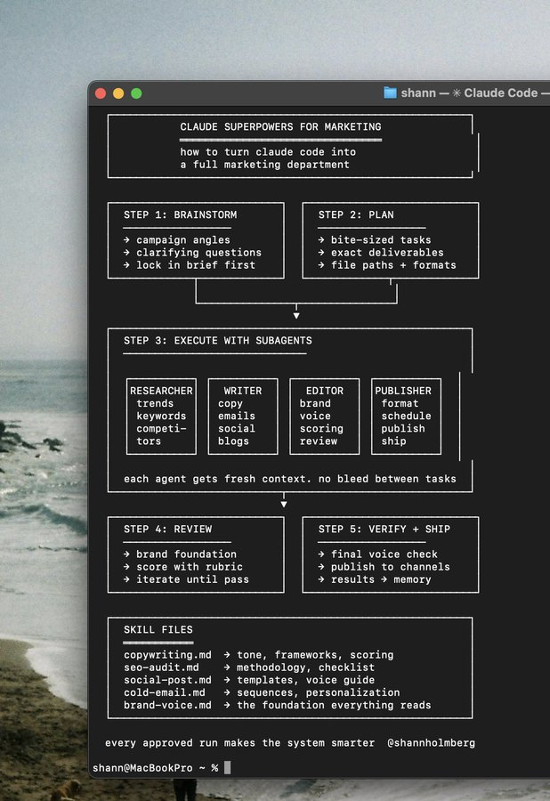
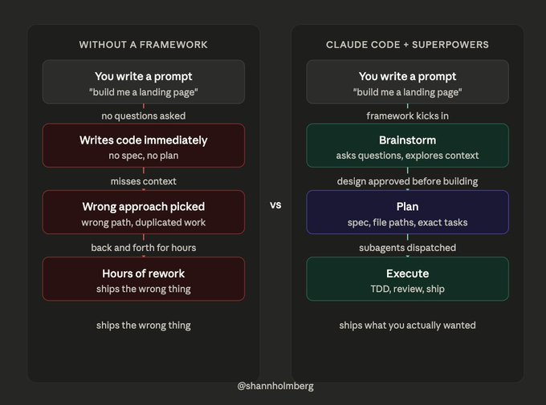
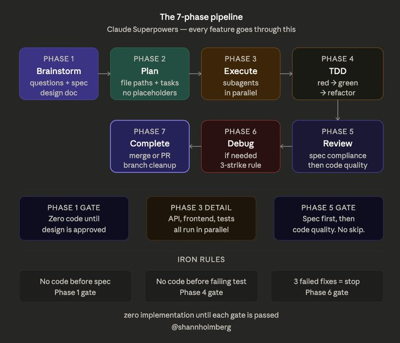
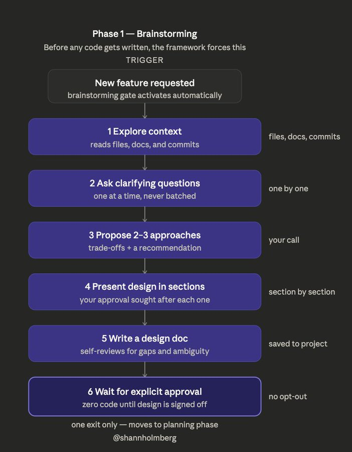
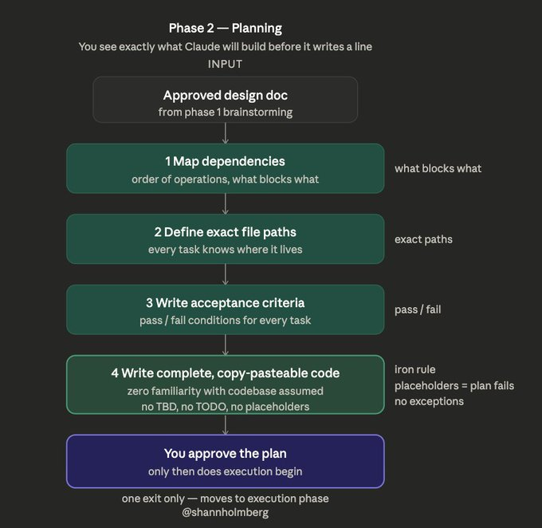
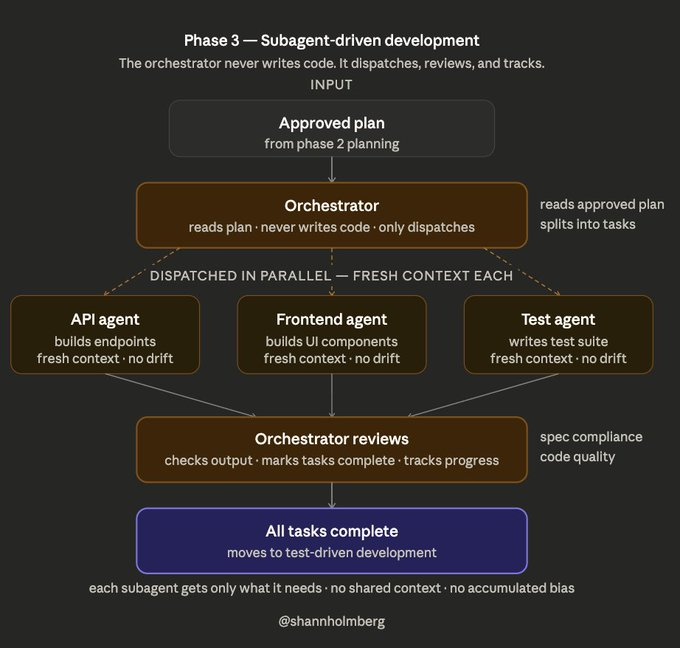
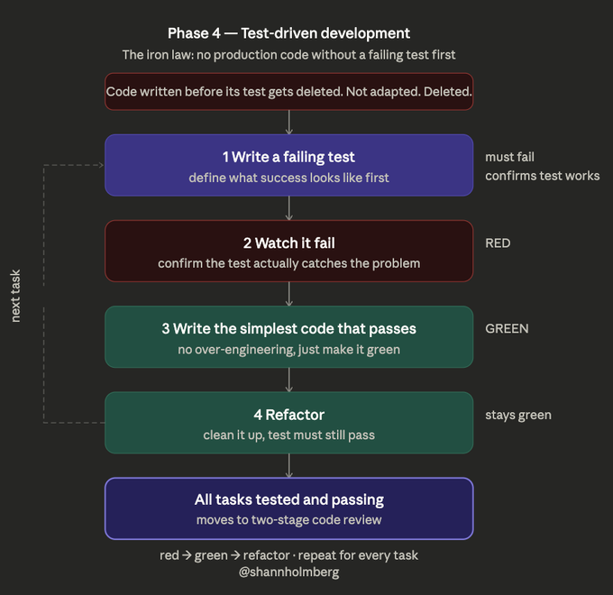
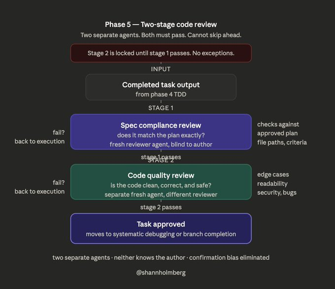
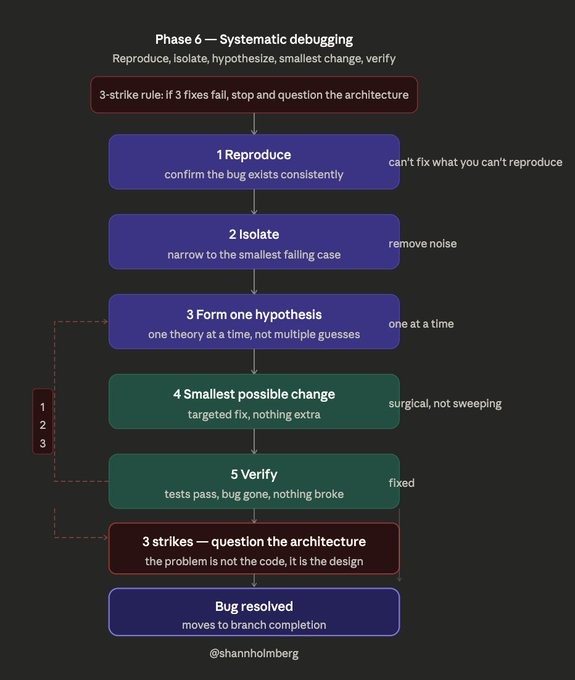
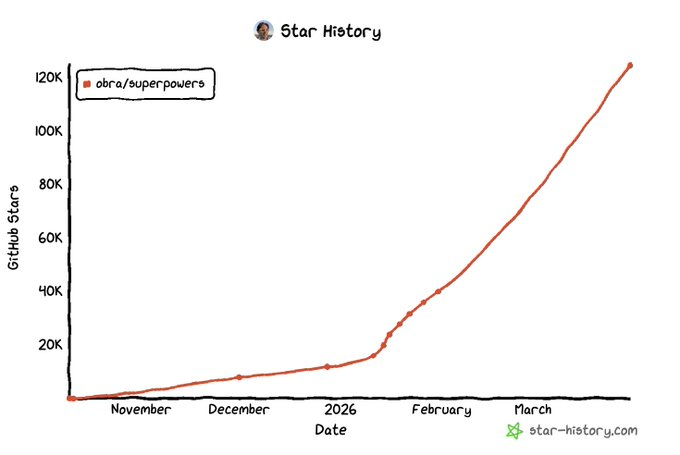

# Shann³ on X: "How to give Claude Code Superpowers" / 如何赋予 Claude Code 超能力

Title: Shann³ on X: "How to give Claude Code Superpowers" / 如何赋予 Claude Code 超能力

URL Source: https://x.com/shannholmberg/status/2038636871270424794

Markdown Content:

After a year of claude code. superpowers is the plugin I wish I had from day one.

用 claude code 一年了。superpowers 是我从第一天起就想要的插件。

it increased speed, quality and removed the frustration of going back and forth with claude on a regular basis.

它提升了速度、代码质量，也消除了与 claude 来回反复沟通的挫败感。

without it, claude just starts building without asking questions &. writing a plan. sometimes it works, but mostly you end up course-correcting for an hour.

没有它的话，claude 只是闷头开始构建，不会先问问题也不会写计划。有时候能行，但大多数时候你得花一个小时来回纠错。

superpowers is an open-source workflow framework by jesse vincent (GitHub). 125,000+ github stars, gaining 15-20K per week.

superpowers 是一个由 jesse vincent 开发的开源工作流框架（GitHub）。拥有超过 125,000 颗星，每周增长 15-20K。

Shann³

@shannholmberg

claude superpowers is the most underrated plugin for marketers right now 83,000 github stars. trending daily. but almost everyone using it is a developer here´s how it works and how to apply it to marketing 

claude superpowers 是目前营销人员最被低估的插件。83,000 GitHub 星，每日趋势上涨。但几乎所有使用它的人都是开发者——以下是它的工作原理以及如何应用到营销中。

think about what a good engineer does with a new task. they dont just start coding. they read the codebase, ask questions, weigh trade-offs, write up an approach, then build.

想象一下一个优秀的工程师面对新任务时会怎么做。他们不会一上来就开始写代码。他们会阅读代码库、提问、权衡利弊、写出方案思路，然后再动手构建。

superpowers gives claude that same process. 14+ skills that kick in based on what you're doing: brainstorming, spec-first planning, TDD, subagent execution, systematic debugging.

superpowers 给 claude 赋予同样的流程。14+ 项技能，根据你正在做的事情自动触发：头脑风暴、规格优先规划、TDD、子智能体执行、系统化调试。

the skills are mandatory. if one applies, claude must use it. the framework has a list of 12 excuses developers use to skip workflows.

这些技能是强制性的。如果有一项适用，claude 就必须使用它。该框架列出了 12 种开发者用来跳过工作流的借口。

works with cursor, codex, and gemini CLI.

支持 cursor、codex 和 gemini CLI。

superpowers breaks every task into 7 phases. you don't always hit all 7, some tasks only need the first two or three. but the structure is there when you need it.

superpowers 将每个任务拆分为 7 个阶段。你不总是需要经历全部 7 个阶段，有些任务只需要前两三个。但当你需要时，这个结构是现成的。

phase 1: brainstorming

第一阶段：头脑风暴

this is the one I use the most

这是我使用最频繁的一个。

before any new feature, superpowers forces a brainstorming session. not "ask a few questions and move on." a full 9-step workflow:

在任何新功能之前，superpowers 都会强制进行一场头脑风暴。不是"问几个问题然后跳过"，而是完整的 9 步工作流：

> explore your project context (files, docs, recent commits)

> 探索你的项目上下文（文件、文档、最近的提交记录）

> ask clarifying questions one at a time (never batched, so you actually think about each answer)

> 一次只提一个澄清问题（绝不批量提问，这样你才能真正思考每个答案）

> propose 2-3 approaches with trade-offs and a recommendation

> 提出 2-3 个方案，附上利弊分析和推荐建议

> present the design in sections, seek your approval after each

> 分段展示设计，每段结束后征求你的批准

> write a design doc to your project

> 将设计文档写入你的项目

> self-review the spec for gaps, contradictions, ambiguity

> 自我审查规格说明，查找漏洞、矛盾和歧义

> wait for your explicit approval before moving forward

> 在获得你明确批准之前等待，绝不提前行动

zero implementation until the design is approved. there´s only one exit from brainstorming: moving to the planning phase.

在设计被批准之前，零实现。头脑风暴只有一个出口：进入规划阶段。

phase 2: planning

第二阶段：规划

once brainstorming is approved, superpowers generates a structured plan with dependencies, acceptance criteria, exact file paths, and order of operations.

一旦头脑风暴获得批准，superpowers 会生成一份结构化计划，包含依赖关系、验收标准、精确文件路径和操作顺序。

the iron rule here: no placeholders allowed. any of these will fail the plan:

这里的铁律是：不允许任何占位符。以下任何一种都会导致计划失败：

> "TBD"

> "TBD"（待定）

> "TODO"

> "TODO"（稍后实现）

> "implement later"

> "implement later"（稍后实现）

> "similar to task above"

> "similar to task above"（与上述任务类似）

every single task has to contain complete, copy-pasteable instructions. the assumption is that whoever executes the plan (usually a subagent) has zero familiarity with your codebase.

每一个任务都必须包含完整的、可直接复制粘贴的指令。假设执行计划的人（通常是子智能体）对你的代码库一无所知。

strict, yes. but it means you see exactly what claude will build before it writes a single line. you read the plan, tweak anything thats off, approve it, and execution follows the spec.

严格，是的。但这意味着在 claude 写第一行代码之前，你就能看到它将要构建的全部内容。你阅读计划，修改任何不对的地方，批准它，然后执行就会严格按照规格进行。

I've started treating these plans like mini PRDs. they're detailed enough that I could hand one to a subagent and they'd know exactly what to build.

我已经开始把这些计划当作小型 PRD（产品需求文档）来对待了。它们足够详细，我甚至可以把其中一个交给子智能体，它就会明确知道自己要构建什么。

phase 3: subagent-driven development

第三阶段：子智能体驱动开发

claude dispatches subagents for independent tasks, all running in parallel. each subagent gets a fresh context window with no drift from other tasks. the main claude session never writes code itself. it just orchestrates:

claude 将独立任务分派给子智能体，全部并行运行。每个子智能体获得一个全新的上下文窗口，不会因其他任务而产生漂移。主 claude 会话本身不写代码，只负责协调：

> dispatch tasks to subagents

> 向子智能体分派任务

> review what comes back

> 审查返回结果

> track progress against the plan

> 对照计划跟踪进度

phase 4: test-driven development

第四阶段：测试驱动开发

superpowers enforces what it calls the "iron law": no production code without a failing test first. if code gets written before its test, it gets deleted.

superpowers 强制执行它所称的"铁律"：没有失败的测试，就不能写生产代码。如果代码在测试之前被写出来，就会被删除。

write a failing test, write the simplest code that passes it, refactor. classic TDD loop, but the framework enforces it so you can't skip it when you're in a hurry.

写一个失败的测试，写出能使其通过的最简单代码，然后重构。经典的 TDD 循环，但框架会强制执行它，所以你忙的时候也无法跳过。

I don't use TDD for everything. for quick prototypes and one-off scripts, I skip this phase. but for anything that needs to be maintained, having tests written before the code means I can refactor later without guessing what's going to break.

我并非所有事情都用 TDD。对于快速原型和一次性脚本，我会跳过这个阶段。但对于任何需要长期维护的东西，代码之前先写测试，意味着我以后重构时不需要猜测什么会被破坏。

phase 5: two-stage code review

第五阶段：两阶段代码审查

two separate reviews per task. first review checks spec compliance: does the code match what was planned? second review checks code quality. both must pass, and they run as separate reviewer agents so the first review doesnt bias the second.

每个任务进行两次独立审查。第一次审查检查规格遵循：代码是否符合计划？第二次审查检查代码质量。两次都必须通过，且作为独立的审查智能体运行，这样第一次审查不会影响第二次。

phase 6: systematic debugging

第六阶段：系统化调试

when something breaks, superpowers follows a strict protocol:

当出现问题时，superpowers 遵循严格的协议：

> reproduce the bug

> 重现 bug

> isolate the cause

> 隔离原因

> form one hypothesis (not three)

> 形成一个假设（不是三个）

> make the smallest possible change

> 做最小可能的改动

> verify

> 验证

theres a 3-strike rule. if 3 attempted fixes fail, the framework stops trying to patch symptoms and forces you to question the architecture. this prevents the death spiral where claude keeps making small tweaks that don't address the root cause.

有三次机会规则。如果 3 次修复尝试都失败了，框架会停止尝试修补症状，强制你去质疑架构本身。这防止了死亡螺旋——即 claude 不断做小的调整却无法解决根本原因。

phase 7: branch completion

第七阶段：分支完成

once everything passes, it handles the merge, PR, or cleanup.

一旦所有检查通过，它处理合并、PR 或清理工作。

My latest example is building our new agency landing page from scratch.

我最近的例子是从零开始构建我们新的代理落地页。

I kicked off a brainstorming session and superpowers started by reading my existing project structure, the design system I had in place, and recent commits. about 5 minutes of back and forth:

我发起了一个头脑风暴会议，superpowers 首先读取了我现有的项目结构、我已有的设计系统和最近的提交记录。大约 5 分钟的来回沟通：

> asked about framework preferences

> 询问了框架偏好

> asked about design constraints

> 询问了设计约束

> asked whether I had existing brand assets

> 询问了我是否有现成的品牌资产

> proposed a component structure, animation plan, deployment config

> 提出了组件结构、动画计划和部署配置

approved the plan and it dispatched agents: one for the hero section, another for the feature grid, another for deployment. 30 minutes and 5 iterations later, the coming soon page was live

批准了计划，然后它分派了智能体：一个负责英雄区，一个负责功能网格，一个负责部署。30 分钟和 5 次迭代之后，coming soon 页面就上线了。

Shann³

@shannholmberg

building our new agency LP from scratch. 1. huddled with the team on brand direction. mood boards in Google Flow, type pairings, color palettes. goal was a brand that doesnt scream ai generated but lets us create assets with ai 2. researched frameworks, landed on Astro + Radix

从零开始构建我们新的代理 LP。1. 与团队讨论品牌方向。情绪板放在 Google Flow，字体搭配，色板。目标是打造一个不喊"AI 生成"的品牌，但让我们能用 AI 创建资产。2. 研究了框架，选择了 Astro + Radix

without those brainstorming and planning steps, that build would have been hours of me course-correcting claudes assumptions mid-build. I know because I've done similar builds without a framework and spent most of the time doing exactly that.

如果没有那些头脑风暴和规划步骤，那个构建过程会花上我几个小时来纠正 claude 的假设。之所以知道，是因为我之前没用框架做过类似的构建，把大部分时间都花在了纠错上。

the brainstorming session front-loaded every decision that would have been a mid-build argument. by the time agents started writing code, there was nothing left to argue about.

头脑风暴会议把所有本该是构建中途争论的决策都前置了。当智能体开始写代码的时候，已经没有什么值得争论的了。

install it as a claude code plugin and start your next task normally.

把它安装为 claude code 插件，然后正常开始你的下一个任务。

the brainstorming kicks in automatically before any code gets written.

头脑风暴会在任何代码被写之前自动触发。

1. answer the brainstorming questions honestly. you'll catch assumptions you didn't know you were making.

1. 如实回答头脑风暴问题。你会发现自己未曾意识到的假设。

2. let it generate a plan. read through it carefully. tweak anything thats off and approve.

2. 让它生成一份计划。仔细阅读。修改任何不对的地方并批准。

3. on a multi-file task, let it dispatch subagents and just watch what happens.

3. 对于多文件任务，让它分派子智能体，然后观察发生了什么。

Link to git:

GitHub 链接：

the skills consume context window. on large tasks with lots of existing code, the brainstorming and planning prompts can eat into what claude has available for your actual implementation. I've hit this on a few bigger projects.

这些技能会消耗上下文窗口。在大型任务中，如果已有代码很多，头脑风暴和规划提示会占用 claude 可用于实际实现的空间。我在几个更大的项目中遇到过这个问题。

for quick one-file fixes, the brainstorming gate is overkill. sometimes you just want to change a color or fix a typo.

对于快速单文件修复，头脑风暴的门控是多余的。有时候你只是想改个颜色或修个拼写错误。

it shines on multi-file features and full builds. anything where you'd normally go back and forth with claude for an hour trying to get the architecture right.

它最擅长的是多文件功能和完整构建。任何你通常需要和 claude 来回争论一个小时才能把架构做对的场景。

0 to 125,000 github stars in months. #1 trending on github.

几个月内从 0 到 125,000 GitHub 星。GitHub 趋势榜第一。

developers are figuring out that raw prompting has a ceiling. you can write better prompts, add more context, be more specific. but at some point you need structure, not just better input.

开发者们正在意识到，原始提示是有天花板的。你可以写更好的提示、加更多上下文、更具体。但到了某个阶段，你需要的是结构，而不仅仅是更好的输入。

follow me

关注我

for more on building with ai tools, vibe coding, and agent systems.

了解更多关于使用 AI 工具、氛围编程和智能体系统的内容。
