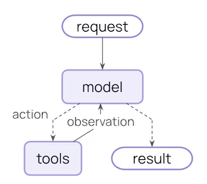
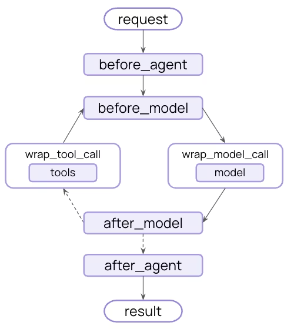

# How Middleware Lets You Customize Your Agent Harness / Middleware 如何自定义 Agent Harness

Agent harnesses are what help build an agent, they connect an LLM to its environment and let it do things.
Agent harnesses 是帮助构建 agent 的关键，它们将 LLM 与环境连接起来，让它能够执行各种操作。

When you’re building an agent, it’s likely you’ll want build an application specific agent harness. “Agent Middleware” empowers you to build on top of LangChain and Deep Agent’s solid foundation, but customize them for your use case.
在构建 agent 时，你很可能需要构建一个特定于应用的 agent harness。"Agent Middleware" 让你能够在 LangChain 和 Deep Agent 的坚实基础上进行构建，并针对你的用例进行定制。

An agent is a system built around a model. The model needs to be connected to an environment, data, memory, and tools. Agent harnesses are the system that helps you do that.
Agent 是围绕模型构建的系统。模型需要连接到环境、数据、记忆和工具。Agent harnesses 就是帮助完成这一切的系统。

The core of every agent harness is the same, and remarkably simple: an LLM, running in a loop, calling tools. Simple as it is, there's power in this core loop.
每个 agent harness 的核心都是相同的，而且出奇地简单：一个 LLM，运行在一个循环中，调用各种工具。这个核心循环虽然简单，但蕴含着强大的力量。

LangChain contains `create_agent` - an abstraction with just this core loop.
LangChain 包含 `create_agent`——一个只有这个核心循环的抽象。

Different agent use cases have different needs. They may require different agent harnesses.
不同的 agent 用例有不同的需求。它们可能需要不同的 agent harnesses。

Some parts of the an agent harness - like instructions or tools - are pretty easy to customize. create_agent in LangChain lets you pass in a system prompt and tools for example.
Agent harness 的某些部分——比如指令或工具——非常容易定制。例如，LangChain 的 create_agent 允许你传入 system prompt 和工具。

Other parts are more involved. What if you want always run a certain step before the model executes? What if you always want to check the tool output for certain things?
但有些部分则更复杂。如果你想在模型执行之前总是运行某个步骤，该怎么办？如果你想总是检查工具输出中的某些内容呢？

Things that involve changing the core loop of the agent are trickier to change. When done correctly, it enables really powerful customization that still allows you to build on the core harness.
涉及到改变 agent 核心循环的东西就更难改变了。但如果做对了，就能实现真正强大的定制能力，同时仍然建立在核心 harness 之上。

AgentMiddleware is our answer for this - how we let people customize LangChain agents.
AgentMiddleware 就是我们的答案——我们如何让人们自定义 LangChain agents。

Note: “Middleware” is a general term often used in other software engineering practices, but below we refer to a different system which we call agent middleware.
注意："Middleware" 在其他软件工程实践中是一个通用术语，但下面我们指的是一个不同的系统，我们称之为 agent middleware。

Middleware exposes a set of hooks that let you run custom logic before and after each step, so you can control what happens at every stage of the loop:
Middleware 暴露了一系列钩子，让你在每个步骤前后运行自定义逻辑，这样你就能控制循环每个阶段发生的事情：

*   before_agent: Runs once on invocation. Good for loading memory, connecting to resources, or validating initial input.
* `before_agent`：在每次调用时运行一次。适合加载记忆、连接资源或验证初始输入。
* `before_model`：在每次模型调用前触发。用于在进入 LLM 之前修剪历史记录或捕获 PII。
* `wrap_model_call`：端到端地包装模型调用。缓存、重试和动态模型请求（如更改可用工具）都放在这里。
* `wrap_tool_call`：类似地包装工具执行。注入上下文、拦截结果或控制哪些工具实际运行。
* `after_model`：在模型响应之后、工具执行之前运行。最自然的人机交互介入点。
* `after_agent`：在完成时运行一次。保存结果、发送通知、清理。

*   before_model: Fires before each model call. Use it to trim history or catch PII before it hits the LLM.
Middleware 是可组合的，你可以随心所欲地混合搭配。

*   wrap_model_call: Wraps the model call end-to-end. Caching, retries, and dynamic model requests like changing available tools all live here.
LangChain 附带了一组预置的 middleware，用于最常见的模式，如摘要、重试和 PII 删除。构建者也可以子类化 AgentMiddleware 类，为你的业务特有的任何东西编写自己的 middleware。

*   wrap_tool_call: Wraps tool execution similarly. Inject context, intercept results, or gate which tools actually run.
定制需求往往围绕相同的主题聚集。以下是最常见的用例：

*   after_model: Runs after the model responds but before tools execute. The most natural place for human-in-the-loop.
**业务逻辑与合规。** 有些东西不能放在 prompt 里，比如 PII 删除和内容审核。这些是每次都必须触发的确定性策略。你无法通过 prompt 实现 HIPAA 合规。

*   after_agent: Runs once on completion. Save results, send notifications, clean up.
深入了解：PII 检测 LangChain 内置的实现了 before_model 和 after_model 钩子。它能够屏蔽/删除/哈希模型输入、输出和工具输出中的 PII。在最关键的 PII 检测情况下，它也可以抛出 PIIDetectionError。

Middleware are composable, so you can mix and match to your heart’s content.
**动态 agent 控制。** Middleware 可以在运行时重塑 agent：根据当前状态注入工具、在任务中间切换模型、根据上下文演变更新 system prompt。这是对 agent 每个步骤行为进行主动控制。

LangChain ships a set of prebuilt middleware for the most common patterns, like summarization, retries, and PII redaction. Builders can also subclass the AgentMiddleware class to write your own for anything bespoke to your business.
深入了解：动态工具选择 LangChain 的在 wrap_model_call 钩子中运行一个快速 LLM，从注册表中识别给定请求相关的工具。然后它将这些工具绑定到模型请求中，以减少主模型调用中不必要工具带来的上下文膨胀。

Customization needs tend to cluster around the same themes. Below are the most common use cases:
**上下文管理。** 模型的质量取决于你放在它面前的东西。例如，你可能需要在接近 token 限制时进行摘要，并修剪嘈杂的工具输入/输出。上下文工程是一个运行时问题，而不是一次性的 prompt 问题。

Business logic & compliance. Some things can't live in a prompt, like PII redaction and content moderation. These are deterministic policies that have to fire every time. You can't prompt your way to HIPAA compliance.
深入了解：摘要和上下文卸载 LangChain 内置的实现了 before_model 钩子。为了避免上下文溢出，如果消息历史超过某个 token 阈值，其内容会在传递给模型之前被摘要。这个 middleware 的扩展实现了 wrap_tool_call 钩子，将冗长的工具调用输入和输出扩展到文件系统。

*   Deep dive: PII detection LangChain’s builtin
**生产就绪。** Middleware 允许你构建模型/工具重试逻辑、模型回退以及带中断的人机交互。这类功能不会在演示中出现，但对生产 agents 至关重要。

implements before_model and after_model hooks. It has the ability to mask/redact/hash PII on model inputs, outputs, and tool outputs. It can also raise a PIIDetectionError for the most critical PII detection situations.
深入了解：模型重试 LangChain 内置的实现了 wrap_model_call 钩子，以便用重试处理程序包装模型的 API 调用。这个处理程序支持重试配置，如重试次数、退避因子和初始延迟（用于排查速率限制）。

Dynamic agent control. Middleware can reshape the agent at runtime: inject tools based on current state, swap the model mid-task, update the system prompt as context evolves. It's active control over how the agent behaves at each step.
**工具集。** 注入需要在 agent 循环周围进行自定义设置和拆卸的工具，如连接到外部工具服务器、初始化 shell 或启动沙箱。

*   Deep dive: dynamic tool selection LangChain’s
深入了解：shell 工具 middleware LangChain 的实现了 before_agent 和 after_agent 钩子，以便在核心 agent 循环周围初始化和拆卸 shell 资源。它还将 shell 工具添加到模型的工具列表中。

runs a fast LLM in the wrap_model_call hook to identify which tools from a registry are relevant for a given request. It then binds those tools to the model request to minimize context bloat from unnecessary tools in the main model call.
Deep Agents 是一个配备完善的 agent harness，完全构建在 create_agent（LangChain 构建 agents 的标准入口）之上，并在此基础上叠加了一个固执己见的 middleware 栈。

Context management. The model is only as good as what you put in front of it. For example, you might need to summarize when you're approaching token limits and trim noisy tool inputs/outputs. Context engineering is a runtime problem, not a one-time prompt problem.
以下是驱动 Deep Agents 的一些 middleware：

*   Deep dive: summarization and context offloading LangChain’s builtin
* FilesystemMiddleware：基于文件的上下文开启/卸载和长期记忆
* SubagentMiddleware：具有上下文隔离的子 agents
* SummarizationMiddleware：用于长运行任务的上下文溢出管理
* SkillsMiddleware：专业能力的渐进式展示
* 还有更多！

implements the before_model hook. To avoid context overflow, if message history exceeds a certain token threshold, its contents are summarized before being passed to the model. Extensions of this middleware implement a wrap_tool_call hook to extend verbose tool call inputs and outputs to the filesystem.
有关驱动 Deep Agents 的 middleware 的完整概述，请参阅和 Vivek 的帖子。

Production readiness. Middleware allows you to build in model/tool retry logic, model fallbacks, and human-in-the-loop with interrupts. These kinds of features don’t show up in demos, but are essential for production agents.
在此之上——你还可以添加更多 middleware 来针对你的用例定制 Deep Agents！

*   Deep dive: model retries LangChain’s builtin
模型正在变得越来越强大，这将改变 middleware 栈的某些部分。Deep Agents 今天做的某些事情——摘要、工具选择、输出修剪——最终将被吸收到模型本身中。

implements the wrap_model_call hook in order to wrap a model’s API call with a retry handler. This handler supports retry configuration such as retry count, backoff factor, and initial delay (to troubleshoot rate limiting).
但底层需求不会改变。构建者始终需要定制杠杆：确定性策略强制执行、生产就绪 guardrails、特定于用例的业务逻辑。这些都不会转移到模型中。Harness 仍然是它所在的地方，middleware 仍然是暴露它的最干净方式。

Toolsets. Inject tools that require custom setup and teardown around the agent loop like connecting to an external tool server, initializing a shell, or spinning up a sandbox.
自 LangChain v1 发布以来，我们已经看到了这一点。Middleware 让不同团队拥有不同关注点，保持业务逻辑与核心 agent 代码解耦，并使在整个组织中重用逻辑变得容易。完全在其之上构建 Deep Agents 说服了我们这是正确的抽象。

*   Deep dive: shell tool middleware LangChain’s
想从一个基础的 agent harness 开始？试试中的 middleware。想在一个更强大的 agent harness 基础上构建？试试中的 middleware。想贡献你自己的 middleware？请参阅相关指南。

implements the before_agent and after_agent hooks in order to initialize and teardown shell resources around the core agent loop. It also adds the shell tool to the model’s list of tools.

Deep Agents is a batteries included agent harness built entirely on create_agent, LangChain's standard entry point for building agents, with an opinionated middleware stack on top.

Here are a few of the middlewares that power Deep Agents:

*   FilesystemMiddleware: file-based context on/offloading and long-term memory

*   SubagentMiddleware: subagents with context isolation

*   SummarizationMiddleware: context overflow management for long-running tasks

*   SkillsMiddleware: progressive disclosure of specialized capabilities

*   And more!

For a full review of the middleware powering Deep Agents, see

and Vivek’s

post.

On top of all of this - you can add even more middleware to Deep Agents to customize it for your use case!

Models are getting more capable, and that will change parts of the middleware stack. Some of what Deep Agents does today — summarization, tool selection, output trimming — will eventually be absorbed into the model itself.

But the underlying need won't change. Builders will always need levers for customization: deterministic policy enforcement, production readiness guardrails, use-case-specific business logic. None of that moves into the model. The harness is still where it lives, and middleware is still the cleanest way to expose it.

We've seen this play out since the LangChain v1 launch. Middleware lets different teams own different concerns, keeps business logic decoupled from core agent code, and makes it easy to reuse logic across an org. Building Deep Agents entirely on top of it convinced us it's the right abstraction.

Want to get started from a barebones agent harness? Try out middleware in

.

Want to build on top of a more robust agent harness? Try out middleware in

.

Want to contribute your own middleware? See guides for that

.
