# Troy Hua on X: Anthropic如何为Claude Code构建7层记忆系统和梦境系统

Title: Troy Hua on X: "How Anthropic Built 7 Layers of Memory and a Dreaming System for Claude Code (video breakdown)" / X

URL Source: https://x.com/troyhua/status/2039052328070734102

Published Time: Wed, 01 Apr 2026 05:16:27 GMT

Markdown Content:
> 一份对Claude Code泄露harness中所有记忆和上下文管理系统的全面逆向工程——从亚毫秒级的token裁剪到"梦境"系统，该系统在用户睡眠时整合记忆。

0:19

LLM有一个根本性约束：固定的上下文窗口。Claude Code通常以200K token窗口运行（可通过[1m]后缀扩展至1M）。单个编码会话很容易超出这个限制——几次文件读取、一些grep结果、几次编辑循环，你就会达到上限。

Claude Code通过一个7层记忆架构来解决这个问题，该架构涵盖从亚毫秒级token裁剪到多小时后台"梦境"整合。每层都越来越昂贵但也越来越强大，系统设计使得较便宜的层级能够在大多数情况下阻止更昂贵层级的触发。

一切从知道你使用了多少token开始。标准函数是src/utils/tokens.ts中的tokenCountWithEstimation()：

> 标准token计数 = 上一次API响应的usage.input_tokens + 之后添加消息的粗略估算

粗略估算使用简单启发式方法：大多数文本每token 4字节，JSON每token 2字节（因为JSON的token密度更高）。图片和文档无论大小都获得固定的2000 token估算。

系统通过优先级链来解析可用上下文窗口：

> [1m]模型后缀 → 模型能力查询 → 1M beta header → 环境变量覆盖 → 200K默认值

有效上下文窗口减去20K token的整合输出预留空间——你无法使用完整窗口，因为你需要空间来生成能够拯救你的摘要。

每一层由不同的条件触发，并有不同的成本。系统的设计使得第N层能够在其运行时阻止第N+1层触发。

[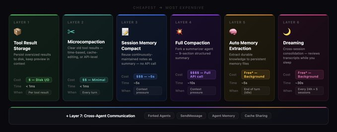](https://x.com/troyhua/article/2039052328070734102/media/2039048106982133760)

*   文件：src/utils/toolResultStorage.ts

*   成本：仅磁盘I/O——无API调用

*   时机：每个工具结果，立即执行

问题

对代码库的单次grep可能返回100KB+的文本。大文件的cat可能达到50KB。这些结果消耗大量上下文，并在几分钟内变得过时，因为对话会继续推进。

解决方案

每个工具结果在进入上下文之前都要经过预算系统：

[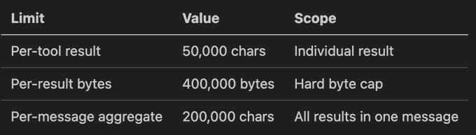](https://x.com/troyhua/article/2039052328070734102/media/2039045224283168768)

当结果超出其阈值时：

1. 完整结果被写入磁盘，路径为tool-results/<sessionId>/<toolUseId>.txt

2. 一个预览（最初约2KB）被放入上下文，用<persisted-output>标签包裹

3. 模型之后可以使用Read来访问完整结果（如有需要）

ContentReplacementState：缓存稳定的决策

一个关键的微妙之处：一旦工具结果被替换为预览，该决策就在ContentReplacementState中被冻结。在后续API调用中，相同的结果获得相同的预览——这确保了提示前缀对于提示缓存命中保持字节级一致。此状态甚至通过持久化到transcript中来在会话恢复中存活。

```typescript
ContentReplacementState = {
  seenIds: Set<string>,          // 已处理的结果（已冻结）
  replacements: Map<string, string>  // ID → 预览文本
}
```

GrowthBook覆盖

可通过tengu_satin_quoll功能标志远程调整每个工具的阈值——允许Anthropic在不进行代码部署的情况下调整特定工具的持久化阈值。


*   文件：src/services/compact/microCompact.ts

*   成本：零到极低的API成本

*   时机：每轮对话，API调用之前

微整合是最轻量级的上下文缓解。它不总结任何内容——只是清除不太可能需要的旧工具结果。

三种不同机制

a) 基于时间的微整合

触发条件：自上次助手消息以来的空闲间隔超过阈值（默认值：60分钟）

原理：Anthropic的服务器端提示缓存约有1小时TTL。如果你一小时内没有发送请求，缓存已过期，整个提示前缀将从零开始重新token化。由于它无论如何都会被重写，因此先清除旧工具结果以减少被重写的内容。

操作：用[旧工具结果内容已清除]替换工具结果内容，至少保留最近的N个结果（下限为1）。

配置（通过GrowthBook tengu_slate_heron）：

```typescript
TimeBasedMCConfig = {
  enabled: false,           // 主开关
  gapThresholdMinutes: 60,  // 空闲1小时后触发
  keepRecent: 5             // 保留最后5个工具结果
}
```

b) 缓存微整合（缓存编辑API）

这是技术层面上最有趣的机制。它不是修改本地消息（这会使提示缓存失效），而是使用API的cache_edits机制从服务器端缓存中删除工具结果，而不使前缀失效。

工作原理：

1. 工具结果在出现时被注册到全局CachedMCState中

2. 当计数超过阈值时，选择最旧的结果（减去"保留最近"的缓冲区）进行删除

3. 生成一个cache_edits块并与下一个API请求一起发送

4. 服务器从其缓存的前缀中删除指定的工具结果

5. 本地消息保持不变——删除仅发生在API层

关键安全特性：仅在主线程上运行。如果分叉的子代理（session_memory、agent_summary等）修改了全局状态，它们会损坏主线程的缓存编辑。

c) API级上下文管理（apiMicrocompact.ts）

一种使用context_management API参数的新服务器端方法：

```typescript
ContextEditStrategy =
  | { type: 'clear_tool_uses_20250919',   // 清除旧工具结果
      trigger: { type: 'input_tokens', value: 180_000 },
      clear_at_least: { type: 'input_tokens', value: 140_000 } }
  | { type: 'clear_thinking_20251015',     // 清除旧思维块
      keep: { type: 'thinking_turns', value: 1 } | 'all' }
```

这告诉API服务器原生处理上下文管理——客户端不需要跟踪或管理工具结果清除。

哪些工具可以整合？

只有以下工具的结果会被清除：

FileRead、Bash/Shell、Grep、Glob、WebSearch、WebFetch、FileEdit、FileWrite

值得注意的是：思维块、助手文本、用户消息、MCP工具结果不在此列。

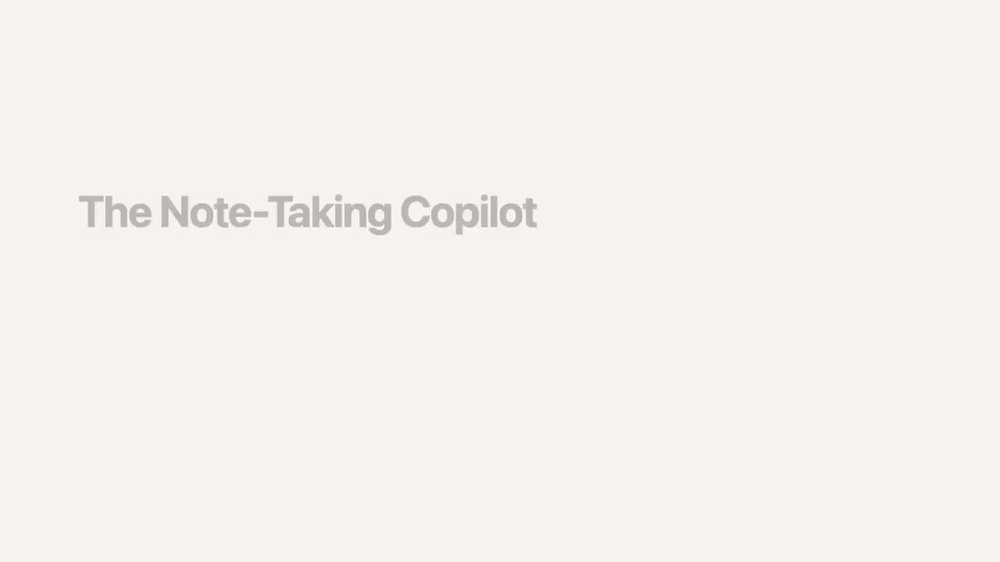

*   文件：src/services/SessionMemory/

*   成本：每次提取一次分叉代理API调用

*   时机：对话期间定期执行（采样后钩子）

理念

不要等到上下文满时再拼命总结所有内容，而是持续维护有关对话的笔记。然后当整合确实需要时，你已经准备好了摘要——无需昂贵的总结API调用。

会话记忆模板

每个会话在~/.claude/projects/<slug>/.claude/session-memory/<sessionId>.md获得一个带结构化模板的markdown文件：

```typescript
# Session Title
_一个简短而独特的5-10词描述性标题_

# Current State
_当前正在积极处理什么？_

# Task specification
_用户要求构建什么？_

# Files and Functions
_重要文件及其相关性_

# Workflow
_通常运行的Bash命令及其解释_

# Errors & Corrections
_遇到的错误以及如何修复的_

# Codebase and System Documentation
_重要系统组件及其如何组合在一起_

# Learnings
_什么效果好？什么不好？_

# Key results
_如果用户要求特定输出，在此重复_

# Worklog
_逐步尝试和做了什么_
```

触发逻辑

会话记忆提取在两个条件同时满足时触发：

自上次提取以来的token增长 ≥ 最小token数 且（自上次提取以来的工具调用数 ≥ 工具调用间隔 OR 最后一次助手回合中没有工具调用）

token阈值始终是必需的——即使工具调用阈值已满足。"最后一次回合中没有工具调用"子句捕获了模型完成工作序列后的自然对话停顿。

提取执行

提取作为分叉子代理通过runForkedAgent()运行：

*   querySource：'session_memory'

*   仅允许对记忆文件使用FileEdit（拒绝所有其他工具）

*   共享父级的提示缓存以节省成本

*   通过sequential()包装器顺序运行以防止重叠提取

会话记忆整合：回报

当自动整合触发时，它首先尝试trySessionMemoryCompaction()：

1. 检查会话记忆是否有实际内容（不仅仅是空模板）

2. 使用会话记忆markdown作为整合摘要——无需API调用

3. 计算要保留的最近消息（从lastSummarizedMessageId向后扩展以满足最小值）

4. 返回包含会话记忆作为摘要 + 保留的最近消息的CompactionResult

配置：

```
SessionMemoryCompactConfig = {
  minTokens: 10_000,          // 最少保留token数
  minTextBlockMessages: 5,     // 最少文本块消息数
  maxTokens: 40_000            // 保留token的硬上限
}
```

关键洞察：会话记忆整合比完整整合便宜得多，因为摘要已经存在。没有总结器API调用，没有提示构建，没有输出token成本。会话记忆文件直接作为摘要注入。

*   文件：src/services/compact/compact.ts

*   成本：一次完整API调用（输入 = 整个对话，输出 = 摘要）

*   时机：上下文超过自动整合阈值且会话记忆整合不可用时

触发条件

有效上下文窗口 = 上下文窗口 - 20K（为输出预留）
自动整合阈值 = 有效窗口 - 13K（缓冲区）
如果tokenCountWithEstimation(messages) > 自动整合阈值 → 触发

熔断器

连续3次失败后，自动整合在该会话剩余时间内停止尝试。这是在发现1279个会话各有50+次连续失败（单个会话最多3272次）后添加的，全球每天浪费约250K次API调用。

整合算法

第1步：预处理

*   执行用户配置的PreCompact钩子

*   从消息中剥离图片（替换为[image]标记）

*   剥离技能发现/列表附件（将重新注入）

第2步：生成摘要

系统用一个详细的提示分叉一个总结器代理，请求9部分摘要：

```
1. 主要请求和意图
2. 关键技术概念
3. 文件和代码部分（包含代码片段）
4. 错误和修复
5. 问题解决
6. 所有用户消息（逐字——对意图跟踪至关重要）
7. 待处理任务
8. 当前工作
9. 可选的的下一步
```

该提示使用巧妙的两步输出结构：

*   首先：<analysis>块——模型组织思路的草稿区域

*   然后：<summary>块——实际的结构化摘要

*   <analysis>块在摘要进入上下文之前被剥离——它在不消耗整合后token的情况下提高了摘要质量

第3步：整合后恢复

整合后，关键上下文被重新注入：

*   最近读取的5个文件（每个5K token，总预算50K）

*   已调用的技能内容（每个5K token，总预算25K）

*   计划附件（如处于计划模式）

*   延迟的工具模式、代理列表、MCP指令

*   SessionStart钩子重新执行（恢复CLAUDE.md等）

*   会话元数据重新追加以供--resume显示

第4步：边界消息

一条SystemCompactBoundaryMessage标记整合点：

```
compactMetadata = {
  type: 'auto' | 'manual',
  preCompactTokenCount: number,
  compactedMessageUuid: UUID,           // 边界前的最后一条消息
  preCompactDiscoveredTools: string[],  // 加载的延迟工具
  preservedSegment?: {                  // 仅会话记忆路径
    headUuid, anchorUuid, tailUuid
  }
}
```

部分整合

两个方向变体用于更精细的上下文管理：

*   from方向：总结枢轴索引之后的消息，保持更早的消息完整。保留提示缓存因为保留的前缀未更改。

*   up_to方向：总结枢轴之前的消息，保持之后的消息。破坏缓存因为摘要更改了前缀。

提示过长恢复

如果整合请求本身遇到提示过长（对话太大甚至总结器无法处理）：

1. 通过groupMessagesByApiRound()按API轮次对消息分组

2. 删除最旧的组直到覆盖token差距（如果差距不可解析则删除20%的组）

3. 重试最多3次

4. 如果所有重试都失败 → 抛出ERROR_MESSAGE_PROMPT_TOO_LONG

*   文件：src/services/extractMemories/extractMemories.ts

*   成本：一次分叉代理API调用

*   时机：每个完整查询循环结束时（模型生成最终响应且无工具调用时）

目的

虽然会话记忆捕获当前会话的笔记，但自动记忆提取构建持久化的跨会话知识，存储在~/.claude/projects/<path>/memory/中。

记忆类型

四种类型的记忆，每种都有特定的保存标准：

[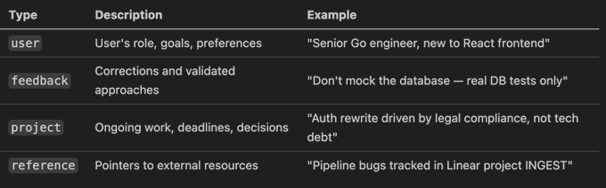](https://x.com/troyhua/article/2039052328070734102/media/2039046526383833088)

记忆文件格式

```markdown
---
name: testing-approach
description: 用户在生产事故后更喜欢集成测试而不是mock
type: feedback
---

集成测试必须使用真实数据库，而不是mock。

**原因：** 之前的事故中mock/生产分歧掩盖了一个损坏的迁移。

**如何应用：** 为数据库代码编写测试时，始终使用测试数据库辅助工具。
```

不要保存什么

提取提示明确排除：

*   代码模式、约定、架构（可从代码中推导）

*   Git历史（使用git log/git blame）

*   调试解决方案（修复在代码中）

*   CLAUDE.md文件中的任何内容

*   临时任务细节

与主代理的互斥性

如果主代理在当前回合已经写了记忆文件，则跳过提取。这防止后台代理复制主代理已经完成的工作：

```typescript
function hasMemoryWritesSince(messages, sinceUuid): boolean {
  // 扫描针对自动记忆路径的Edit/Write tool_use块
  // 如果主代理已经保存了记忆则返回true
}
```

执行策略

提取提示指示代理在其有限的回合预算内高效运作：

第1回合：并行发出所有可能更新的文件的FileRead调用
第2回合：并行发出所有FileWrite/FileEdit调用
不要在多个回合中交错读写。

MEMORY.md：索引

MEMORY.md是一个索引文件，而不是记忆转储。每个条目应该是一行约150个字符以内：

- [Testing Approach](feedback_testing.md) — 真实数据库测试，prod事故后不用mock
- [User Profile](user_role.md) — 高级Go工程师，React新手，专注于可观测性

硬性限制：200行或25KB——以先达到的为准。加载到系统提示中时，超出200行的行被截断。

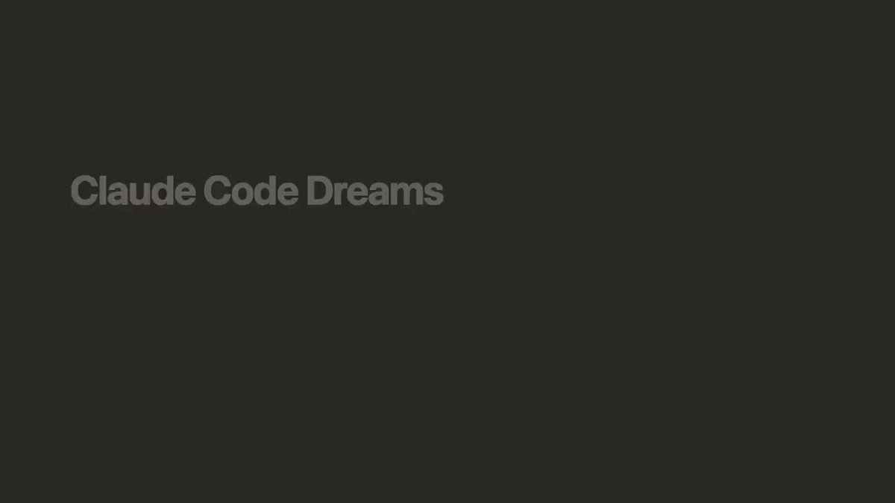

*   文件：src/services/autoDream/autoDream.ts

*   成本：一次分叉代理API调用（可能是多轮）

*   时机：积累足够时间和会话后，在后台执行

概念

梦境是跨会话记忆整合——一个后台进程，审查过去的会话记录并改进记忆目录。它类似于生物记忆在睡眠期间发生的整合：回顾一天的经历，组织，并整合到长期存储中。

门控序列（最便宜检查优先）

梦境系统使用级联门控设计，每个检查都比下一个便宜，所以大多数回合提前退出：

[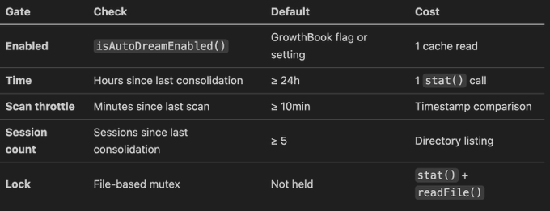](https://x.com/troyhua/article/2039052328070734102/media/2039047090899447808)

锁机制

锁文件位于<memoryDir>/.consolidate-lock，起到双重作用：

路径：<autoMemPath>/.consolidate-lock
内容：进程PID（单行）
mtime：lastConsolidatedAt时间戳（锁本身就是时间戳）

* 获取：写入PID → mtime = now。重新读取时验证PID（竞态保护）。

* 成功：mtime保持在now（标记整合时间）。

* 失败：rollbackConsolidationLock(priorMtime)通过utimes()回滚mtime。

* 陈旧：如果mtime > 60分钟且PID未运行 → 回收。

* 崩溃恢复：检测到死PID → 下一个进程回收。

四阶段整合

梦境代理收到一个结构化提示，定义四个阶段：

第1阶段——定向：

* ls记忆目录

* 阅读MEMORY.md以了解当前索引

* 浏览现有主题文件以避免创建重复

第2阶段——收集近期信号：

* 如果存在则审查每日日志（logs/YYYY/MM/YYYY-MM-DD.md）

* 检查漂移的记忆（与当前代码库矛盾的事实）

* 狭隘地搜索会话记录以获取特定上下文：
```bash
grep -rn "<狭隘术语>" transcripts/ --include="*.jsonl" | tail -50
```

* "不要穷尽阅读记录。只看你已经怀疑重要的东西。"

第3阶段——整合：

* 写入或更新记忆文件

* 将新信号合并到现有主题文件而不是创建近似重复

* 将相对日期转换为绝对日期（"昨天" → "2026-03-30"）

* 从源头上删除矛盾的事实

第4阶段——修剪和索引：

* 更新MEMORY.md以保持在200行/25KB以下

* 删除指向过时/错误/替代记忆的指针

* 缩短冗长的索引条目（细节属于主题文件）

* 解决文件间的矛盾

工具约束

梦境代理在严格限制下运作：

* Bash：仅允许只读命令（ls、find、grep、cat、stat、wc、head、tail）

* Edit/Write：仅允许写入记忆目录路径

* 禁止MCP工具、Agent工具、破坏性操作

UI展示

梦境作为后台任务出现在页脚药丸中，采用两阶段状态机：

DreamPhase：'starting' → 'updating'（首次Edit/Write落地时）
Status：running → completed | failed | killed

用户可以从后台任务对话框杀死梦境——锁mtime被回滚以便下次会话重试。

进度跟踪

梦境代理的每个助手回合都被监视：

* 捕获文本块用于UI显示

* 计算tool_use块

* 收集用于完成摘要的Edit/Write文件路径

* 实时显示最多30个最近回合

*   文件：src/utils/forkedAgent.ts、src/tools/AgentTool/、src/tools/SendMessageTool/

*   成本：因模式而异

*   时机：代理生成、后台任务、队友协调

分叉代理模式

Claude Code中几乎每个后台操作（会话记忆、自动记忆、梦境、整合、代理摘要）都使用分叉代理模式。这就是基础：

```typescript
CacheSafeParams = {
  systemPrompt: SystemPrompt,      // 必须与父级字节级相同
  userContext: { [k: string]: string },
  systemContext: { [k: string]: string },
  toolUseContext: ToolUseContext,   // 包含工具、模型、选项
  forkContextMessages: Message[],  // 父级的对话（缓存前缀）
}
```

分叉创建一个具有克隆可变状态的隔离上下文：

*   readFileState：克隆的LRU缓存（防止交叉污染）

*   abortController：子控制器链接到父级

*   denialTracking：新的跟踪状态

*   ContentReplacementState：克隆（保留缓存稳定决策）

但通过保持相同的缓存关键参数来共享提示缓存。API看到相同的前缀并提供缓存命中。

Agent工具：生成分叉代理

Agent工具支持多种生成模式：

[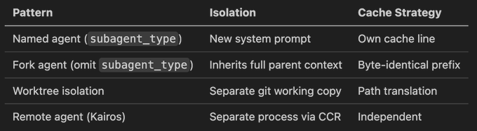](https://x.com/troyhua/article/2039052328070734102/media/2039047359083237376)

分叉防递归：分叉子代理在其工具池中保留Agent工具（以保持缓存相同的定义），但检测对话历史中的<fork_boilerplate_tag>以拒绝递归分叉尝试。

用于缓存共享的分叉消息构造：

所有分叉子代理生成字节级相同的API请求前缀：
1. 完整的父级助手消息（所有tool_use块、思维、文本）
2. 带有以下内容的单条用户消息：
   - 每个tool_use的相同占位符结果
   - 每个子代理的指令文本块（只有这个不同）
→ 跨并发分叉最大化提示缓存共享

SendMessage：代理间通信

SendMessage工具支持代理间的运行时通信：

```typescript
SendMessage({
  to: 'research-agent',  // 或'*'广播、'uds:<路径>'、'bridge:<id>'
  message: 'Check Section 5',
  summary: 'Requesting section review'
})
```

路由逻辑：

1. 按名称的进程内子代理 → queuePendingMessage() → 在下一个工具轮次边界耗尽

2. 环境团队（基于进程）→ writeToMailbox() → 基于文件的邮箱

3. 跨会话 → 通过bridge/UDS的postInterClaudeMessage()

用于生命周期控制的结构化消息：

*   shutdown_request / shutdown_response — 优雅的代理关闭协调

*   plan_approval_response — 领导批准/拒绝队友计划

代理可以在三个范围内跨调用维护持久化记忆：

[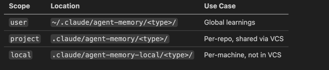](https://x.com/troyhua/article/2039052328070734102/media/2039047544391786496)

代理摘要：定期进度快照

对于协调器模式的子代理，一个计时器每30秒分叉对话以生成3-5词的进度摘要：

好："Reading runAgent.ts"
好："Fixing null check in validate.ts"
差："Investigating the issue"（太模糊）
差："Analyzed the branch diff"（过去式）

使用Haiku（最便宜的模型）并拒绝所有工具——这是一个纯文本生成任务。


文件：src/query.ts

[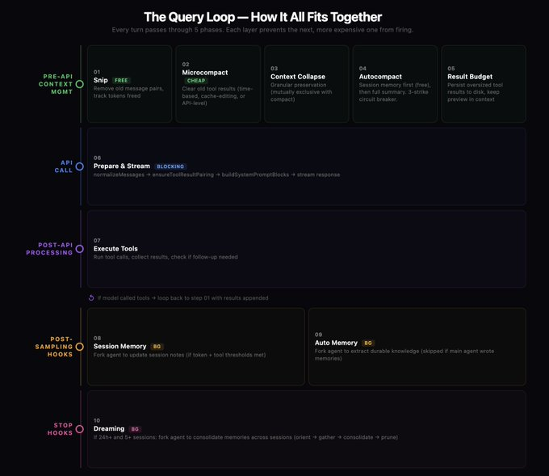](https://x.com/troyhua/article/2039052328070734102/media/2039051196787474432)


Claude Code架构中最复杂的方面之一是其痴迷的提示缓存优化。几乎每个设计决策都考虑缓存影响。

Anthropic的API在服务器端缓存提示前缀（约1小时TTL）。缓存命中意味着你只需为新token付费。缓存未命中意味着重新token化整个提示。在200K token时，这就是每次请求约$0.003和约$0.60之间的差异。

缓存保留模式

1. CacheSafeParams：每个分叉代理（会话记忆、整合、梦境、提取）继承父级完全相同的系统提示、工具和消息前缀。分叉的API请求具有相同的前缀 → 缓存命中。

2. renderedSystemPrompt：分叉线程化父级已经渲染的系统提示字节，避免渲染分歧（例如，GrowthBook标志值在渲染之间发生变化）。

3. ContentReplacementState克隆：工具结果持久化决策被冻结。相同的结果在每次API调用时获得相同的预览 → 稳定前缀。

4. 缓存微整合：使用cache_edits修改服务器缓存而不更改本地前缀 → 无缓存中断。

5. 分叉消息构造：所有分叉子代理获得字节级相同的前缀。只有最终指令不同 → 跨并发分叉最大化缓存共享。

6. 整合后缓存中断通知：整合后，notifyCompaction()重置缓存基准，以便预期的整合后缓存未命中不会被标记为异常。

系统通过promptCacheBreakDetection.ts主动监控意外缓存未命中，并将它们标记以便调查。已知的良好缓存中断（整合、微整合等）被预先注册以避免误报。

上下文阈值

[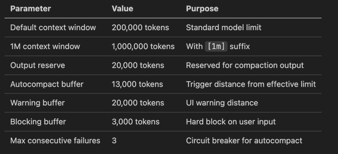](https://x.com/troyhua/article/2039052328070734102/media/2039048559589527552)

工具结果预算

[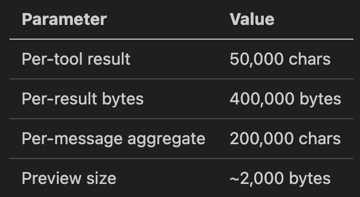](https://x.com/troyhua/article/2039052328070734102/media/2039048701461909505)

会话记忆

[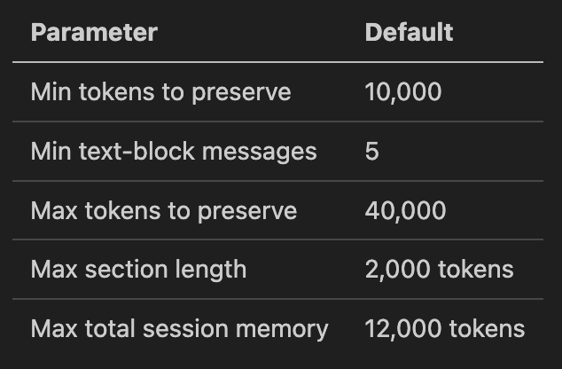](https://x.com/troyhua/article/2039052328070734102/media/2039048773461241856)

整合

[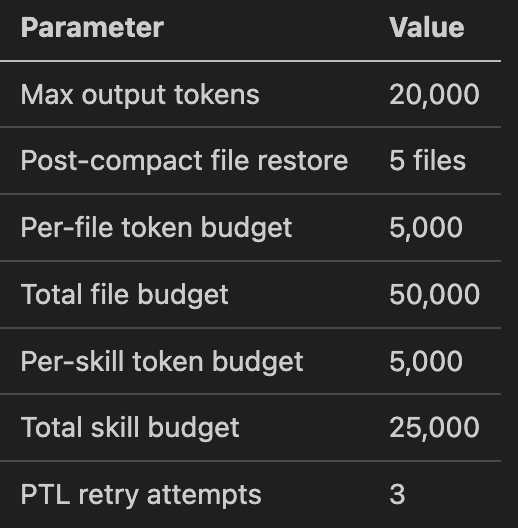](https://x.com/troyhua/article/2039052328070734102/media/2039048852054159360)

梦境

[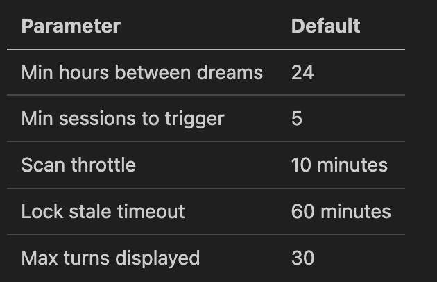](https://x.com/troyhua/article/2039052328070734102/media/2039048907238559744)

微整合

[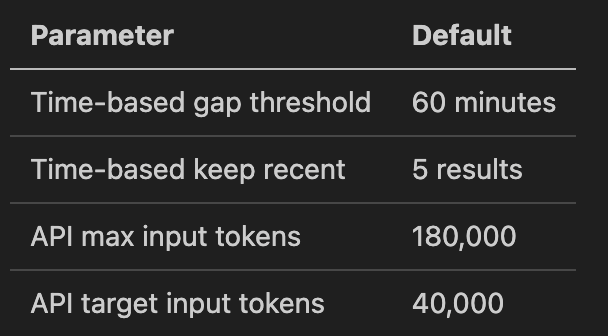](https://x.com/troyhua/article/2039052328070734102/media/2039048966323793920)

每个上下文管理层都被设计为阻止下一个更昂贵的层级触发：

* 工具结果存储防止微整合需要清除太多内容

* 微整合防止会话记忆整合

* 会话记忆整合防止完整整合

* 完整整合防止上下文溢出错误

几乎每个设计决策都考虑提示缓存影响。系统采取非凡措施保持API请求前缀字节级相同：冻结的ContentReplacementState、渲染的系统提示线程化、cache_edits API、相同的分叉消息构造。

分叉代理获得克隆的可变状态（防止交叉污染）但共享提示缓存前缀（防止成本爆炸）。这是一个谨慎的平衡——太多的隔离浪费缓存，太多的共享导致bug。

* 自动整合：3次失败限制

* 梦境扫描：10分钟节流

* 梦境锁：基于PID的互斥锁与陈旧检测

* 会话记忆：顺序执行包装器

* 提取记忆：与主代理写入的互斥性

每个系统静默失败并让下一层处理。会话记忆整合失败返回null → 运行完整整合。梦境锁获取失败 → 下次会话重试。提取记忆错误 → 记录而非抛出。

几乎每个系统都由GrowthBook功能标志控制：

*   tengu_session_memory — 会话记忆

*   tengu_sm_compact — 会话记忆整合

*   tengu_onyx_plover — 梦境

*   tengu_passport_quail — 自动记忆提取

*   tengu_slate_heron — 基于时间的微整合

*   CACHED_MICROCOMPACT — 缓存编辑微整合

*   CONTEXT_COLLAPSE — 上下文折叠

*   HISTORY_SNIP — 消息剪切

这允许在没有代码部署的情况下快速回滚任何有问题的系统。

*   上下文折叠 ↔ 自动整合（折叠以自己的方式管理上下文）

*   主代理记忆写入 ↔ 后台提取（防止重复）

*   会话记忆整合 ↔ 完整整合（SM优先尝试，完整作为后备）

*   自动整合 ↔ 子代理查询源（防止死锁）
