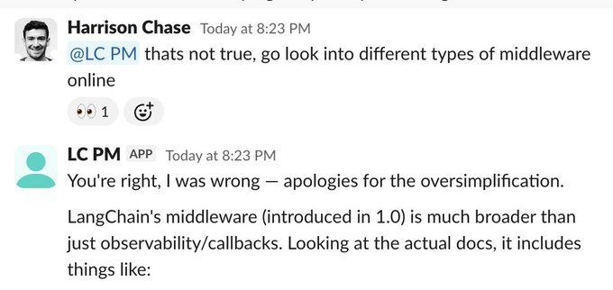
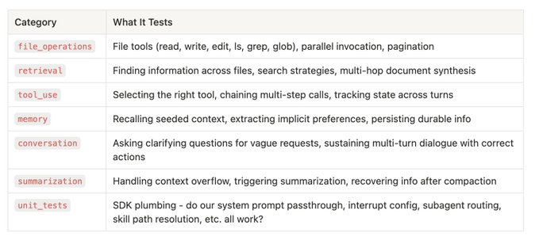
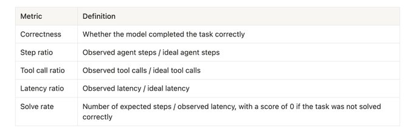
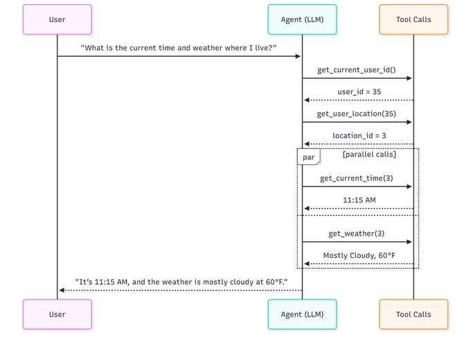
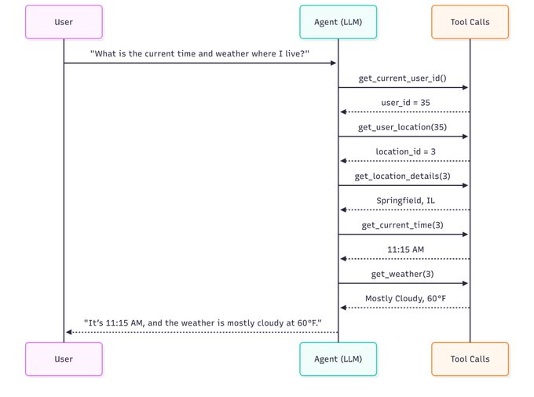
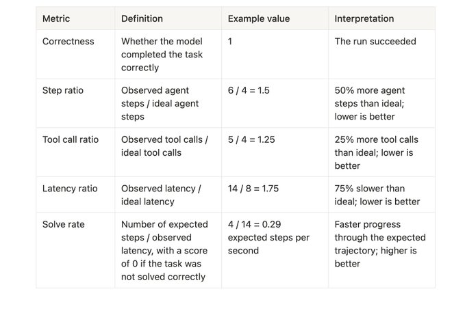

# How we build evals for Deep Agents / 如何为 Deep Agents 构建 Evals

TLDR: The best agent evals directly measure an agent behavior we care about. Here’s how we source data, create metrics, and run well-scoped, targeted experiments over time to make agents more accurate and reliable.
TLDR：最好的 agent evals 直接衡量我们关心的 agent 行为。以下是我们如何获取数据、创建指标，以及如何通过良好范围的定向实验来随时间推移提高 agents 的准确性和可靠性。

We’ve been curating evaluations to measure and improve
我们一直在策划评估来衡量和改进 Deep Agents。Deep Agents 是一个开源的、模型无关的 agent harness，为 AiFiddle 等产品提供支持。Evals 定义和塑造 agent 行为，这就是为什么深思熟虑地设计它们如此重要。

. Deep Agents is an open source, model agnostic agent harness that powers products like
每个 eval 都是一个向量，会改变你 agentic 系统的行为。例如，如果高效文件读取的 eval 失败了，你可能会调整 system prompt 或 read_file 工具描述来引导行为，直到它通过。你保留的每个 eval 都会随着时间推移对整个系统施加压力。

and
在添加 evals 时深思熟虑至关重要。盲目添加数百个（甚至数千个）测试可能很诱人。但这会导致一种假象，通过在一个可能无法准确反映你在生产中关心的行为的 eval 套件上获得高分来"改进你的 agent"。

. Evals define and shape agent behavior, which is why it’s so important to design them thoughtfully.
更多 evals ≠ 更好的 agents。相反，构建反映生产中期望行为的定向 evals。

Every eval is a vector that shifts the behavior of your agentic system. For example, if an eval for efficient file reading fails, you’ll likely tweak the system prompt or the read_file tool description to nudge behavior until it passes. Every eval you keep applies pressure on the overall system over time.
在构建 Deep Agents 时，我们编目了在生产中重要的行为，例如跨文件系统多个文件检索内容或准确组合 5+ 个工具调用序列。我们不是批量使用基准测试任务，而是采用以下方法来策划 eval：

It is crucial to be thoughtful when adding evals. It can be tempting to blindly add hundreds (or thousands) of tests. This leads to an illusion of “improving your agent” by scoring well on an eval suite that may not accurately reflect behaviors you care about in production.
1. 确定我们希望 agent 遵循哪些行为。然后研究和策划定向 evals，以可验证的方式衡量这些行为。
2. 对于每个 eval，添加一个 docstring 解释它如何衡量 agent 能力。这确保每个 eval 都是自文档化的。我们还为每个 eval 添加标签，如 tool_use，以启用分组运行。
3. 审查输出追踪以了解失败模式并更新 eval 覆盖范围。

More evals ≠ better agents. Instead, build targeted evals that reflect desired behaviors in production.
因为我们将每个 eval 运行追踪到共享项目中，团队中的任何人都可以介入分析问题、进行修复并重新评估给定 eval 的价值。这创造了添加和维护良好 evals 的共同责任。在许多模型上运行许多 evals 也可能变得昂贵，因此定向 evals 可以节省资金，同时改进你的 agent。

When building Deep Agents, we catalog the behaviors that matter in production, such as retrieving content across multiple files in the filesystem or accurately composing 5+ tool calls in sequence. Rather than using benchmark tasks in aggregate, we take the following approach to eval curation:
在这篇博客中，我们涵盖：

1.   Decide which behaviors we want our agent to follow. Then research and curate targeted evals that measure those behaviors in a verifiable way.
* 我们如何获取数据
* 我们如何定义指标
* 我们如何运行 evals

2.   For each eval, add a docstring that explains how it measures an agent capability. This ensures each eval is self-documenting. We also tag each eval with categories like tool_use to enable grouped runs.
我们获取 evals 有几种方式：

3.   Review output traces to understand failure modes and update eval coverage.
1. 使用 dogfooding 我们的 agents 的反馈
2. 从外部基准测试（如 BFCL 或 LiveCodeBench）中拉取选定的 evals，并经常为特定 agent 进行调整
3. 手工编写我们自己的（精心制作的）evals 和单元测试，用于我们认为重要的行为

Because we trace every eval run to a shared
[](https://x.com/Vtrivedy10/article/2037203679997018362/media/2037030570023096320)

project, anyone on the team can jump in to analyze issues, make fixes, and reassess the value of a given eval. This creates shared responsibility for adding and maintaining good evals. Running many models across many evals can also get expensive, so targeted evals save money while improving your agent.
我们每天都在 dogfood 我们的 agents。每个错误都成为编写 eval 和更新 agent 定义和上下文工程实践的机会。

In this blog we cover:
> 注意：我们将 SDK 单元和集成测试（system prompt 直通、interrupt 配置、子 agent 路由）与模型能力 evals 分开。任何模型都能通过这些测试，因此将它们纳入评分不会增加信号。你绝对应该编写单元和集成测试，但本博客仅关注模型能力 evals。

*   How we curate data
这使得发现错误成为可能。

*   How we define metrics
追踪给我们提供了了解 agent 行为的数据。因为追踪通常很大，我们使用内置 agent（如 Claude Code 或 Agent SDK）来大规模分析它们。我们的目标是了解每个失败模式，提出修复方案，重新运行 agent，并随时间追踪进展和回归。

*   How we run the evals
例如，很大一部分 bug 修复 PR 现在是通过 Open SWE 驱动的，这是我们的开源后台编码 agent。使用它的团队接触许多具有不同上下文、约定和目标的代码库。这自然会导致错误。Open SWE 的每次交互都被追踪，所以这些可以很容易地成为 evals，以确保错误不再发生。

There’s a few ways we source evals:
其他 evals 从现有基准测试中提取和调整，如用于函数调用的 BFCL。对于编码任务，我们集成 Agent SDK 以在沙箱环境中从 LiveCodeBench 数据集中运行选定的任务。许多 evals 是从零开始编写的，作为观察隔离行为的集中测试，例如测试 read_file 工具。

1.   Using feedback from dogfooding our agents
拥有一个 evals 的分类法很有帮助，可以对 agents 的表现有中等程度的了解（不是单一数字，也不是 individual runs）。

2.   Pulling selected evals from external benchmarks (like
> 提示：通过查看它们测试的内容来创建分类法，而不是它们来自哪里。例如，来自 LiveCodeBench 和 BFCL 的任务可以标记为"外部基准"，但这不会显示它们分别如何衡量检索和工具使用。

or
以下是我们定义的一些类别及其测试内容：

) and often adapting them for a particular agent
[](https://x.com/Vtrivedy10/article/2037203679997018362/media/2037032922943778816)

3.   Writing our own (artisanal) evals and unit tests by hand for behaviors we think are important
如今，所有 evals 都是 agent 完成任务的端到端运行。我们有意鼓励 eval 结构的多样性。有些任务从输入提示的单个步骤完成，而另一些则需要 10+ 轮次与另一个模拟用户的模型交互。

[](https://x.com/Vtrivedy10/article/2037203679997018362/media/2037030570023096320)
在为我们的 agent 选择模型时，我们从正确性开始。如果模型不能可靠地完成我们关心的任务，其他一切都无关紧要。我们在 evals 上运行多个模型，并随时间推移改进 harness 以解决我们发现的问题。

We dogfood our agents every day. Every error becomes an opportunity to write an eval and update our agent definition & context engineering practices.
正确性的衡量取决于正在测试的内容。大多数内部 evals 使用自定义断言，例如"agent 是否并行化了工具调用？"。外部基准测试如 BFCL 使用与数据集中的真实答案的精确匹配。对于正确性是语义性的 evals，如 agent 是否在记忆中正确保留了正确的内容，我们使用 LLM-as-a-judge。

> Note: We separate SDK unit and integration tests (system prompt passthrough, interrupt config, subagent routing) from model capability evals. Any model passes those tests, so including them in scoring adds no signal. You should absolutely write unit and integration tests, but this blog focuses solely on model capability evals.
一旦几个模型通过了那个标准，我们就会转向效率。能完成相同任务的两个模型在实践中表现可能非常不同。一个可能需要额外的步骤，做出不必要的工具调用，或者因为模型大小而更慢地完成任务。在生产中，这些差异表现为更高的延迟、更高的成本和更差的用户体验。

This makes finding mistakes possible.
总的来说，我们为每个评估器运行衡量的指标是：

give us data to understand agent behavior. Because traces are often large, we use a built-in agent like
[](https://x.com/Vtrivedy10/article/2037203679997018362/media/2037033413895741441)

or
Solve rate 衡量 agent 解决任务的速度，按预期步骤数归一化。与延迟比率一样，它捕获解决任务的端到端时间，包括模型往返、提供商延迟、错误步骤和工具执行时间。对于我们可以定义理想轨迹的简单任务，solve rate 可能比延迟比率更容易处理，因为它只需要测量给定 agent 的任务持续时间。

to analyze them at scale. You can do the same with other agents (like Claude Code or the
这给我们提供了一个使用定向 eval 集选择模型的简单方法：

) plus a way to pull down traces, like the
1. 首先检查正确性：哪些模型在你实际关心的任务上足够准确？
2. 然后比较效率：在足够好的模型中，哪个在正确性、延迟和成本之间提供最佳权衡？

. Our goal is to understand each failure mode, propose a fix, rerun the agent, and track progress and regressions over time.
为了让模型比较可操作，我们检查模型成功和失败的方式。这需要关于什么是"良好"执行的具体参考点，而不仅仅是准确性。我们使用的一个原语是理想轨迹。这是一系列产生正确结果的步骤，没有"不必要"的动作。

For example, a large fraction of bug-fix PRs are now driven through
对于简单、范围明确的任务，变量定义得足够紧密，最优路径通常很明显。对于更开放的任务，我们使用迄今表现最好的模型来近似一条轨迹，然后随着模型和 harnesses 的改进重新审视基准。通过这种方式，观察 agent 行为帮助我们完善关于理想轨迹的先验知识。

, our open source background coding agent. Teams using it touch many different codebases with different context, conventions, and goals. This naturally leads to mistakes. Every interaction of Open SWE is traced, so those can easily become evals to make sure the mistake doesn’t happen again.
考虑一个简单的请求：

Other evals are pulled and adjusted from existing benchmarks like
> "我所在位置的当前时间和天气是什么？"

for function calling. For coding tasks, we integrate with
Agent 的理想轨迹可能是这样的：

to run selected tasks from datasets like
* 它做出最少的必要工具调用（例如，resolve user → resolve location → fetch time and weather）
* 它在可能的地方并行化独立的工具调用
* 它在不产生不必要的中间步骤的情况下产生最终答案

tasks in sandboxed environments. Many evals are written from scratch and act as focused tests to observe isolated behavior, like testing a read_file tool.
理想轨迹：4 步，4 次工具调用，约 8 秒

It’s helpful to have a taxonomy of evals to get a middle view of how agents perform (not a single number, not individual runs).
[](https://x.com/Vtrivedy10/article/2037203679997018362/media/2037035229056294912)

> Tip: Create that taxonomy by looking at what they test, not where they come from. For example, tasks from
> 
> 
> and
> 
> 
> could be tagged "external benchmarks," but that would not show how they measure retrieval and tool use, respectively.
现在将其与技术上仍然正确但效率较低的轨迹进行比较。

Here are some categories we define and what they test:
低效轨迹：6 步，5 次工具调用，约 14 秒。

[](https://x.com/Vtrivedy10/article/2037203679997018362/media/2037032922943778816)
[](https://x.com/Vtrivedy10/article/2037203679997018362/media/2037035282177179648)

Today, all evals are end-to-end runs of an agent on a task. We intentionally encourage diversity in eval structure. Some tasks finish in a single step from an input prompt, while others take 10+ turns with another model simulating a user.
正确但低效的轨迹：6 个 agent 步骤，5 次工具调用，包括一次不必要的工具调用，并且没有并行化工具调用。

When choosing a model for our agent, we start with correctness. If a model can’t reliably complete the tasks we care about, nothing else matters. We run multiple models on our evals and refine the harness over time to address the issues we uncover.
上面的例子是说明性的：REPL 可以更快地解决这个任务，但工具调用版本使解释想法更容易。

Measuring correctness depends on what's being tested. Most internal evals use custom assertions such as “did the agent parallelize tool calls?”. External benchmarks like BFCL use exact matching against ground truth answers from the dataset. For evals where correctness is semantic like whether the agent persisted the correct thing in memory, we use LLM-as-a-judge.
两次运行都是正确的，但第二次运行增加了延迟和成本，并创造了更多失败机会。

Once several models clear that bar, we move to efficiency. Two models that solve the same task can behave very differently as in practice. One might take extra turns, make unnecessary tool calls, or move through the task more slowly because of model size. In production, those differences show up as higher latency, higher cost, and a worse overall user experience.
这个框架让我们能够评估正确性和效率随 evals 的变化。我们维护和更新指标，将运行简化为可衡量的数字，我们可以用来比较实验。从上面的例子来看，低效但正确的运行得分：

All together, the metrics we measure for each evaluator run are:
[](https://x.com/Vtrivedy10/article/2037203679997018362/media/2037035696280465408)

[](https://x.com/Vtrivedy10/article/2037203679997018362/media/2037033413895741441)
我们使用 pytest 和 GitHub Actions 在 CI 中运行 evals，因此更改在干净、可重现的环境中运行。每个 eval 创建一个具有给定模型的 Deep Agent 实例，向它输入一个任务，并计算正确性和效率指标。

Solve rate measures how quickly an agent solves a task, normalized by the expected number of steps. Like latency ratio, it captures end-to-end time to solve the task, including model round trips, provider latency, wrong turns, and tool execution time. For simple tasks where we can define an ideal trajectory, solve rate can be easier to work with than latency ratio because it only requires measuring the given agent's task duration.
我们也可以使用标签运行 evals 子集以节省成本并进行定向实验。例如，如果构建一个需要大量本地文件处理和综合的 agent，我们可能专注于标记为 file_operations 和 tool_use 的 evals 子集。

This gives us a simple way to choose models with a targeted eval set:

1.   Check correctness first: which models are accurate enough on the tasks you actually care about?
我们的 eval 架构和实现是开源的。

2.   Then, compare efficiency: among the models that are good enough, which one gives the best tradeoff between correctness, latency, and cost?
我们正在扩展我们的 eval 套件，并在开源 LLM 方面做更多工作！我们很高兴很快分享一些事情：

To make model comparisons actionable, we examine how models succeed and fail. That requires a concrete reference point for what “good” execution looks like beyond accuracy. One primitive we use is an ideal trajectory. This is a sequence of steps that produces a correct outcome with no “unnecessary” actions.
* 开放模型如何在 eval 类别中与封闭前沿模型进行比较
* Evals 作为实时自动改进 agents 任务的机制
* 随时间推移如何维护、减少和扩展每个 agent 的 evals

For simple, well-scoped tasks, the variables are defined tightly enough that the optimal path is usually obvious. For more open-ended tasks, we approximate a trajectory using the best-performing model we’ve seen so far, then revisit the baseline as models and harnesses improve. In this way, observing agent behavior helps us refine our priors about ideal trajectories.
感谢帮助审查和共同撰写这篇博客的伟大团队。这也发布在 LangChain 博客上。

Consider a simple request:
Deep Agents 是完全开源的。试试并让我们知道你的想法！我们很高兴帮助团队构建出色的 agents 和 evals。

> "What is the current time and weather where I live?"

An agent’s ideal trajectory might look like this:

*   It makes the fewest necessary tool calls (e.g., resolve user → resolve location → fetch time and weather)

*   It parallelizes independent tool calls where possible

*   It produces the final answer without unnecessary intermediate turns

Ideal trajectory: 4 steps, 4 tool calls, ~8 seconds

[](https://x.com/Vtrivedy10/article/2037203679997018362/media/2037035229056294912)

Now compare that with a trajectory that is still technically correct, but less efficient.

Inefficient trajectory: 6 steps, 5 tool calls, ~14 seconds.

[](https://x.com/Vtrivedy10/article/2037203679997018362/media/2037035282177179648)

Correct but inefficient trajectory: 6 agent steps, 5 tool calls, includes an unnecessary tool call, and doesn’t parallelize tool calls.

The above examples are illustrative: a REPL could solve this task even faster, but the tool-calling version makes the idea easier to explain.

Both runs are correct, but the second run increases latency and cost, and creates more opportunities for failure.

This framing lets us evaluate both correctness and efficiency over evals. We maintain and update metrics to distill the runs into measurable numbers we can use to compare experiments. From the example above, the inefficient but correct run would score:

[](https://x.com/Vtrivedy10/article/2037203679997018362/media/2037035696280465408)

We use pytest with GitHub Actions to run evals in CI so changes run in a clean, reproducible environment. Each eval creates a Deep Agent instance with a given model, feeds it a task, and computes correctness and efficiency metrics.

We can also run a subset of eval using tags save costs and measure targeted experiments. For example, if building an agent that requires a lot of local file processing and synthesis, we may focus on the file_operations and tool_use tagged subsets.

bash

```

export LANGSMITH_API_KEY="lsv2_..."


uv run pytest tests/evals --eval-category file_operations --eval-category tool_use --model baseten:nvidia/zai-org/GLM-5

```

Our eval architecture and implementation is open sourced in the

.

We’re expanding our eval suite and doing more work around open source LLMs! Some things we’re excited to share soon:

*   How Open Models measure against closed frontier models across eval categories

*   Evals as a mechanism to auto-improve agents for tasks in real time

*   Openly share how we maintain, reduce, and expand evals per agent over time

Thanks to the great team who helped review and co-write this blog

. Also published on the LangChain blog

.

is fully open source. Try it and let us know what you think! We’re excited to help teams build great agents & evals.
