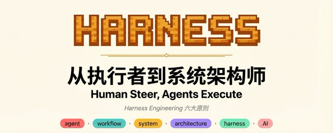
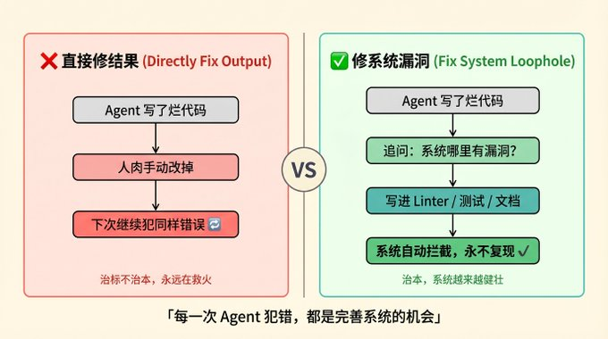
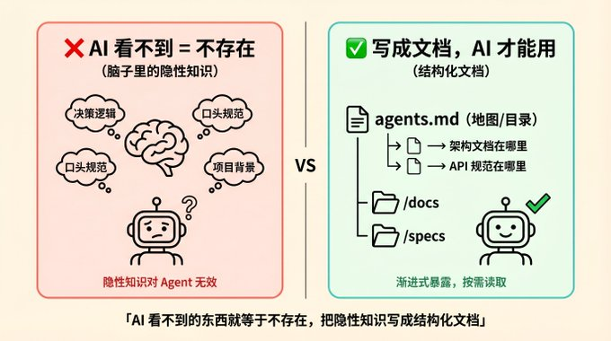
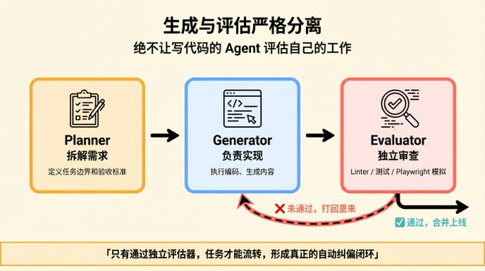
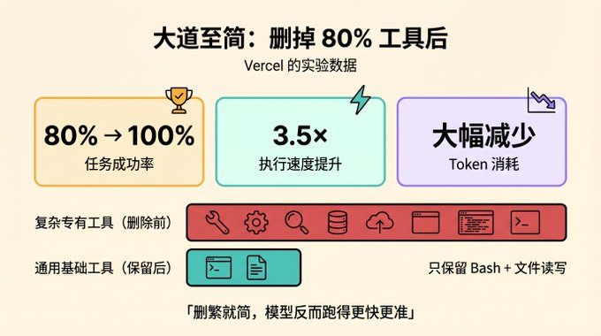

# Yanhua on X: "Harness Engineering:从执行者到系统架构师" / X

Title: Yanhua on X: "Harness Engineering:从执行者到系统架构师" / X

URL Source: https://x.com/yanhua1010/status/2043900031661682997

Markdown Content:
## Article

## Conversation

Harness Engineering:从执行者到系统架构师

2026 年，AI Agent 能力突飞猛进，但一个反直觉的事实摆在眼前：顶级模型在真实长周期任务中翻车，原因通常不是模型不够聪明，而是执行链和编排（Orchestration）先崩了。模型只是引擎，没有方向盘、刹车和导航，引擎再猛也开不到终点。

这套"方向盘、刹车和导航"，就叫 Harness Engineering（驾驭工程）。

综合 OpenAI、Anthropic、DeepMind、Vercel 等公司在实战中趟出来的经验，以及它们公开发表的工程博客，这个领域已经收敛出 5 个核心共识和 6 条对普通人最实用的启示。

1. 人类掌舵，Agent 干活（Human Steer, Agents Execute）

你不再是写代码的人，而是设计系统和工作环境的人。制定规则、配置环境、建立反馈闭环、协调多个 Agent，这些才是你的日常。

OpenAI Codex 团队负责人 Ryan Lopopolo 打了个比方：这就像带一个 500 人的技术团队当 Tech Lead，你得退后一步，用系统性思维去想问题，而不是扎到某段代码里出不来。

2. 修系统，别修结果（Fix the System, Not the Output）

Agent 写了一坨烂代码，你的第一反应不应该是撸起袖子自己改。

正确做法是追问：系统哪里有漏洞，才让这种错误溜出来了？HashiCorp 创始人的原话是，每次发现 Agent 犯错，就花时间工程化一个解决方案。比如把规范写成自动化 Linter、加结构化测试、补文档。让系统以后自动拦截同类问题，而不是每次人肉救火。

3. 没写下来的东西，对 AI 来说就不存在（Make the Environment Legible）

你脑子里的默契、Slack 群里随口聊的决策、没落笔的潜规则，对 Agent 来说统统等于零。

所以必须把上下文全部外部化，让文件系统和代码仓库成为 Agent 的唯一事实来源（Single Source of Truth）。设计决策、架构边界、编码规范，全部写成文档。

一个关键技巧：不要把所有规则塞进一个巨大的 agents.md。把它当地图就好，只放核心指引（"架构文档在 /docs/arch"、"API 规范在 /specs"），让 Agent 需要时自己按需去读。这叫渐进式暴露（Progressive Disclosure），能有效避免撑爆上下文窗口。

4. 写代码的和审代码的，必须是不同 Agent（Separate Generation & Evaluation）

Anthropic 在实验中发现了一个系统性缺陷：Agent 自评时普遍盲目自信，自己写的平庸代码也能给自己打高分。

所以行业内不约而同走向了"生成-评估分离"：

*   Anthropic 的做法：Planner 拆需求 → Generator 写代码 → Evaluator 打分审查

*   DeepMind 的做法：Generator 生成 → Verifier 验证 → Revisor 修正

关键是引入独立的 Evaluator Agent，给它配上挑剔的系统提示词，甚至让它用 Playwright 操作浏览器做真实验收。质量标准要写成机器可执行的东西：Linter、自动化测试、端到端检查。只有过了独立评估，任务才能往下流转。

5. 模型越强，框架越该做减法（Harness Must Evolve & Simplify）

这条最反直觉但最重要：你在 Harness 里加的每一个组件，本质上都是在说"我觉得模型自己搞不定这件事"。

比如早期模型有"上下文焦虑"，所以大家设计了复杂的上下文重置机制。但模型进化到 Opus 4.6 这一代之后，这些老假设过期了，那些复杂机制反而成了绊脚石。

Vercel 团队的实战数据很说明问题：他们砍掉了 80% 的专用复杂工具，只留最基础的 Bash 和文件读写。结果任务成功率从 80% 跳到了 100%，速度快了 3.5 倍。

模型越聪明，Harness 越该精简。用 MCP（Model Context Protocol）和 Skills 这类标准化协议接入外部工具和知识，别硬编码一堆专有逻辑。

这些启示的核心不是教你写代码或者搓提示词，而是工作方式和思维方式层面的转变。

1. 你不再是执行者，而是系统设计者

过去用 AI 就是把它当高级搜索引擎或者写作助手，自己还是干活的那个人。现在不一样了，你的角色是制定规范、搭建环境、验收结果。更像一个项目经理或技术主管，而不是一线工人。你要做的是搭好舞台、定好规矩、画好护栏，然后让 Agent 去跑。

2. AI 出错了？别改结果，改系统。更别骂它

大多数人的本能反应：AI 写错了，自己动手改掉。或者在提示词里加一句"你上次写的是垃圾，重来"。两个都是错的。

改系统：问自己，为什么系统允许这个错误出现？是文档没写清？缺少自动验证？还是工具链有缺口？把规则补进护栏里，让下次自动拦截。

别骂它：AI 本质是文字接龙。你用"你真笨"、"太烂了"这类字眼，它在预测下一个词的时候，真的会顺着"差劲"的方向滑下去，越写越烂。给它客观的错误日志和具体反馈，而不是情绪。

3. 别再争"哪个模型更好"了，环境才是天花板

Claude 还是 GPT 还是 Gemini？这个问题在 2026 年已经不是关键瓶颈了。顶级模型在长任务中翻车，几乎都是编排和执行环境的问题，不是推理能力的问题。

2026 是 Harness 元年。AI 能做到什么程度，取决于你给它搭了什么样的工作环境。

4. 大道至简，工具越少反而越强

新手常犯的错：给 AI 塞一堆花哨的专用工具，以为越多越好。

Vercel 的数据直接打脸：砍掉 80% 复杂工具，只留 Bash 和文件读写，成功率 80% → 100%，速度快 3.5 倍，Token 消耗大降。

模型在变强，你该学会做减法。别过度设计，给模型最基础的通用工具，让它自己去探索。

5. 脑子里的东西不算数，写下来才算

你的决策习惯、工作流偏好、判断标准，如果还停留在脑子里，对 AI 来说就是空气。

不管你是不是程序员，都应该把这些东西写成结构化文档，放进一个专属目录让 AI 随时读取。这个过程其实是双赢的：AI 变得更懂你，你自己也被迫把模糊的工作流梳理清楚了。

6. 掌控 AI 的记忆，才是你真正的护城河

2026 年的 AI Agent 不再是用完即走的一次性工具，而是能通过记忆（Memory）持续成长的长期伙伴。但问题来了：谁管理这些记忆？

如果你全盘依赖某个大厂的封闭 API 和托管系统，你的偏好、交互历史、工作流记忆全部握在别人手里。换平台的代价极高，等于被锁死了。

用开放的 Harness 掌控自己的 AI 记忆数据，才是真正属于你的"数字资产"。

2026 年，大多数人还在问"用哪个 AI 更好"，少数人已经在问"怎么为 AI 搭一个更好的工作环境"。

后者会在这个时代建立起真正难以复制的优势。

如果这篇文章对你有启发，转发给也在用 AI 的朋友。
