# 老张来了 on X: "Karpathy 最新分享：用 LLM 搭建个人知识库，告别 RAG 的低效循环" / X

Title: 老张来了 on X: "Karpathy 最新分享：用 LLM 搭建个人知识库，告别 RAG 的低效循环" / X

URL Source: https://x.com/laozhang2579/status/2040732229035585615?s=52&t=jjVOMAzDZNfuD4kcqctqJw

Markdown Content:
你以为把文档扔给 AI 让它检索就叫知识管理？Karpathy 说，那叫 每次从零开始。

几个小时前，Karpathy 在 GitHub 上发了一篇 Gist，提出了一个完全不同的思路：不是让 AI 被动检索，而是让 AI 主动帮你建一个 Wiki，持续更新、自动交叉引用、知识越积越厚

你只用负责读和想，AI 负责整理和维护

今天老张就按照Karpathy这套方法，手把手教你在 Obsidian 里落地👇

大多数人用 AI 处理文档的方式是 RAG，例如通过NotebookLM、ChatGPT 文件上传一堆文件，问问题的时候 AI 临时检索相关片段，拼出一个答案，基本都是这个模式。

Karpathy 指出了这种方式的根本问题是 没有积累。 每次提问，AI 都在从头搜寻知识。 问一个需要综合五篇文档的问题？AI 要每次现场找碎片、现场拼，什么都没沉淀下来。

他提出的替代方案叫 LLM Wiki，让 AI 增量地构建和维护一个持久化的 Wiki，其实就是互相链接的 Markdown 文件。

1、在浏览器安装 Obsidian Web Clipper 扩展

[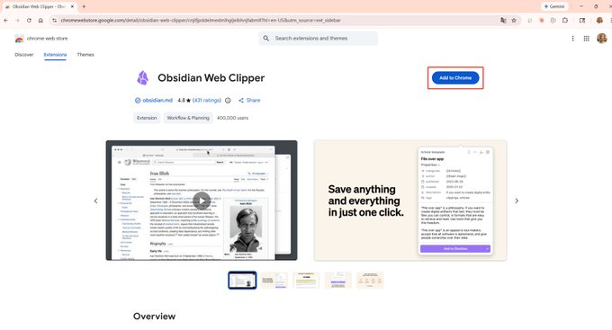](https://x.com/laozhang2579/article/2040732229035585615/media/2040728497954652161)

[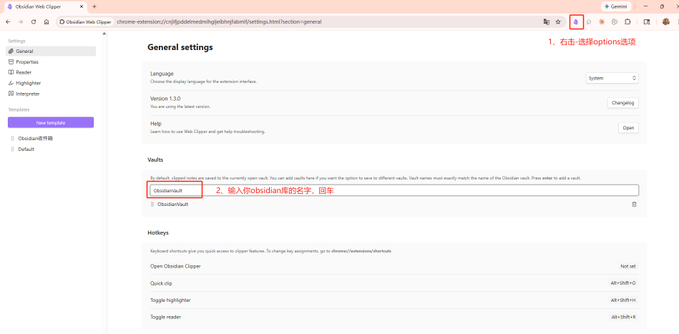](https://x.com/laozhang2579/article/2040732229035585615/media/2040728575108956161)

[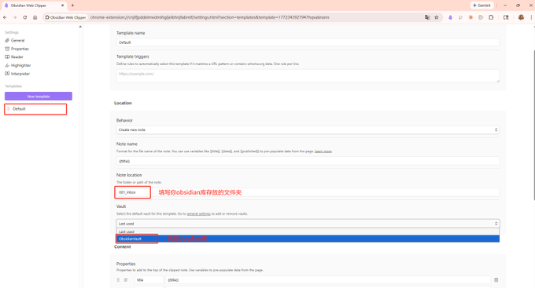](https://x.com/laozhang2579/article/2040732229035585615/media/2040728639436967936)

2、打开任意网页文章，点击扩展图标--Add to Obsidian

[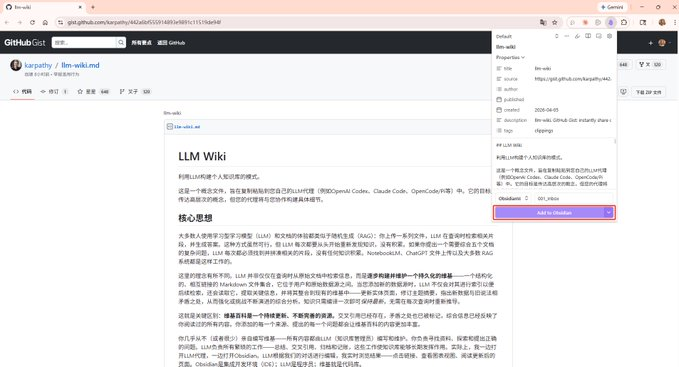](https://x.com/laozhang2579/article/2040732229035585615/media/2040728910485508096)

3、保存后文章自动转为 Markdown 出现在 Obsidian 里

[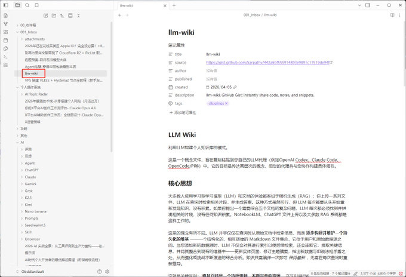](https://x.com/laozhang2579/article/2040732229035585615/media/2040729281870102528)

剪藏下来的文章，图片通常还是外链，过几个月链接一挂，文章就残了。更关键的是，AI 读不了挂掉的图片链接。 Karpathy 的方案是两步配置，一劳永逸：

第一步：统一附件存储路径

打开 设置 → 文件与链接 → 找到附件存储路径 → 设为当前文件夹下指定的子文件夹，子文件夹名称设为attachments 不推荐Karpathy的固定到一个目录 raw/assets/ 因为多了之后附件混在了一起不好管理。

[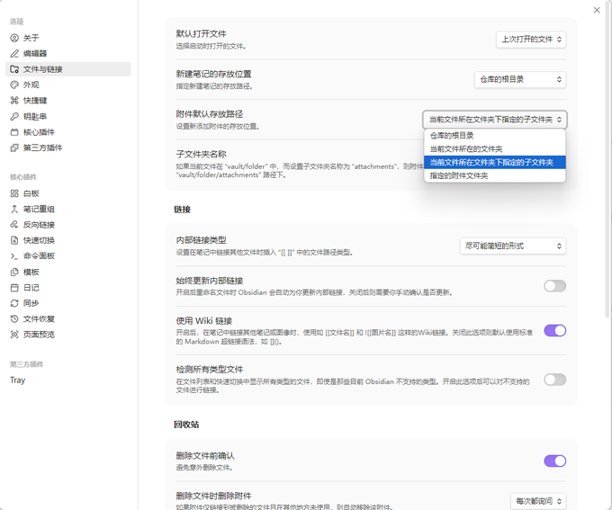](https://x.com/laozhang2579/article/2040732229035585615/media/2040729487789490177)

第二步：绑定下载快捷键 设置 → 快捷键 → 搜索 "下载" → 绑定快捷键Ctrl+Shift+D

[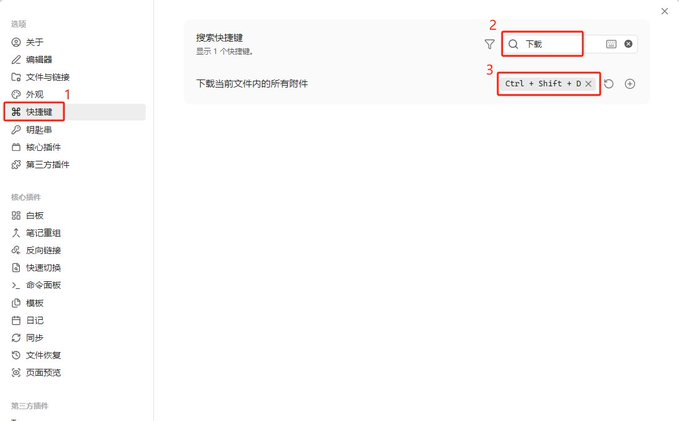](https://x.com/laozhang2579/article/2040732229035585615/media/2040729565958717440)

以后每次剪藏完一篇文章，按一下 Ctrl+Shift+D，所有图片自动下载到本地。AI 就能直接读取和引用这些图片了

这里Karpathy分享了一个小细节：LLM 目前没法一次性读取带内嵌图片的 Markdown。变通做法是先让 AI 读文本内容，再让它单独查看文章引用的图片，不够优雅，但管用。

Obsidian 的 Graph View 是这套方法使你的所有 Wiki 页面以节点形式展示，页面之间的 双链 关系自动连线。打开方式：左侧边栏点击图谱图标或者用快捷键 Ctrl+G

[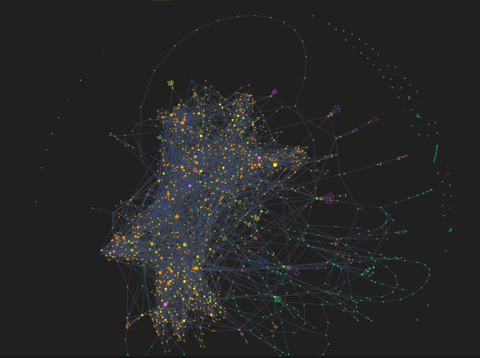](https://x.com/laozhang2579/article/2040732229035585615/media/2040729662066978816)

Karpathy把图谱视图结合AI用在两个场景：

1、Lint 健康检查时 一眼看出哪些页面是孤岛没有任何链接指向它，说明交叉引用缺失，需要让 AI 补上

2、发现知识盲区 如果某个概念被很多页面提到但自己没有独立页面，它在图谱里会显示为一个灰色的幽灵节点，提醒你应该让 AI 为它创建专页

Dataview 是 Obsidian 的社区插件，它能对页面的 YAML frontmatter 做数据库式查询，自动生成动态表格和列表。 我觉得这个价值不大，只有多到一定程度或者想用元数据查询方式习惯的可以考虑，老张是直接用索引文件或者配合Claude 的文件检索 ,需要了无非在Prompt写的细一点 安装路径：设置 → 第三方插件→社区插件市场 → 搜索 "Dataview" → 安装并启用

[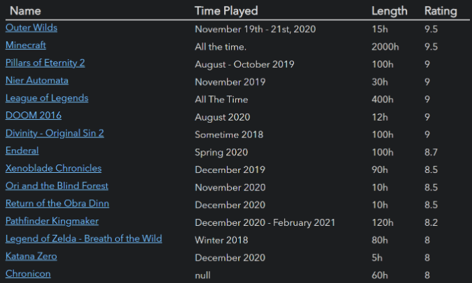](https://x.com/laozhang2579/article/2040732229035585615/media/2040729998676676608)

配合 LLM Wiki 的用法是：让 AI 在每个 Wiki 页面的 frontmatter 里写上结构化元数据，比如：

markdown

```
type: source
title: "文章标题"
date: 2026-04-05
tags: [AI, knowledge-base]
source_count: 3
```

然后你在任意页面写一段 Dataview 查询：

markdown

```
TABLE title, date, tags
FROM "wiki/sources"
SORT date DESC
```

就会自动生成一个按日期倒序排列的来源列表，Wiki 页面越多，这个报表越有价值。

Marp 是一个基于 Markdown 的幻灯片格式，在 Obsidian 里装上 Marp Slides 插件就能直接预览和导出。 安装路径：设置 → 社区插件 → 搜索 "Marp Slides" → 安装并启用。

[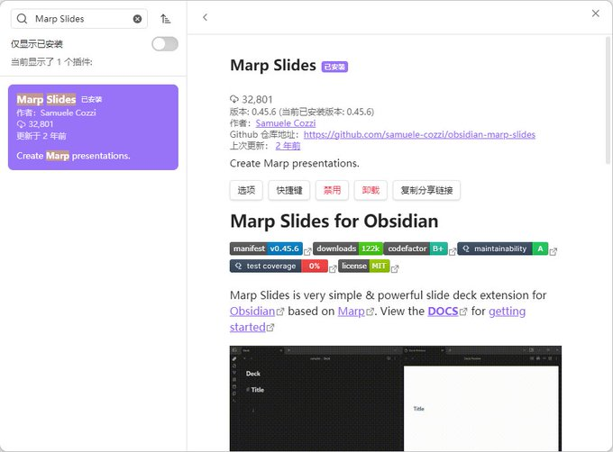](https://x.com/laozhang2579/article/2040732229035585615/media/2040730288708624384)

用法：在 Markdown 文件开头加上 marp: true，用 --- 分隔每页幻灯片，写完直接在 Obsidian 里预览，也可以导出为 PDF / HTML / PPTX。

[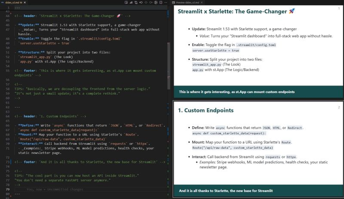](https://x.com/laozhang2579/article/2040732229035585615/media/2040730377074200576)

配合 LLM Wiki 的场景，让 AI 从 Wiki 的某个主题页面直接生成 Marp 格式的幻灯片草稿，你微调后就能用。

操作步骤：设置 → 第三方插件 → 社区插件市场 → 搜索 "git" → 安装并启用

[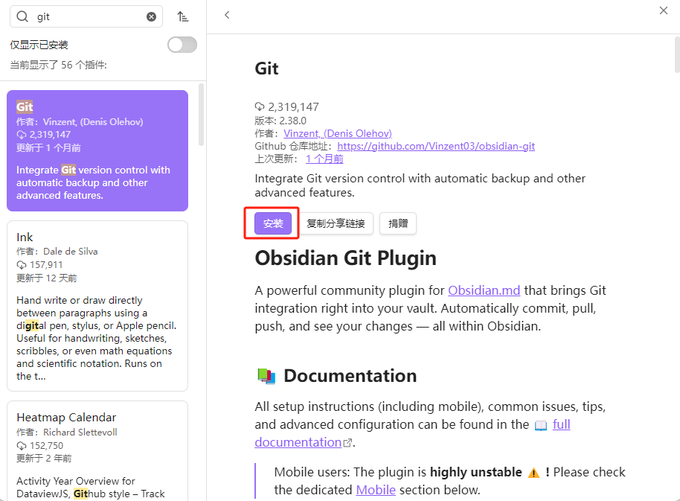](https://x.com/laozhang2579/article/2040732229035585615/media/2040730491918426112)

如果你的 Vault 还不是一个 Git 仓库，需要初始化一次：

1、打开终端（Windows 用 PowerShell，Mac 用 Terminal），cd 到你的 Vault 目录 执行 git init 初始化仓库

[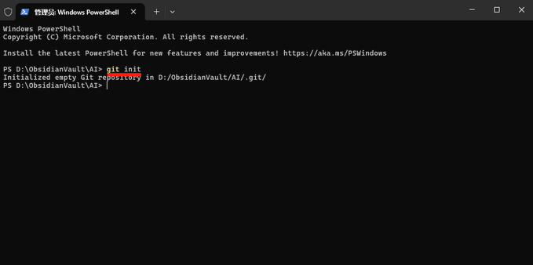](https://x.com/laozhang2579/article/2040732229035585615/media/2040730596100747265)

2、打开

创建一个private仓库

[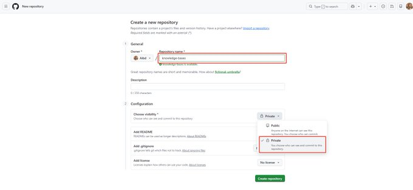](https://x.com/laozhang2579/article/2040732229035585615/media/2040730688274722816)

3、如果要同步到 GitHub，在 GitHub 上创建一个 私有仓库（重要，知识库是私人数据），然后

bash

```
git branch -M main
git remote add origin https://github.com/你的用户名/knowledge-bases.git
git add .
git commit -m "init: 初始化知识库"
git push -u origin main
```

[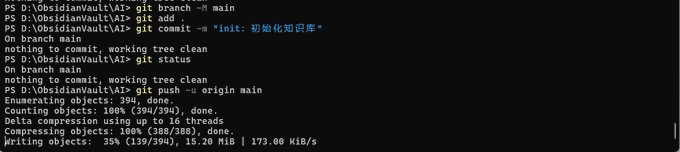](https://x.com/laozhang2579/article/2040732229035585615/media/2040730959423954944)

安装完 Obsidian Git 插件后，打开它将Auto commit-and-sync interval设为10 分钟，插件会自动 commit + push，你完全不用管

[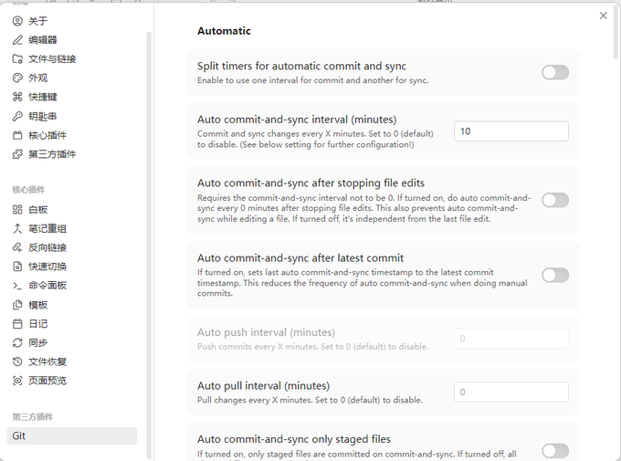](https://x.com/laozhang2579/article/2040732229035585615/media/2040731041779052544)

配好之后日常使用你不需要做任何事情。每隔几分钟插件自动 commit 和 push，相当于你的知识库有了一个 实时备份+完整历史。

Git 对这套 LLM Wiki 方法来说是 必选项，AI 批量改文件的能力越强，你越需要版本管理来兜底。

7. 搜索利器：qmd 让 AI 精准定位知识

Wiki 规模小的时候，一个 index.md 目录文件就够 AI 导航了。但页面多了之后，需要真正的搜索能力。 Karpathy 推荐 qmd（

），一个完全本地运行的 Markdown 搜索引擎 对于咱们大多数人，Wiki 到几百个页面之前 index.md 完全够用。等你觉得 AI 找东西变慢了，再接入 qmd 也不迟。

Karpathy 的原话很到位 维护知识库最痛苦的不是阅读和思考，而是 记录。更新交叉引用、保持摘要最新、标注新旧矛盾、维护几十个页面的一致性。人类放弃 Wiki 是因为维护成本的增长速度超过了价值的增长速度。 但是AI 不会厌倦，不会忘记更新交叉引用，一次操作可以碰十五个文件。维护成本趋近于零，知识库就能真正活下去。

思想精髓： 你把精力放在 选素材、定方向、问好问题、思考意义，AI 负责其他一切。

其实老张觉得 Obsidian Web Clipper + 图片本地化附件热键 + Git + Claude 就够了，完全可以打造和Karpathy一样的RAG知识库，与Claude集成看这篇

老张来了

@laozhang2579


Claude + Obsidian最猛方案 | Filesystem MCP教程 | 一个界面接管Obsidian

多数人把 Obsidian + AI，做复杂了 真猛的方案，反而最简单 不用装插件、学命令、搭工作流 只需 1 个 配置 下面跟着老张，我们2分钟搞定 效果展示 查询：列出我 Obsidian 库里所有的文件夹结构...

Karpathy的llm-wiki链接：

以上就是老张经过自己实操分享的内容，如果你喜欢，欢迎点赞 、关注 + 转发！
