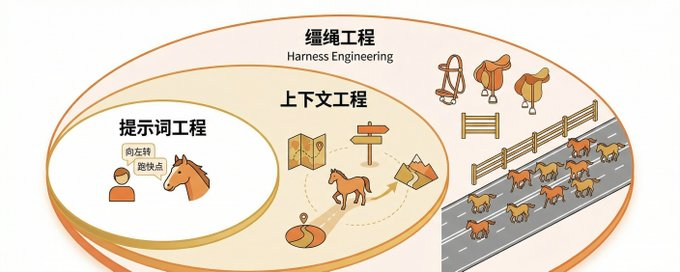
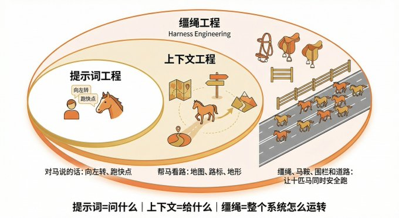
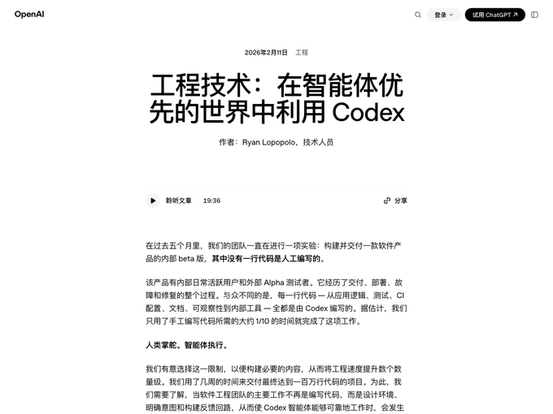
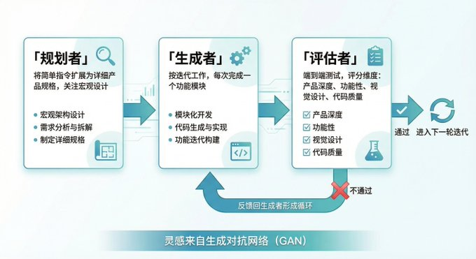

Title: 花叔 on X: "Harness Engineering又他妈是啥？" / X

URL Source: https://x.com/alchainhust/status/2037407418104283253

Published Time: Fri, 27 Mar 2026 12:12:31 GMT

Markdown Content:
## Article

## Conversation

Harness Engineering又他妈是啥？

Vibe Coding都没学完，Prompt Engineering课还在卖，Context Engineering墨迹还没干，现在又来一个？

AI圈造新词的速度，快赶上模型迭代了。过去一年光「XX Engineering」就冒出来四五个。

但我去读了OpenAI和Anthropic的原文之后，反应变了。不是「哇好新」，是：等等，这不就是我过去半年一直在干的事吗？

，告诉AI我是谁、什么规则必须遵守。配hooks，在agent关键节点注入检查。建知识库，给AI准备决策需要的上下文。调skills，定义AI能用什么工具、有什么权限。

做了半年，从来没觉得这些事需要一个统一的名字。

然后OpenAI发了篇博文说这叫Harness Engineering。Mitchell Hashimoto发了篇博文也说这叫Harness Engineering。Anthropic发了两篇工程文章，Martin Fowler写了长文分析，大家都这么叫。

行，那就叫Harness Engineering。

Harness这个词，英文原意是马具、缰绳。不是马本身，是套在马身上让它能拉车、能被引导的那整套东西。没有它，马就是一匹乱跑的野马，力气再大也白搭。

三层关系很好懂：Prompt Engineering是你对马说的话​，向左转、跑快点。Context Engineering是帮马看路的一切​，地图、路标、地形。Harness Engineering是缰绳、马鞍、围栏和道路本身​，让十匹马同时安全跑起来的系统

Prompt管你问什么，Context管你给模型看什么，Harness管整个东西怎么运转。Context是Harness的一部分，Harness还多管了约束、反馈和质量检查。

懂了这个，再看最近几个月的事，很多碎片就拼上了。

先说最硬的一个数据。LangChain的coding agent在Terminal Bench 2.0上，成绩从52.8%涨到了66.5%，排名从Top 30跳到Top 5。重点是：模型完全没换​。他们只改了三样东西：系统提示词、工具配置、中间件钩子。

同一个模型，换了套缰绳，成绩天差地别。

模型可能已经不是瓶颈了。瓶颈是你给它搭了个什么样的环境。

然后是OpenAI自己的实验。Codex团队3个工程师，后来扩到7个，5个月，用Codex搞出了一个100万行代码的beta产品。零行人工手写。约1500个PR合并，每个工程师每天3.5个PR，估算速度是传统方式的10倍。

这些数字很炸。但有个问题没人聊：这100万行代码的质量怎么样？

速度快了10倍，不代表产出好了10倍。每人每天3.5个PR，谁在做代码审查？六个月后需要改需求的时候，这100万行好改吗？AI写的代码和人写的代码有个关键区别：人写代码时会无意识地留下结构线索，方便将来的自己理解。AI不会。它只解决眼前的任务，不考虑六个月后维护这段代码的人会不会骂娘。

所以harness不只是让AI写得快，还得让AI写得能维护。OpenAI的实验证明了速度，但长期成本还是个问号。

回到他们怎么做到的。Martin Fowler把harness拆成了三块。

第一块：上下文工程。给模型一张地图，不是一本1000页的说明书。维护一个持续更新的代码库知识库，加上agent能实时看到的系统状态。上下文是稀缺资源，塞太多反而挤占干活的空间。

第二块：架构约束。不光靠AI自己检查，还有代码检查器和结构测试在旁边盯着。硬规则，不遵守就编译不过。

第三块：垃圾回收。专门有个agent周期性运行，不写代码不做功能，就干一件事：找文档里的矛盾和架构违规。一个专职找茬的AI。

Anthropic走了另一条路。他们搞了个三agent架构：规划者负责把简单指令扩展成详细的产品规格，生成者按迭代一次做一个功能，评估者跑端到端测试。

灵感来自生成对抗网络。训练一个专门的评估者让它一直挑刺，比让生成者自己检查自己管用得多。谁都不擅长批评自己，AI也一样。

他们还发现Claude Sonnet 4.5有「上下文焦虑」。不是人焦虑，是模型焦虑。上下文太多，表现反而变差。压缩不够，必须定期清空重来。

所以harness不是越大越好。这可能是最反直觉的部分。

到这里你可能想：这不就是给老东西起了个新名字吗？

说实话，还真有点。

航天工程师60年前就在做类似的事。NASA让飞船自动执行任务，围绕自动化系统设计的约束、反馈循环、冗余检查、异常处理，和今天说的harness没有本质区别。工业控制领域也一样，PLC编程里的安全联锁机制就是一种harness。

AI圈不是发明了harness engineering，是终于意识到自己需要学几十年前就有的工程纪律。

但命名还是有价值的。当一群人各自在做类似的事，没有共同的词来说，经验就传不开。这个词出来之后，突然大家都能聊到一起了。就像Vibe Coding，你可以笑它，但它确实让一种做法变成了可以讨论的东西。

Harness Engineering也一样。价值不在于发明了什么，在于让一群人意识到：自己工作的重心变了。

我自己去年8月搭了Claude Code自动化写作工作流。从那以后写文章轻松太多，平时做做选择，喷一喷不满意的地方就好了。但让这套系统好用的，不是模型有多强，是我围绕它搭的那一圈东西。

CLAUDE.md从一个简单的规则文件，变成了一个路由器。它就干一件事：判断当前任务属于哪个工作区，然后指向对应的规则。写公众号时不会被iOS开发的规则干扰。

Hooks是另一层。在agent执行关键操作前后注入脚本。编辑文件之前自动跑linting，生成代码之后自动做类型检查。这不是prompt里写的「请注意代码规范」，是物理上拦住它，不合格就不让过。建议和约束，完全两回事。

Skills解决了模块化的问题。每个skill是独立的能力包：一个管小红书配图，一个管飞书同步。平时不占context，需要时才调。

路由器、hooks、skills、知识库，加在一起就是一个harness。没人告诉我这叫什么，它自己长出来的。

这个生长方式，和Mitchell Hashimoto说的一样。

他是HashiCorp联合创始人，Terraform创造者，今年2月写了「My AI Adoption Journey」，首次给这个实践命名。方法极其朴素：每次agent犯错，就工程化一个方案，让它再也犯不了同样的错。他拿自己的终端模拟器Ghostty举例，配置文件里每一行都对应着agent过去犯过的一次错。文件是活的，一直在长。

我的CLAUDE.md也是这么长出来的。被AI搞烦了就加一条，规则太多了就砍一轮。活的系统。

如果你想开始，三条就够。

给地图不给说明书。CLAUDE.md应该像地图：项目结构、文件关系、关键约束。不要把每步都写死。AI需要方向感，不需要僵化步骤。

每次犯错加一条规则。空文件开始，agent犯一个错就加一条。三个月后那个文件就是你的harness。高度定制，因为全是你场景里真实出过的问题。

让AI查AI。Anthropic的Evaluator思路。别让AI自己查自己。最简单的做法：写完后开一个新对话，把结果贴进去：「找出所有问题」。你会惊讶第二个AI能发现多少第一个漏掉的。

最后聊一个我想了很久的问题。

Martin Fowler在文章里说：如果太早把人类从「in the loop」移到「on the loop」，将来可能没人真正懂得怎么回事，也就没人能设计好的harness。

这句话值得多读两遍。

现在设计harness的人，都是写过很多年代码的老手。Mitchell Hashimoto能给Ghostty写好harness，因为他理解终端模拟器的每个细节。OpenAI那3个工程师能驾驭100万行代码，因为他们知道什么架构是好的、什么会在三个月后爆炸。

但下一代呢？新手程序员从第一天起就不写代码，

，他能设计出好的harness吗？

Martin Fowler把这叫「经验工程」。怎么在AI写所有代码的时代培养新人。

我自己是个有意思的样本。

我从来没手写过代码，所有产品都是AI写的。小猫补光灯上了AppStore付费榜Top 1，累计用户超百万。我的harness从零开始，在和AI互动中一点一点长出来，没有任何编程经验可以迁移。

但我得对自己诚实。

我能设计harness，不是因为我天生懂系统设计。是因为我在和AI协作的上千小时里，观察到了它的行为模式。它什么时候偷懒，什么时候幻觉，什么时候需要硬约束而不是温柔提醒。这些判断力不来自写代码的经验，但来自另一种经验：和AI反复较劲的经验。

问题是，这种经验能教吗？我自己说不清楚。

我知道CLAUDE.md该怎么写，但让我教别人为什么这么写，我会卡住。很多决定是直觉做的，直觉来自踩坑，踩坑来自大量重复，大量重复来自时间。这和老程序员说「你写几万行代码自然就懂了」其实是一回事。

所以问题可能不是「写代码的经验」能不能被替代。而是：不管你积累的是什么经验，足够多的经验本身就是设计harness的前提。没有捷径，换了个赛道而已。

也许Martin Fowler担心的不是「没人写代码了」，而是「没人愿意花够多时间踩够多坑了」。

这个我也不确定。留给你想。
