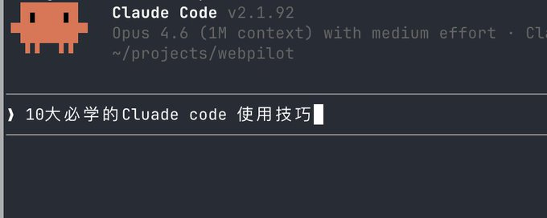
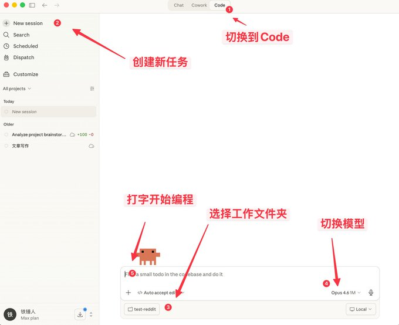
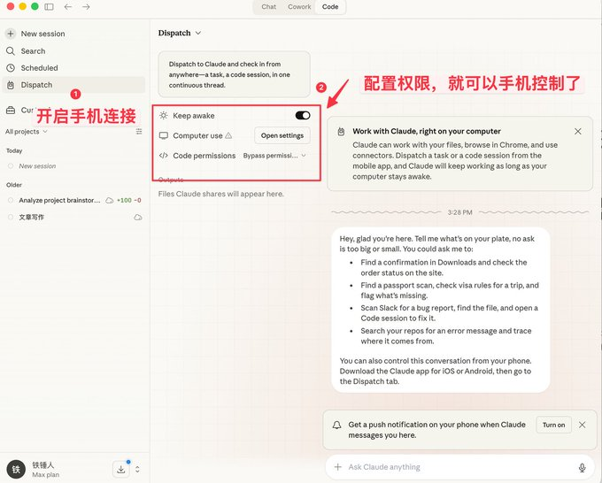
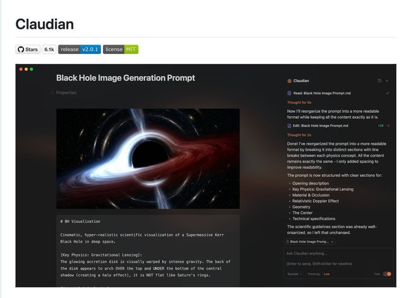
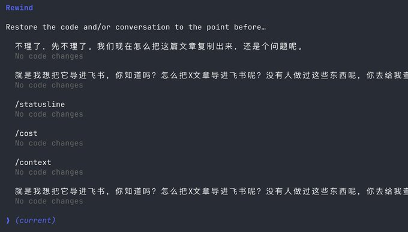
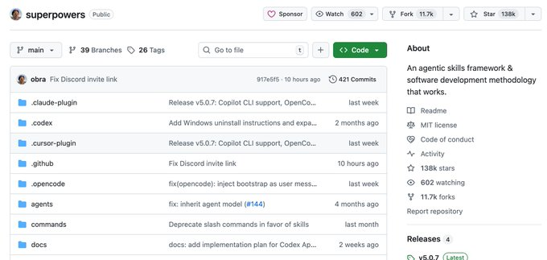
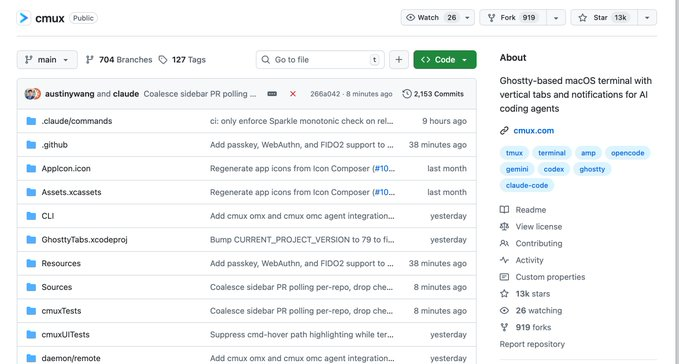
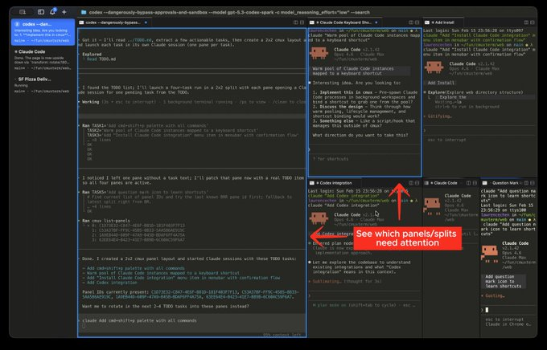
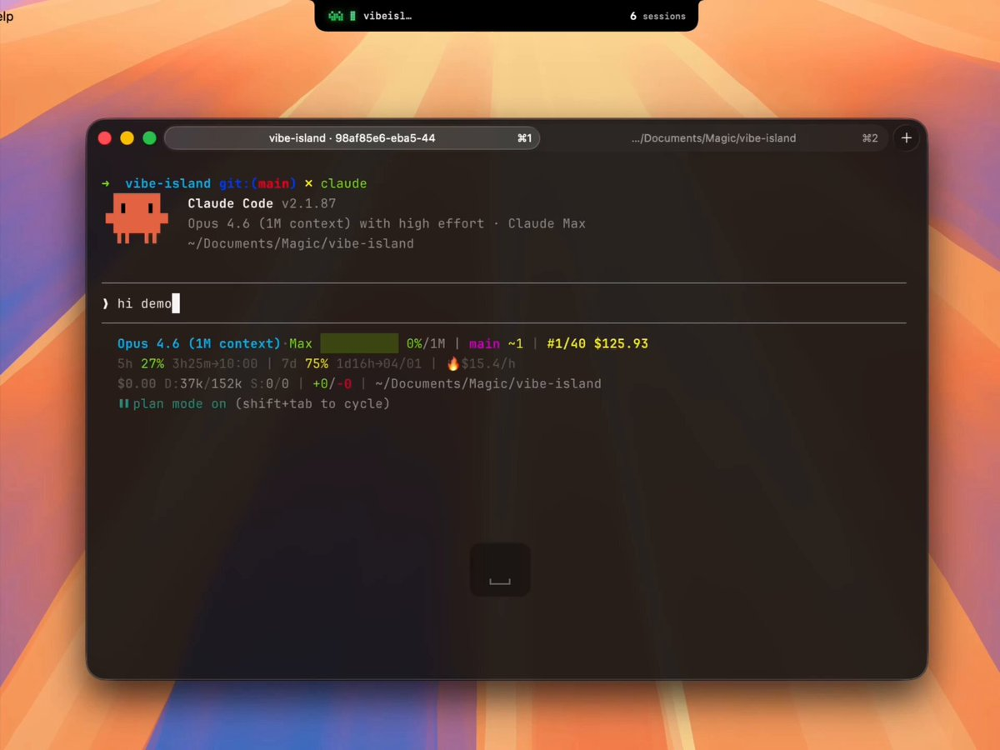

# 铁锤人 on X: "10大我希望早点知道的Claude code使用技巧" / X

Title: 铁锤人 on X: "10大我希望早点知道的Claude code使用技巧" / X

URL Source: https://x.com/lxfater/status/2041448785516343592

Markdown Content:
## Article

## Conversation

[](https://x.com/lxfater/article/2041448785516343592/media/2041450693517774848)

10大我希望早点知道的Claude code使用技巧

下面是我半年多，经常感叹要是早点知道就好的Claude code使用技巧。

他们节约我大量的时间，让我在写代码，写内容时候进入丝滑的状态。 文章分三部分：

1.   三种启动方式

2.   运行中使用技巧

3.   使用配套软件解决人机协同效率问题

所有的这一切都是：让你更加专注于编程等手头的活动。

我希望在几个月前时有人将这份教程发给我，让我少走弯路，开启丝滑：

1.   保存这份指南，这周末花 30 分钟掌握 Claude code技巧。

2.   把它发给任何问你"我觉得 Claude code难，但从来没试过"的人。

好了，首先我们从最简单的启动开始（你没有看错，启动也有门道）

简单启动

启动Claude是一件十分简单的事情，简单在命令行

bash

`claude`

但是对于不喜欢命令行工具的朋友，其实Claude code 其实是可视化界面的。

如何做到呢？

在这里网站：

下面Claude Desktop，按照下面步骤你就获得一个可视化的Claude。

[](https://x.com/lxfater/article/2041448785516343592/media/2041440379871100928)

这里不仅仅可以聊天，还附带了很多类似OpenClaw的功能。

[](https://x.com/lxfater/article/2041448785516343592/media/2041441415805476864)

可视化的界面对于普通人来说好用点，但是程序员更加喜欢命令行的启动方式。

下面给大家介绍几个加速启动的命令。

在特定历史启动

我们使用Claude code的过程中，经常碰到需要重启的情况，每当重启，就需要回复之前的上下文： 我之前我总是使用

bash

```
# 启动
claude
# 恢复
/resume
```

但是官方其实给了很不多不错的启动命令：

```
# 直接启动最近会话
claude -c
# 会话命名
claude -n "page"
# 直接启动特定会话
claude -r "page"
# 启动直接带提示词
claude "你好"
```

这里面我高频使用的就是 cluade -c，短短的命令节约了我不少生命。 -p 以自动化的方式启动

Claude Code是可以以无UI的方式启动的，简单使用下面命令即可

bash

```
# 以无头方式启动，特别适合自动化
claude -p "分析input.cvs..." --output-format json
```

值得注意的是，现在你想使用本地的订阅Token来自动化任务，目前仅仅这种方式能做了

下面是著名的 Obsidian + Claude Code 工具，就是自己做了一个SDK来这样使用本地的订阅Token。

[](https://x.com/lxfater/article/2041448785516343592/media/2041442122008809472)

我承认我前面说的可能有点复杂了，下面说说使用过程中几个简单的命令。

优雅地终止和回退任务

刚使用claude code的时候，大家还是喜欢使用Ctrl+C关闭当前对话，谁知道直接把Claude都关闭了。 正确的做法是按一次 Ese按键，就能来立马打断对话，避免事情恶化。

假如Claude突然失智，我们就可以按两下Ese+Ese，接下面就会弹出一个列表

[](https://x.com/lxfater/article/2041448785516343592/media/2041442877595930625)

你可以使用这个功能，回到任意一个检查点，避免Claude code将代码搞乱。

不离开Claude执行命令

有时候我们会想自己运行一个测试命令, 但是为了不断当前Claude，不得不开启另外一个命令窗口

其实我们可以使用！语法

```
# 这样子就可以不离开Claude，运行命令
!npm run lint
# 按下crtb+b，就可以将命令后置
```

再一次，这个小技巧节约我们30s的生命。

上下文管理

随着对话的继续，我们积累的聊天记录越多，单次消耗的token也就变多，这个时候Claude code会运行越来越冷慢。

你有两个选择，新开窗口或者使用 /clear 命令

一个简单的命令，清理无用的上下文，就行你一下子关闭20个chrome标签页一样。

但是我不想清除这些上下文呢？使用 /compact，压缩一下。

相当于让claude 喝杯红牛，提升醒脑。

希望上面的一些小技巧能帮你使用Claude code更加丝滑。

但这远远不够，由于Claude code是命令行工具，无论学多少命令，都是心智负担。

幸运的是社群里面出了不少配套的软件来解决下面的痛点：

1. 没有成熟的提示词方法论，编程效率低

2. 人打字比较慢，导致输入提示词效率低

3. 多任务过程中，人割裂开来，无法提高生产力

假如上面有任何一个是你的痛点，请继续看下去

现在，我们慢慢发现了，人开始跟不上机器的速度了，为了社区里面出了一系列的软件来解决这个问题。

首先我们需要一套成熟的编程方法论：

Superpowers

普通人Vibecoding的时候是没有啥章法的，想到哪就干到哪，这个Skills是一位老程序员总结的编程工作流。

他把顶级软件工程最佳实践打包成一键 Skills。从需求梳理、Spec 确认、详细计划，到 TDD 测试驱动 + 自动 Code Review，全程强制结构化工作流，让 AI 像成熟工程师团队一样输出高质量、可维护代码，一次通过率大幅提升，再也不用反复救火。

这个项目已经有138k Stars，具体你们去了解一下，我就不赘述了

[](https://x.com/lxfater/article/2041448785516343592/media/2041443990202167296)

当你有一套成熟的编程Skills后，你会发现，他需要你频繁输入信息，这个时候你就发现打字速度成为你效率瓶颈。

你在想，有没有什么在办公室悄悄说话，就能转文字，中英文识别特别准的软件呢？

有的，有的，而且有很多，但是我只推荐两个，typeless和豆包输入法

语音输入软件

豆包输入法的优点就是，快，然后中英文识别还不错，最重要是免费。有点像安卓系统，我也在用。

但typeless，除了需要付费外，没有太多缺点了，但能试用了（好像是我的）。

[](https://x.com/lxfater/article/2041448785516343592/media/2041446415222882304)

我下面都放出链接来，你们自己

typeless以贩养吸我推荐：

豆包输入法还在测试阶段，你们搜索就能找到安装包。

一旦开始口喷输入后，我们就能提供更多上下文给Claude code，一次通过率将会越来越来高，这一个时候效率的瓶颈就在Claude code的运行时间了。

我们可以同时运用多个Claude code实例，这个时候，我们的瓶颈就是人类多任务切换丢失上下文的问题。

解决你的注意力切换问题

首先我推荐一个软件叫做Cmux：

它基于 Ghostty 全新打造的 macOS 原生终端，专为同时跑多个 coding agent 而生：垂直标签 + 智能侧边栏、灵活分屏、智能通知高亮、浏览器内置分屏 + Socket API。

这是个开源项目：

大家可以点赞一个

[](https://x.com/lxfater/article/2041448785516343592/media/2041446021423886336)

我最喜欢就是分屏功能，但是一旦分屏后，就会出现不知道是哪个窗口完成任务。

幸运的是，这个软件会直接高亮某个终端区域，帮助你及时切换到对应窗口。

[](https://x.com/lxfater/article/2041448785516343592/media/2041445820810375168)

官网的图哈

但是我现在介绍的下个软件会将这种切换变得务必丝滑：

这个就是最近比较火的产品，叫做Vibe Island，先给大家看看效果：

UI是不是很好看，但这个产品最牛逼的地方是支持很多不同工具之间的切换



而且每次切换会自动唤起，所在APP的窗口并聚焦，然后直接输入就行。

理论上只要你切换得够快，窗口开的够多，他就会源源不断将需要处理的窗口推送到你的面前。 你有种在处理流水线的感觉。

目前有2天试用时间，用这链接有8.5折优惠：

希望这次的内容对你有帮助，本次比较新手向，其实对于程序员来说算是常识。

不过还是希望能帮助到你，如果你感觉这篇内容对你有帮助

请点赞，转发一键三连，为了感谢👇

我有个公众号，分享干货，里面还有社群，欢迎关注

[](https://x.com/lxfater/article/2041448785516343592/media/2041447388360167424)
